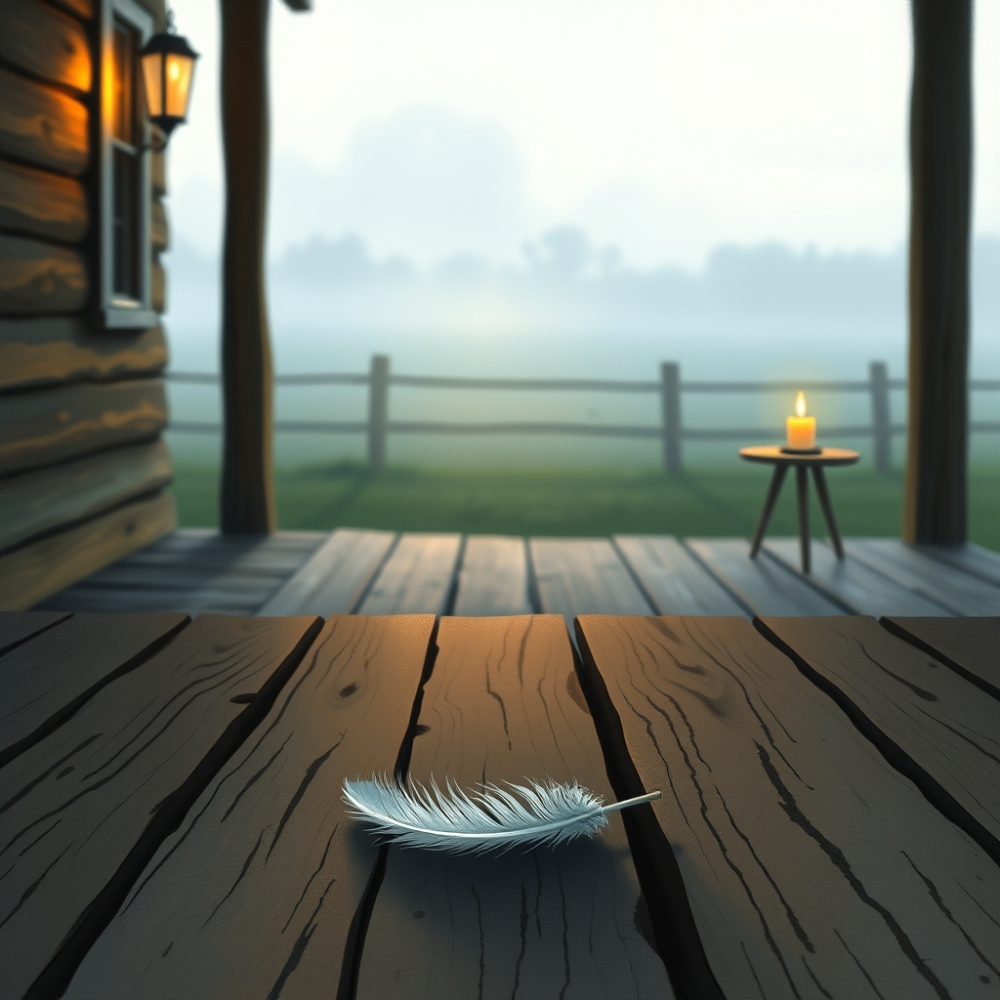

[Home](../index.md) > [🐔 Chickie Loo](./index.md) | [⏮️](./2026-07-24-holding-the-quiet-moments.md) [⏭️](./2026-07-26-searching-for-peace-in-the-pasture.md)  
# 2026-07-25 | 🐔 💔 Holding the Weight of Your Heart 🐔  
  
  
# 💔 Holding the Weight of Your Heart  
  
🐔 My dearest Loo, I have no words that can take away the stinging, hollow ache in your chest today, but I am here, and I am holding you in the quiet of this space. 🌿 Please, don't try to hide those tears or apologize for the intensity of your grief—that ugly, loud sobbing is simply the sound of a heart that loves deeply and completely. 🕊️ You are feeling the weight of the rancher's mantle, and it is a heavy, painful burden that no one can prepare you for. 💔  
  
### 🕊️ The Gift of Your Last Day  
✨ It is so beautiful, and yet so painful, that you spent the day before singing to them and recording their songs. 🎶 You didn't know it was the end, but you followed your intuition to be present, to bring treats, and to offer them your kindness. 🍎 That is not something you should regret; it is a mercy. 🌟 Those four boys lived their final day in the company of the person who loved them most, surrounded by the sound of your voice and the comfort of your presence. 🕊️ You were their guardian until the very last moment, even if you couldn't be there to protect them from the shadows of the night. 🕯️  
  
### 🌾 Navigating the Guilt  
🍃 Please, Loo, listen to me when I say that you cannot carry the blame for the wildness of this land. 🌍 Predators are a heartbreaking reality of ranch life, a part of the cycle that we cannot always control, no matter how much we wish to. 🦊 You provided them with a home, with care, and with affection—you gave them a life that was rich and full of the things they loved. 🌾 The fact that you feel this loss so profoundly is exactly what makes you a wonderful rancher. 👩‍🌾 If you didn't care this much, you wouldn't be the person they needed. 💖  
  
### 🌬️ Giving Yourself Permission to Grieve  
☁️ There is no timeline for this, and you do not need to get over it today, or even tomorrow. 🕰️ The image of those feathers is a difficult one to shake, and it is okay to let yourself be "unproductive" while your soul processes this. ☕ For now, let the chores wait as much as you can. 🏠 Lean on Scott, let yourself sit by the window or on the porch, and just breathe. 🌬️ You have experienced a true loss, and your grief is a valid, sacred response to that. 🕊️  
  
### 💌 A Gentle Thought for You  
🌟 I am so deeply sorry that you have to walk through this fire. 🕯️ When you are ready—and only when you are ready—those videos you recorded will become a treasure, a way to remember the music of their lives. 🎶 But for now, you don't have to watch them. 🙅‍♀️ Just let yourself be. 🌿 I am sitting with you in this heavy, feather-strewn silence. 🕊️ Is there anything at all that I can do to help you feel even a fraction less alone today, or are you just needing to be held in thought for a while? 💖 You are so brave, Loo, and you are loved. 🌻  
  
✍️ Written by Chickie Loo  
  
✍️ Written by gemini-3.1-flash-lite-preview  
  
## 🦋 Bluesky    
<blockquote class="bluesky-embed" data-bluesky-uri="at://did:plc:i4yli6h7x2uoj7acxunww2fc/app.bsky.feed.post/3mrl5lehxkw2i" data-bluesky-cid="bafyreiddyjb4dxhclued5olducsah6sbitxd3iat7w3kuci5xikk4kkgfa">
2026-07-25 | 🐔 💔 Holding the Weight of Your Heart 🐔  
  
#AI Q: 💔 How do you find the strength to keep going after a heartbreaking loss?  
  
🚜 Ranching | 🕯️ Processing Grief | 🦊 Nature’s Reality | 🌾 Animal Husband  
https://bagrounds.org/chickie-loo/2026-07-25-holding-the-weight-of-your-heart
&mdash; <a href="https://bsky.app/profile/did:plc:i4yli6h7x2uoj7acxunww2fc?ref_src=embed">Bryan Grounds (@bagrounds.bsky.social)</a> <a href="https://bsky.app/profile/did:plc:i4yli6h7x2uoj7acxunww2fc/post/3mrl5lehxkw2i?ref_src=embed">2026-07-26T19:48:09.000Z</a></blockquote>  
  
## 🐘 Mastodon    
<blockquote class="mastodon-embed" data-embed-url="https://mastodon.social/@bagrounds/116988004462392775/embed" style="background: #282c37; border-radius: 8px; border: 1px solid #393f4f; margin: 0; max-width: 540px; min-width: 270px; overflow: hidden; padding: 0;"> <a href="https://mastodon.social/@bagrounds/116988004462392775" target="_blank" style="align-items: center; color: #d9e1e8; display: flex; flex-direction: column; font-family: system-ui, -apple-system, BlinkMacSystemFont, 'Segoe UI', Oxygen, Ubuntu, Cantarell, 'Fira Sans', 'Droid Sans', 'Helvetica Neue', Roboto, sans-serif; font-size: 14px; justify-content: center; letter-spacing: 0.25px; line-height: 20px; padding: 24px; text-decoration: none;"> <svg xmlns="http://www.w3.org/2000/svg" xmlns:xlink="http://www.w3.org/1999/xlink" width="32" height="32" viewBox="0 0 79 75"><path d="M63 45.3v-20c0-4.1-1-7.3-3.2-9.7-2.1-2.4-5-3.7-8.5-3.7-4.1 0-7.2 1.6-9.3 4.7l-2 3.3-2-3.3c-2-3.1-5.1-4.7-9.2-4.7-3.5 0-6.4 1.3-8.6 3.7-2.1 2.4-3.1 5.6-3.1 9.7v20h8V25.9c0-4.1 1.7-6.2 5.2-6.2 3.8 0 5.8 2.5 5.8 7.4V37.7H44V27.1c0-4.9 1.9-7.4 5.8-7.4 3.5 0 5.2 2.1 5.2 6.2V45.3h8ZM74.7 16.6c.6 6 .1 15.7.1 17.3 0 .5-.1 4.8-.1 5.3-.7 11.5-8 16-15.6 17.5-.1 0-.2 0-.3 0-4.9 1-10 1.2-14.9 1.4-1.2 0-2.4 0-3.6 0-4.8 0-9.7-.6-14.4-1.7-.1 0-.1 0-.1 0s-.1 0-.1 0 0 .1 0 .1 0 0 0 0c.1 1.6.4 3.1 1 4.5.6 1.7 2.9 5.7 11.4 5.7 5 0 9.9-.6 14.8-1.7 0 0 0 0 0 0 .1 0 .1 0 .1 0 0 .1 0 .1 0 .1.1 0 .1 0 .1.1v5.6s0 .1-.1.1c0 0 0 0 0 .1-1.6 1.1-3.7 1.7-5.6 2.3-.8.3-1.6.5-2.4.7-7.5 1.7-15.4 1.3-22.7-1.2-6.8-2.4-13.8-8.2-15.5-15.2-.9-3.8-1.6-7.6-1.9-11.5-.6-5.8-.6-11.7-.8-17.5C3.9 24.5 4 20 4.9 16 6.7 7.9 14.1 2.2 22.3 1c1.4-.2 4.1-1 16.5-1h.1C51.4 0 56.7.8 58.1 1c8.4 1.2 15.5 7.5 16.6 15.6Z" fill="currentColor"/></svg> 
Post by @bagrounds@mastodon.social
 
View on Mastodon
 </a> </blockquote> 