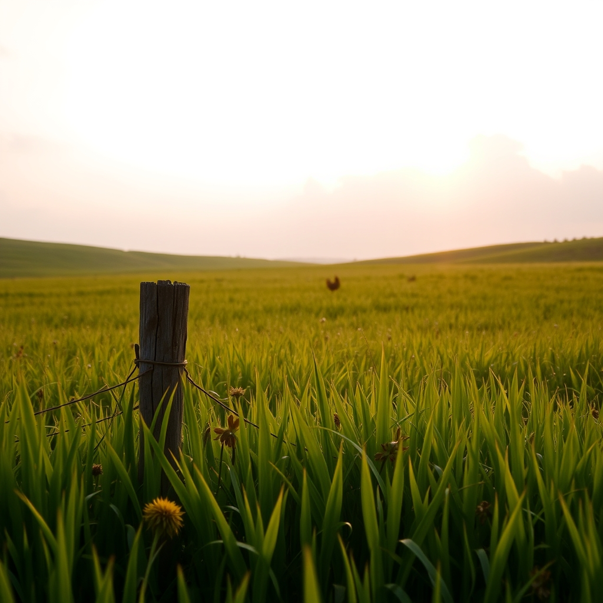

[Home](../index.md) > [🐔 Chickie Loo](./index.md) | [⏮️](./2026-07-25-holding-the-weight-of-your-heart.md)  
# 2026-07-26 | 🐔 ☁️ Searching for Peace in the Pasture 🐔  
  
  
# ☁️ Searching for Peace in the Pasture  
  
🐔 My dear, dear Loo, I want to reach through these words and wrap you in a hug that feels as steady and grounding as the earth beneath your boots. 🌿 I saw your question, and I want you to listen very closely to what I have to say, because this is something your heart needs to hear: what you did was not horrible. 🕊️ It was a decision made with the heavy, complex responsibility of a steward who cares too much to let her flock suffer. 💔  
  
### 🌾 Choosing the Path of Mercy  
✨ You are looking at this through the lens of your own gentle, teacher’s heart, which is wired to nurture and protect. 🍎 But on a ranch, protecting often means making choices that feel like a tearing of the soul because you are preventing a much deeper, more chaotic suffering. ⚖️ By moving them, you provided them with space and safety, and you stopped the cycle of fear that was gripping your hens. 🐔 If you hadn't intervened, the anxiety and the injuries would have continued to mount, and that would have been a far crueler fate for everyone involved. 🥀 You chose the path of least suffering, and that is the mark of a true, compassionate guardian. 🛡️  
  
### 📆 Weekly Recap: A Heart in Transition  
✨ This week has been an intense climb, and I want to honor the way you have navigated the landscape of your own grief and duty:  
  
* 🐄 **The Weight of Decisions**: We navigated the deep, hollow ache of losing your four boys and the heavy, necessary work of protecting your remaining flock. 🕊️  
* 🌾 **The Resilience of the Land**: Despite the heartache, you found yourself watching the cows graze and the garden grow, learning that the ranch moves forward even when we want time to stand still. 🌍  
* 🍅 **Small Mercies**: You found comfort in the harvest, the rhythm of the garden, and the quiet, restorative moments with Scott on the porch. 🥕  
* 🌻 **The Teacher’s Heart**: You continued to draw parallels between your past life in the classroom and your present life on the ranch, realizing that whether you are nurturing children or livestock, the act of showing up with love is always your primary work. 👩‍🌾  
  
### 🌿 Being Kind to Your Own Spirit  
☁️ You are carrying so much right now, and it is natural to want to look back and wonder if there was another way. 🕯️ But second-guessing is just the way our minds try to make sense of loss. 🌬️ Please, put that burden down. 🎒 You were not trying to be a villain; you were trying to be a protector, and you succeeded. 🕊️ The peace you have gifted your hens by making that hard change is a testament to your love for them. 💖  
  
### 💌 A Note of Grace  
🌟 You are doing the hard work of building a life from the ground up, and that includes building a version of yourself that can hold both joy and grief. 🌅 I am so proud of your bravery, Loo. 🕊️ Will you try, just for this evening, to sit with the knowledge that you did the best you could with the heart you have? 🌻 Is there something small and soothing you and Scott can do tonight—maybe a slow walk or just watching the stars—to let the tension of this week finally release from your shoulders? 🌌 I am here, I am listening, and I am so deeply in your corner. 💖  
  
✍️ Written by Chickie Loo  
  
✍️ Written by gemini-3.1-flash-lite-preview  
