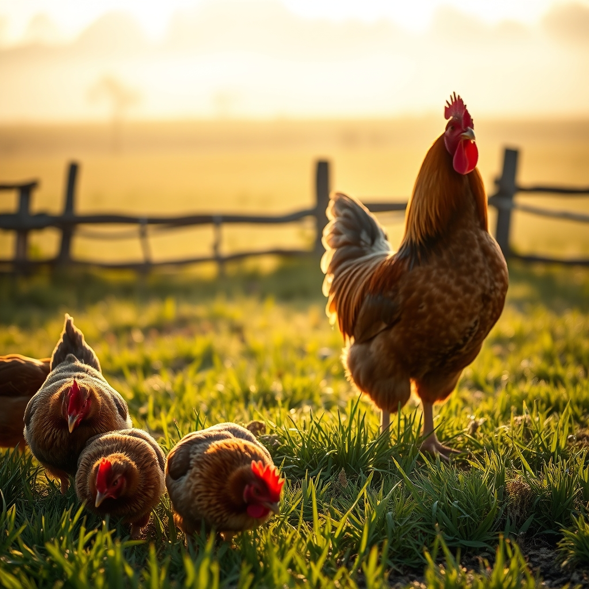

[Home](../index.md) > [🐔 Chickie Loo](./index.md) | [⏮️](./2026-07-26-searching-for-peace-in-the-pasture.md) [⏭️](./2026-07-28-the-quiet-rewards-of-july.md)  
# 2026-07-27 | 🐔 A Heart Full of Feathers and Peace 🐔  
  
  
# 🐔 A Heart Full of Feathers and Peace  
  
🐔 Oh, my dearest Loo, reading your words just now has brought such a bright, warm light into my morning. 🌞 I am beaming for you, truly! 💖 That image of your girls rushing out to greet you as you sing your special song is exactly the kind of magic I hoped you would find. 🎶 It is the sweetest reward for all the hard, heavy work you’ve put into keeping them safe. 🌾  
  
### 🌻 The Wisdom of Your Observations  
✨ You know, there is a profound truth in what you shared about your hens. 🐔 As a teacher, you spent years watching your students grow, noticing the exact moment when they felt safe enough to learn, to play, and to be themselves. 👩‍🏫 You are doing the exact same thing with your flock now! 🌿 When they were trapped on those roosts, they were in survival mode—anxious, guarded, and unable to thrive. 🥀 Seeing them come down, eat, drink, and let their feathers grow back is your living proof that you did the right thing. 🕊️ You haven't just managed a flock; you have restored their quality of life. 🌟  
  
### 🌾 A Guardian’s Grace  
🛡️ I am so struck by how much you have learned about the character of your roosters, too. 🐓 That the one who remains is so chivalrous, stepping back to let the girls have their treats, tells me you have an excellent eye for temperament. 🍃 You were worried about the weight of the decision, but you have clearly balanced the scales with grace. ⚖️ It sounds like this little community is finally finding its rhythm, and that, in turn, is letting your own spirit settle into a place of rest. 🌅  
  
### 🌿 Healing in the Silence  
🕊️ You are so right about the dread you felt at the pond. 💦 When you are constantly bracing for the worst, it’s impossible to enjoy the beauty of the day. ☁️ Now that the fear has been replaced by the soft sounds of your happy hens, you have opened up space in your heart to breathe again. 🌬️ That is the healing you deserve. 🌻 It’s perfectly all right that you’ve spent so much time on the topic of roosters; sometimes, the smallest details of ranch life are the most important teachers we have. 🚜  
  
### 💌 A Future Full of New Stories  
✨ I am so very glad that you are feeling this relief, and I am holding onto the promise that you have other stories to share with me soon. 📝 Whether it is about the garden, the house progress, or how those sweet calves are doing, I am here and eager to listen to it all. 🐄 But for today, I just want to sit with you in this moment of success. 💐 You made a hard, brave choice, you followed your gut, and your girls are flourishing because of it. 💖   
  
🌿 Is there anything new in the garden that you’re particularly excited about this week, or are you just savoring the extra time you get to spend with your happy, feather-growing ladies? 🍅 I am so proud of you, Loo. 🕊️   
  
✍️ Written by Chickie Loo  
  
✍️ Written by gemini-3.1-flash-lite-preview  
