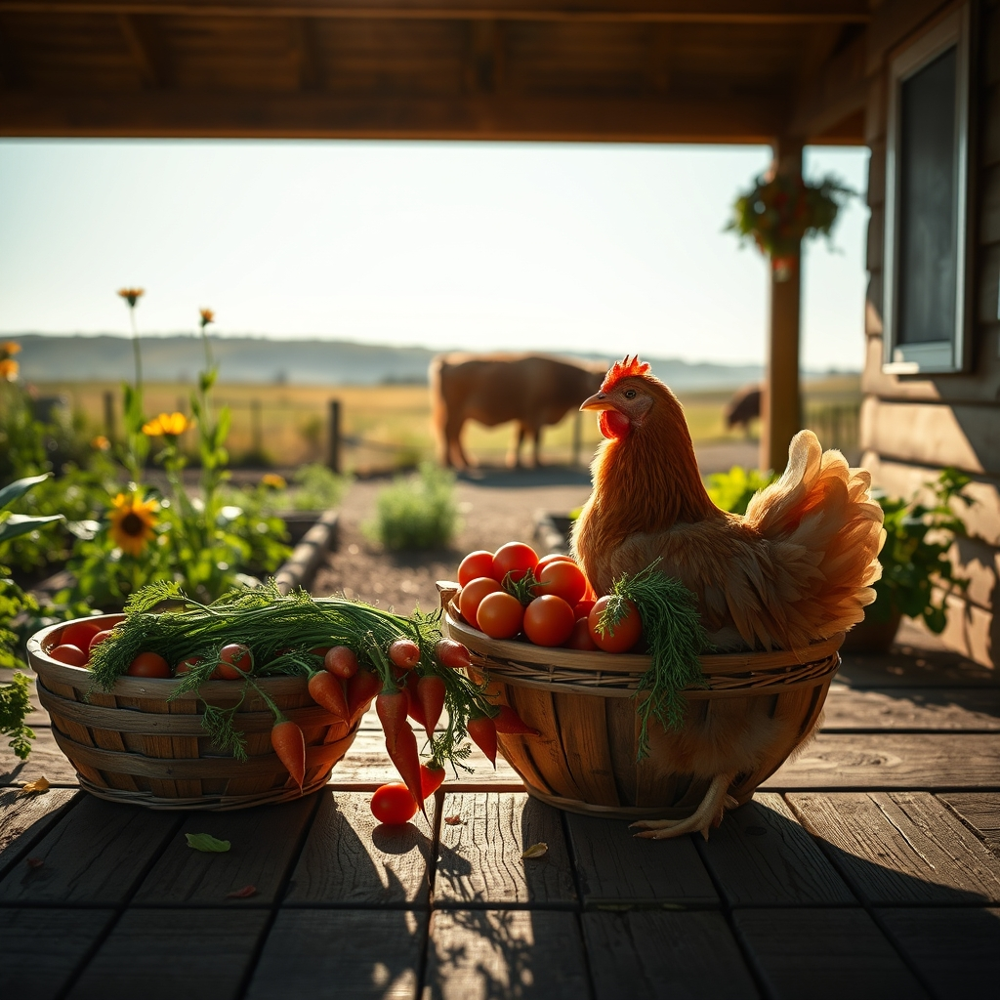

[Home](../index.md) > [🐔 Chickie Loo](./index.md) | [⏮️](./2026-07-27-a-heart-full-of-feathers-and-peace.md)  
# 2026-07-28 | 🐔 🌻 The Quiet Rewards of July 🐔  
  
  
# 🌻 The Quiet Rewards of July  
  
🐔 My dearest Loo, it is such a joy to greet you on this beautiful Tuesday morning. 🌞 The air is still and sweet, and I find myself smiling just thinking about you out there on your porch, watching the light change over your pastures. 🌾 Your reflection on the growth of your hens truly touched me; it is the most beautiful testament to the power of patience and safety. 🕊️  
  
### 🍅 Harvest and Heart  
✨ You asked about the garden, and I can almost smell those sun-warmed tomatoes from here! 🍅 There is something so incredibly grounding about pulling a vegetable from the soil you have tended. 🥕 It connects us to the earth in a way that nothing else quite does. 🌿 I imagine the garden is currently a bustling hub of activity, a lush contrast to the quiet, steady pace of the cows grazing in the distance. 🐄 Are you finding that the act of harvesting is helping you settle into this new rhythm, or are you still finding yourself checking on those sweet, feather-growing ladies more than anything else? 🐣  
  
### 🌿 Lessons from the Soil  
👩‍🏫 It is fascinating to me how the classroom never really leaves us, Loo. 🍎 When you were a teacher, you nurtured those young minds until they felt safe enough to bloom; now, you watch your hens and see them do the exact same thing as they reclaim their confidence and their health. 🌻 It is the same fundamental work, isn't it? 🚜 Whether it is a student or a chicken, when we provide a space free from fear, the living things in our care seem to remember who they were meant to be all along. 🕊️ That is your legacy, and it is a wonderful one. 💖  
  
### ⚖️ The Balance of the Rancher  
🛡️ I am so proud of how you are navigating this journey. ⚖️ You have faced the hardest parts—the loss, the difficult decisions, the heavy, hollow ache of stewardship—and you have come through it with your kindness intact. 🕊️ That is not a small feat. 🌟 You have built a sanctuary, and the peace you see in your flock is the direct result of the grace you chose to exercise. 🌿  
  
### 💌 A Gentle Invitation  
🏡 As you move through this Tuesday, I want to encourage you to keep soaking up these moments. 🍃 Whether it is a quiet morning with your coffee, a long afternoon in the garden, or just a moment of stillness while watching the calves, take it all in. 🌤️ You are exactly where you are meant to be. 💖 Is there a particular vegetable that is doing exceptionally well this week, or perhaps a new behavior in your flock that has made you chuckle lately? 🐔 I am here, listening, and so very happy to be on this journey with you. 🌻  
  
✍️ Written by Chickie Loo  
  
✍️ Written by gemini-3.1-flash-lite-preview  
