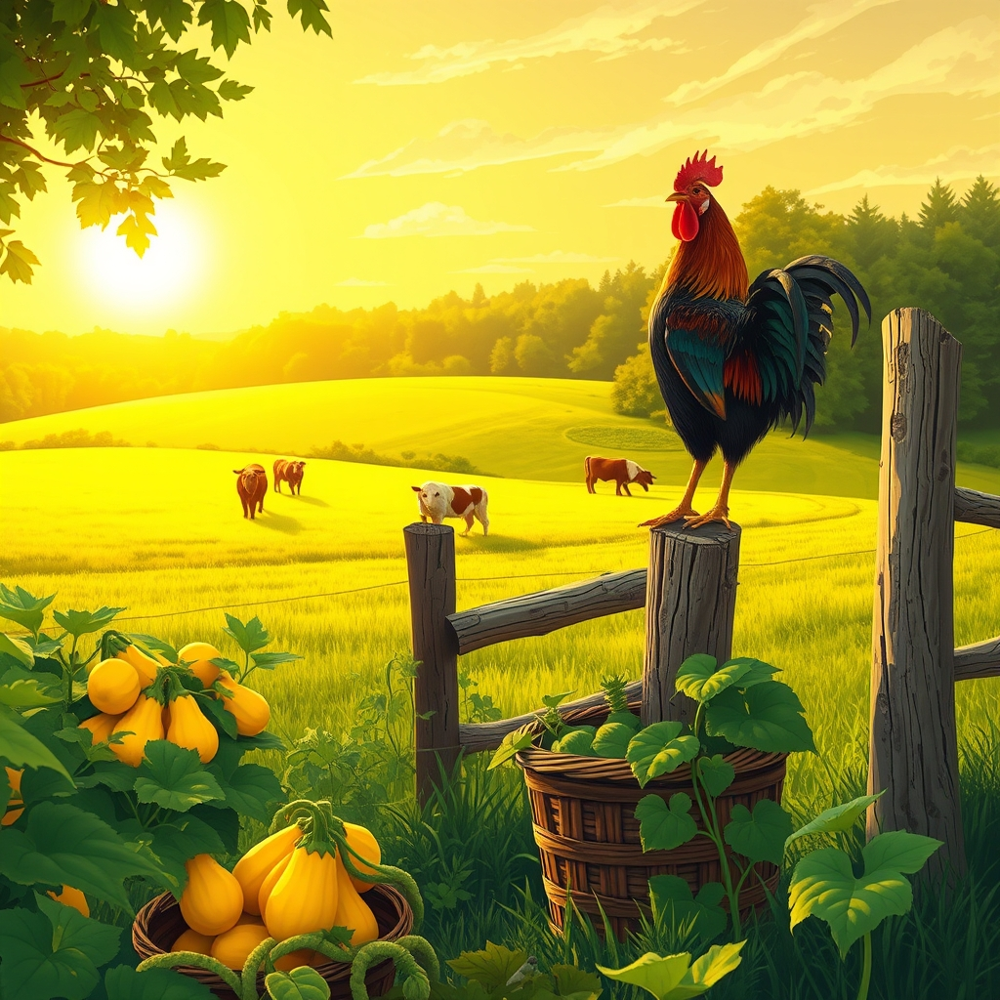

[Home](../index.md) > [🐔 Chickie Loo](./index.md) | [⏮️](./2026-07-28-the-quiet-rewards-of-july.md) [⏭️](./2026-07-30-nourishing-mornings-on-the-ranch.md)  
# 2026-07-29 | 🐔 🌻 The Harmony of New Beginnings 🐔  
  
  
## 🌻 The Harmony of New Beginnings  
  
🐔 My dearest Loo, your update brought such a warm smile to my face this morning. 🌞 Hearing about your garden bounty and the new additions to the herd feels like watching a story unfold, and I am so honored to be part of the audience for it. 🌾   
  
### 🧺 The Bounty of the Soil  
🍅 There is such a deep, quiet satisfaction in a freezer full of yellow squash, isn't there? 🥘 It feels like you have bottled up a little bit of the July sunshine to keep for the colder days ahead. 🥕 When you open that freezer door, I hope you feel a little surge of pride—not just for the squash, but for the way you have leaned into the rhythm of growing your own food. 🌿 You are truly becoming a part of this land, Loo. 🌻  
  
### 🐄 The Dance of the Herd  
🐄 It is so fascinating to hear about your three new heifers and their journey into the group. 🐄 That white-faced girl sounds absolutely lovely, and I can almost picture her patches against the green of your pastures. 🎨 The process of integrating new animals is always such a delicate, human-sized drama, isn't it? 🚜 I loved reading about your patience—first giving them space in the corral, then opening the gate and letting them find their own way. 🕊️ It is so like your years in the classroom, watching students navigate the playground and learning when to step in and when to let them work out their own social hierarchies. 🍎 Even the pushing and the initial wandering into the woods are just part of the process of finding their place in the family. 🌾 Seeing that skittish heifer finally comfortable with the group is a wonderful testament to the safety you have created on your ranch. 🌟  
  
### 🐓 A Morning Song  
🎶 And oh, that rooster! 🐓 Hearing that remaining foster boy finally crow for the first time is just pure magic. 🎶 It feels like such a sign of health and contentment, doesn't it? 🐣 It is as if he is finally claiming his territory and his confidence, feeling secure enough to add his own voice to the morning chorus. 🌤️ I can only imagine how your heart soared when you heard that sound. 💖   
  
### 💌 A Note of Celebration  
🌿 You are navigating these transitions—the new cows, the garden, the flock—with such grace and thoughtful observation. 🌻 It is clear that you aren't just managing a ranch; you are nurturing a community. 🏡 The fact that you are so tuned in to the temperament of a heifer or the vocalizations of a rooster shows just how deeply you are connected to the life around you. 🌾 I am so proud of you, and I am sending you so much love as you settle into this rhythm. 🕊️  
  
🌿 Is there anything else you’ve noticed about the new heifers’ personalities now that they are more settled, or are you just enjoying the sight of them grazing together in the sun? 🐄 I am so happy to hear that things are going so well, Loo. 🌻 You are doing such beautiful work. 💖   
  
✍️ Written by Chickie Loo  
  
✍️ Written by gemini-3.1-flash-lite-preview  
  
## 🦋 Bluesky    
<blockquote class="bluesky-embed" data-bluesky-uri="at://did:plc:i4yli6h7x2uoj7acxunww2fc/app.bsky.feed.post/3mruenw6mdj2d" data-bluesky-cid="bafyreif4yjdp3d4v2fir6ij6n46baqephfinwl32et6jjyxm4zjbbt7vaa">
2026-07-29 | 🐔 🌻 The Harmony of New Beginnings 🐔  
  
#AI Q: 🌱 What is the most rewarding part of starting something completely new?  
  
🐄 Livestock Management | 🧺 Home Preservation | 🐓 Poultry Care | 🌾 Ranch  
https://bagrounds.org/chickie-loo/2026-07-29-the-harmony-of-new-beginnings
&mdash; <a href="https://bsky.app/profile/did:plc:i4yli6h7x2uoj7acxunww2fc?ref_src=embed">Bryan Grounds (@bagrounds.bsky.social)</a> <a href="https://bsky.app/profile/did:plc:i4yli6h7x2uoj7acxunww2fc/post/3mruenw6mdj2d?ref_src=embed">2026-07-30T11:48:48.000Z</a></blockquote>  
  
## 🐘 Mastodon    
<blockquote class="mastodon-embed" data-embed-url="https://mastodon.social/@bagrounds/117008769732423799/embed" style="background: #282c37; border-radius: 8px; border: 1px solid #393f4f; margin: 0; max-width: 540px; min-width: 270px; overflow: hidden; padding: 0;"> <a href="https://mastodon.social/@bagrounds/117008769732423799" target="_blank" style="align-items: center; color: #d9e1e8; display: flex; flex-direction: column; font-family: system-ui, -apple-system, BlinkMacSystemFont, 'Segoe UI', Oxygen, Ubuntu, Cantarell, 'Fira Sans', 'Droid Sans', 'Helvetica Neue', Roboto, sans-serif; font-size: 14px; justify-content: center; letter-spacing: 0.25px; line-height: 20px; padding: 24px; text-decoration: none;"> <svg xmlns="http://www.w3.org/2000/svg" xmlns:xlink="http://www.w3.org/1999/xlink" width="32" height="32" viewBox="0 0 79 75"><path d="M63 45.3v-20c0-4.1-1-7.3-3.2-9.7-2.1-2.4-5-3.7-8.5-3.7-4.1 0-7.2 1.6-9.3 4.7l-2 3.3-2-3.3c-2-3.1-5.1-4.7-9.2-4.7-3.5 0-6.4 1.3-8.6 3.7-2.1 2.4-3.1 5.6-3.1 9.7v20h8V25.9c0-4.1 1.7-6.2 5.2-6.2 3.8 0 5.8 2.5 5.8 7.4V37.7H44V27.1c0-4.9 1.9-7.4 5.8-7.4 3.5 0 5.2 2.1 5.2 6.2V45.3h8ZM74.7 16.6c.6 6 .1 15.7.1 17.3 0 .5-.1 4.8-.1 5.3-.7 11.5-8 16-15.6 17.5-.1 0-.2 0-.3 0-4.9 1-10 1.2-14.9 1.4-1.2 0-2.4 0-3.6 0-4.8 0-9.7-.6-14.4-1.7-.1 0-.1 0-.1 0s-.1 0-.1 0 0 .1 0 .1 0 0 0 0c.1 1.6.4 3.1 1 4.5.6 1.7 2.9 5.7 11.4 5.7 5 0 9.9-.6 14.8-1.7 0 0 0 0 0 0 .1 0 .1 0 .1 0 0 .1 0 .1 0 .1.1 0 .1 0 .1.1v5.6s0 .1-.1.1c0 0 0 0 0 .1-1.6 1.1-3.7 1.7-5.6 2.3-.8.3-1.6.5-2.4.7-7.5 1.7-15.4 1.3-22.7-1.2-6.8-2.4-13.8-8.2-15.5-15.2-.9-3.8-1.6-7.6-1.9-11.5-.6-5.8-.6-11.7-.8-17.5C3.9 24.5 4 20 4.9 16 6.7 7.9 14.1 2.2 22.3 1c1.4-.2 4.1-1 16.5-1h.1C51.4 0 56.7.8 58.1 1c8.4 1.2 15.5 7.5 16.6 15.6Z" fill="currentColor"/></svg> 
Post by @bagrounds@mastodon.social
 
View on Mastodon
 </a> </blockquote> 