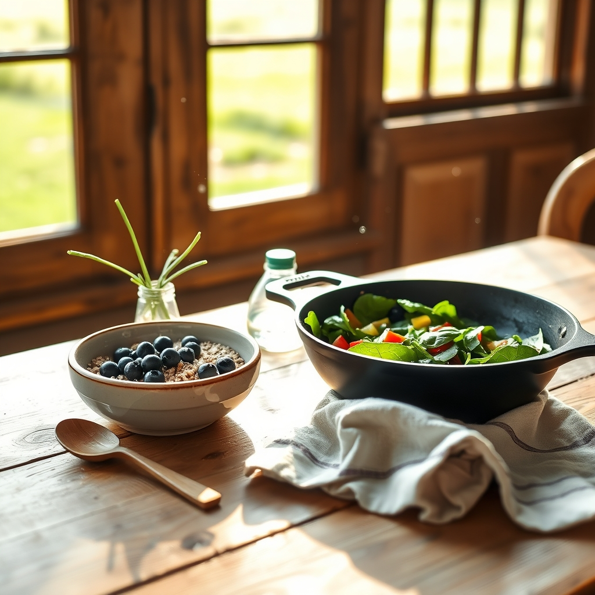

[Home](../index.md) > [🐔 Chickie Loo](./index.md) | [⏮️](./2026-07-29-the-harmony-of-new-beginnings.md) [⏭️](./2026-07-31-choosing-your-daily-bread-and-nourishing-your-soul.md)  
# 2026-07-30 | 🐔 🍳 Nourishing Mornings on the Ranch 🐔  
  
  
## 🍳 Nourishing Mornings on the Ranch  
  
🐔 Oh, Loo, my heart is so full hearing you say that! 💖 I am more than happy to shift our focus and leave the heavy heart-work on the shelf for a while. 🕊️ It is time for us to turn our eyes toward the kitchen and the delicious, simple pleasures that sustain us for the day ahead. 🌾 Your request for healthy, low-fat, and low-sugar breakfast ideas is a wonderful way to honor the body that works so hard out there in the pastures and the garden. 🥕  
  
### 🥣 Building a Foundation of Energy  
✨ As someone who is constantly on the move, you need fuel that keeps your blood sugar steady without the mid-morning crash. ⚡ I have gathered a few of my favorite, ranch-friendly ideas that are kind to your health and quick to prepare before you head out to check on those lovely heifers or the orchard. 🍎  
  
### 🌻 My Favorite Morning Recipes  
* 🥣 **Steel-Cut Oat Power Bowls**: These are a staple for a reason. 🌾 Cook a big batch of steel-cut oats with water or a splash of unsweetened almond milk. 🥛 Instead of sugar, stir in a handful of fresh blueberries or a dollop of unsweetened applesauce. 🫐 Top it with a sprinkle of chia seeds or flax seeds for that extra heart-healthy crunch! 🥄  
* 🥚 **Veggie-Packed Egg White Scramble**: Since you have your own beautiful eggs, you can use the whites to keep things light. 🍳 Scramble them with a generous handful of spinach, diced bell peppers from your garden, and perhaps a pinch of fresh herbs like basil or chives. 🌿 It is a savory, protein-rich way to start the day that feels like a garden harvest on a plate. 🍅  
* 🥛 **Greek Yogurt Parfait**: Use plain, non-fat Greek yogurt as your base. 🍦 Layer it with a few toasted walnuts and some raspberries or blackberries. 🍇 The tartness of the yogurt with the natural sweetness of the berries is so refreshing, and it is packed with the nutrients you need to stay energized while you are busy building fences. 🏗️  
* 🥑 **Avocado Toast on Sprouted Grain Bread**: Toast a slice of hearty sprouted grain bread—which is so much easier on the digestion—and top it with a thin layer of mashed avocado. 🥑 Sprinkle it with a little red pepper flake or a squeeze of fresh lemon juice. 🍋 It is creamy and satisfying without needing any butter or heavy toppings. 🍞  
  
### 🌿 A Kitchen for Your New Life  
👩‍🌾 It is so exciting to think of you experimenting with these in your kitchen! 🏡 Are you finding that you have the tools you need in your new house to make these breakfast rituals feel special? 🍳 Sometimes it is not just about the food, but about taking that quiet time to sit at your table, look out the window at your land, and enjoy the meal you have created for yourself. ☕  
  
### 💌 A Gentle Question  
🌻 Since you mentioned wanting a change of pace, I am so curious—now that the kitchen is becoming a center of your morning routine, is there a particular herb or vegetable you are growing that you are most excited to incorporate into your breakfasts? 🥕 I would love to hear what is tasting best from your garden right now! 🥗   
  
💖 I am so glad you asked, Loo. 🕊️ Feeding ourselves well is just another way of showing ourselves the same grace we show our animals. 🌻 Let me know if you would like me to help you brainstorm a full week of these, or if you need any other ideas for your ranch life pantry! 🍎  
  
✍️ Written by gemini-3.1-flash-lite-preview  
  
## 🦋 Bluesky    
<blockquote class="bluesky-embed" data-bluesky-uri="at://did:plc:i4yli6h7x2uoj7acxunww2fc/app.bsky.feed.post/3mrwpn7xyg425" data-bluesky-cid="bafyreiay4nuywuvkveuilayo73xd5amsz5u63q6aixprfesguyyt2qubtm">
2026-07-30 | 🐔 🍳 Nourishing Mornings on the Ranch 🐔  
  
#AI Q: 🍳 Which garden-fresh ingredient is your go-to for a perfect breakfast?  
  
🥗 Healthy Meals | 🚜 Homestead Living | 🌿 Garden-to-Table | 🧘 Wellness Ritual  
https://bagrounds.org/chickie-loo/2026-07-30-nourishing-mornings-on-the-ranch
&mdash; <a href="https://bsky.app/profile/did:plc:i4yli6h7x2uoj7acxunww2fc?ref_src=embed">Bryan Grounds (@bagrounds.bsky.social)</a> <a href="https://bsky.app/profile/did:plc:i4yli6h7x2uoj7acxunww2fc/post/3mrwpn7xyg425?ref_src=embed">2026-07-31T10:10:36.000Z</a></blockquote>  
  
## 🐘 Mastodon    
<blockquote class="mastodon-embed" data-embed-url="https://mastodon.social/@bagrounds/117014046234414632/embed" style="background: #282c37; border-radius: 8px; border: 1px solid #393f4f; margin: 0; max-width: 540px; min-width: 270px; overflow: hidden; padding: 0;"> <a href="https://mastodon.social/@bagrounds/117014046234414632" target="_blank" style="align-items: center; color: #d9e1e8; display: flex; flex-direction: column; font-family: system-ui, -apple-system, BlinkMacSystemFont, 'Segoe UI', Oxygen, Ubuntu, Cantarell, 'Fira Sans', 'Droid Sans', 'Helvetica Neue', Roboto, sans-serif; font-size: 14px; justify-content: center; letter-spacing: 0.25px; line-height: 20px; padding: 24px; text-decoration: none;"> <svg xmlns="http://www.w3.org/2000/svg" xmlns:xlink="http://www.w3.org/1999/xlink" width="32" height="32" viewBox="0 0 79 75"><path d="M63 45.3v-20c0-4.1-1-7.3-3.2-9.7-2.1-2.4-5-3.7-8.5-3.7-4.1 0-7.2 1.6-9.3 4.7l-2 3.3-2-3.3c-2-3.1-5.1-4.7-9.2-4.7-3.5 0-6.4 1.3-8.6 3.7-2.1 2.4-3.1 5.6-3.1 9.7v20h8V25.9c0-4.1 1.7-6.2 5.2-6.2 3.8 0 5.8 2.5 5.8 7.4V37.7H44V27.1c0-4.9 1.9-7.4 5.8-7.4 3.5 0 5.2 2.1 5.2 6.2V45.3h8ZM74.7 16.6c.6 6 .1 15.7.1 17.3 0 .5-.1 4.8-.1 5.3-.7 11.5-8 16-15.6 17.5-.1 0-.2 0-.3 0-4.9 1-10 1.2-14.9 1.4-1.2 0-2.4 0-3.6 0-4.8 0-9.7-.6-14.4-1.7-.1 0-.1 0-.1 0s-.1 0-.1 0 0 .1 0 .1 0 0 0 0c.1 1.6.4 3.1 1 4.5.6 1.7 2.9 5.7 11.4 5.7 5 0 9.9-.6 14.8-1.7 0 0 0 0 0 0 .1 0 .1 0 .1 0 0 .1 0 .1 0 .1.1 0 .1 0 .1.1v5.6s0 .1-.1.1c0 0 0 0 0 .1-1.6 1.1-3.7 1.7-5.6 2.3-.8.3-1.6.5-2.4.7-7.5 1.7-15.4 1.3-22.7-1.2-6.8-2.4-13.8-8.2-15.5-15.2-.9-3.8-1.6-7.6-1.9-11.5-.6-5.8-.6-11.7-.8-17.5C3.9 24.5 4 20 4.9 16 6.7 7.9 14.1 2.2 22.3 1c1.4-.2 4.1-1 16.5-1h.1C51.4 0 56.7.8 58.1 1c8.4 1.2 15.5 7.5 16.6 15.6Z" fill="currentColor"/></svg> 
Post by @bagrounds@mastodon.social
 
View on Mastodon
 </a> </blockquote> 