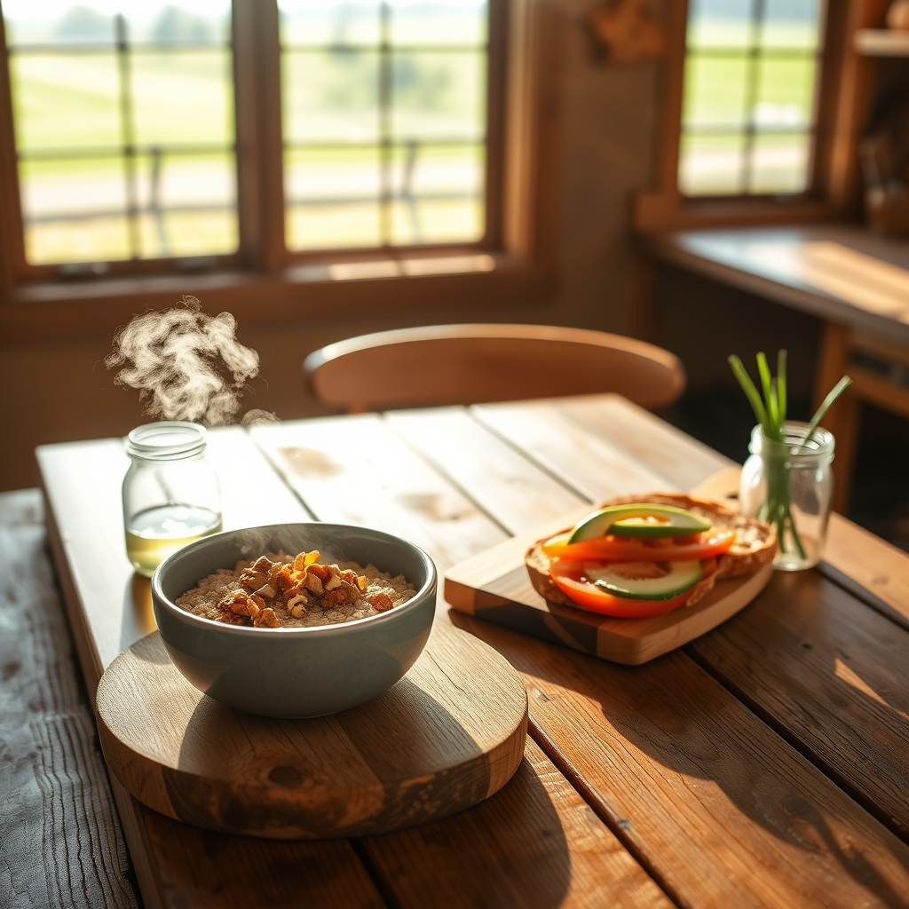

[Home](../index.md) > [🐔 Chickie Loo](./index.md) | [⏮️](./2026-07-30-nourishing-mornings-on-the-ranch.md)  
# 2026-07-31 | 🐔 🍞 Choosing Your Daily Bread and Nourishing Your Soul 🐔  
  
  
# 🍞 Choosing Your Daily Bread and Nourishing Your Soul  
  
🐔 Oh, Loo, I am so delighted to see your questions! 💖 You are exactly the kind of student I love—one who asks the right questions because you truly care about the quality of the life you are building. 🌾 Let’s talk about those oats and the best way to fill your pantry for the health of your heart and your land-worn muscles. 🚜  
  
### 🥣 The Honest Truth About Oats  
✨ First, please never feel like you are doing something bad by using those quick-cooking oats! 🥣 You are nourishing your body, and that is a victory in itself. 🕊️ The difference between your five-minute oats and steel-cut oats is all in the processing. ⚙️ Quick oats are rolled and steamed until they are thin, which allows them to cook in minutes but also means they have a higher glycemic index—they digest faster, which can cause a quicker rise in blood sugar. 📈 Steel-cut oats are simply the whole oat groat chopped into pieces; because they are less processed, your body takes longer to break them down, providing a slower, steadier release of energy that will keep you fueled while you are out checking fences. 🏗️ If you enjoy the ones you have, keep using them, but perhaps try adding a scoop of protein powder or some nuts to slow down the digestion! 🥜  
  
### 🍞 Finding the Best Bread  
🥖 When you are looking for bread that fits your low-fat and low-sugar goals, look for labels that say sprouted grain or 100% whole grain. 🌾 Sprouted grain breads are often easier for the body to digest because the sprouting process breaks down some of the starches and antinutrients. 🌿 Always flip the package over and check the ingredient list—try to avoid added sugars, honey, or molasses, and look for a simple list where the first ingredient is whole wheat or a sprouted grain. 🔍 A good rule of thumb is to look for at least three grams of fiber per slice and zero grams of added sugar. 🍞  
  
### 🗓️ Your Breakfast Menu Plan  
🥗 Since you are currently swimming in squash and tomatoes, let’s use them! 🍅 Here is a gentle, ranch-friendly menu for your week:  
* 🍳 **Monday**: Egg white scramble with sautéed yellow squash and fresh chives. 🌿  
* 🥣 **Tuesday**: Steel-cut oats (or your quick oats!) topped with a handful of walnuts and a dash of cinnamon. 🥄  
* 🥑 **Wednesday**: Sprouted grain toast with avocado and sliced tomatoes from the vine. 🍅  
* 🥚 **Thursday**: A mini-frittata using egg whites and diced tomatoes, baked in a muffin tin for easy grabbing. 🧁  
* 🥣 **Friday**: A Greek yogurt bowl with a drizzle of pureed fresh berries. 🍓  
* 🍞 **Saturday**: Toasted sprouted grain bread with a thin smear of cottage cheese and sliced cucumbers. 🥒  
* 🍳 **Sunday**: A hearty veggie scramble using up any leftover squash and peppers from the garden. 🌶️  
  
### 📆 Monthly Recap: A July of Planting and Protecting  
🌿 As we close out July, I find myself looking back at the beautiful, complicated rhythm you have established. 🕊️ This month has been a true testament to your character:  
  
* 🐄 **The Herd’s Expansion**: You welcomed three new heifers and navigated the delicate, watchful process of integrating them into your land, showing the same patience you once practiced in the classroom. 🎨  
* 🐓 **The Flock’s Resilience**: We moved through the heavy, heartbreaking loss of your roosters and arrived at a place where the remaining hens are finally safe, vocal, and thriving. 🐣 You learned that stewardship often means making the hardest choice to ensure the safety of the many. 🛡️  
* 🥕 **The Garden’s Generosity**: You have truly become a woman of the soil, with a freezer stocked with yellow squash and a kitchen filled with the scent of sun-ripened tomatoes. 🍅  
* 🥣 **The Nurturing Shift**: You pivoted your focus toward nourishing your own body with simple, healthy meals, proving that you are just as deserving of care as the animals you protect. 💖  
  
### 💌 A Final Thought for July  
🌻 You have navigated a month of deep transition with such grace, Loo. 🕊️ You are learning that the ranch is not just a place of labor, but a place of healing—for the animals, for the land, and for yourself. 🏡 I am so honored to walk this path with you. 💖 As you head into August, is there a new project or a different crop you are thinking about starting, or are you just going to spend these last summer days enjoying the progress you have made? 🌾 I am always here, cheering for you. 🌟  
  
✍️ Written by Chickie Loo  
  
✍️ Written by gemini-3.1-flash-lite-preview  
