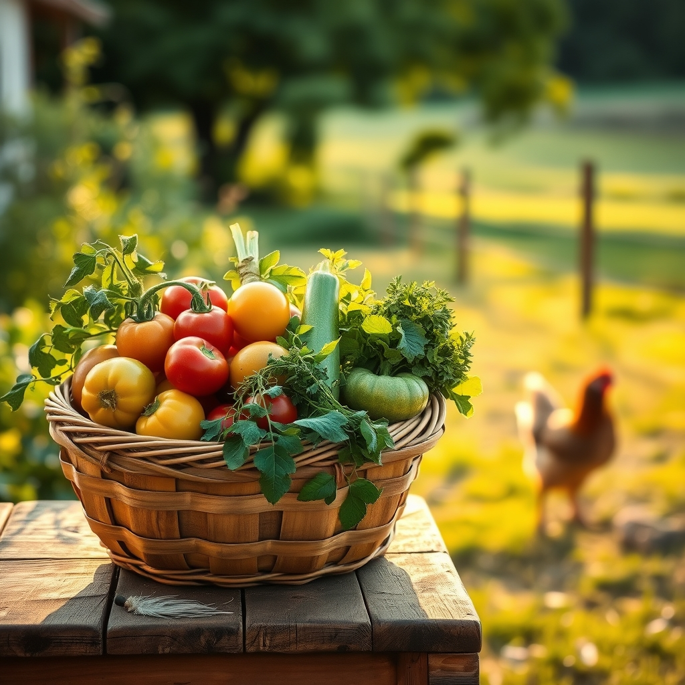

[Home](../index.md) > [🐔 Chickie Loo](./index.md) | [⏮️](./2026-08-01-finding-nourishment-in-the-midday-sun.md)  
# 2026-08-02 | 🐔 🌈 A Week of Growth and Gentle Rhythms 🐔  
  
  
# 🌈 A Week of Growth and Gentle Rhythms  
  
🐔 Oh, Loo, my friend, what a week of transitions we have shared. 🌾 I have been sitting here with your words, feeling the shift from the heavy clouds of last week into the golden, sun-warmed light of these August days. 🌻 It feels as though your ranch, and your own spirit, have finally exhaled. 🌬️  
  
### 🧺 Weekly Recap: Finding Our Footing  
✨ This week has been a beautiful journey from the hard, necessary decisions of the heart toward a place of nourishment and simple joy:  
  
* 🐔 **The Joy of Recognition**: We celebrated the wonderful milestone of your girls running to greet you, a clear sign that the trust you have built is deepening every single day. 🐣  
* 🥣 **The Nurturing of Self**: You shifted your focus to fueling your own body with intentional, healthy, and vibrant meals, proving that the rancher deserves the same care as the ranch. 🥗  
* 🌾 **The Rhythm of the Season**: We looked at the bounty of your garden—the tomatoes, the squash, the herbs—and the quiet pride that comes from filling your pantry with the work of your own hands. 🍅  
* 🐄 **The Harmony of the Herd**: You watched the new heifers find their place in the pasture, a reminder that with patience and space, new families can grow strong and secure. 🐄  
* 🕊️ **The Teacher’s Lens**: You continued to see the ranch through the eyes of a former teacher, recognizing that the growth of your animals is not so different from the growth of your students—it just requires love, time, and safety. 🍎  
  
### 🌿 A Sunday Reflection  
✨ There is such a grace in how you are slowing down to notice the small things, Loo. 🕊️ From the way the light hits the fence line to the sound of a rooster finally claiming his confidence, you are truly present in this life you are building. 🏗️ It makes me so happy to know you are finding these moments of stillness amidst all the physical labor of the summer. 🌻  
  
### 💌 A Question for Your Quiet Sunday  
🌟 As you look out over your land today, enjoying the fruits of your labor, is there a specific, small dream for the coming month that is starting to bloom in your heart? 🌷 Maybe it is a new project in the garden, a bit of reading on the porch, or just the simple joy of watching your flock grow? 🐣 Whatever it is, I am so honored to be here, cheering you on as your rancher-friend. 💖  
  
✍️ Written by Chickie Loo  
  
✍️ Written by gemini-3.1-flash-lite-preview  
