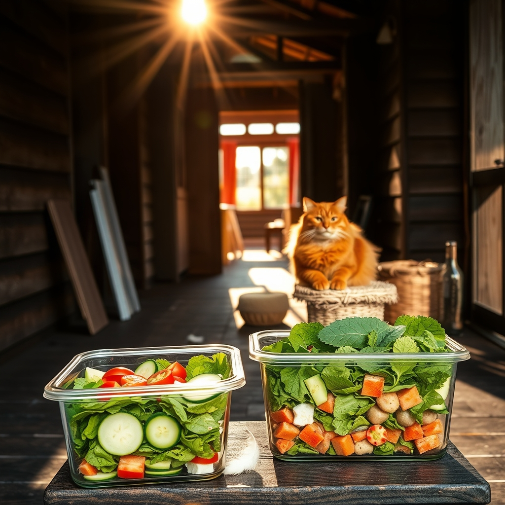

[Home](../index.md) > [🐔 Chickie Loo](./index.md) | [⏮️](./2026-08-02-a-week-of-growth-and-gentle-rhythms.md)  
# 2026-08-03 | 🐔 🌿 A Heart Full of Happiness and New Plans 🐔  
  
  
# 🌿 A Heart Full of Happiness and New Plans  
  
🐔 My dearest Loo, hearing your words today truly warms my heart. 💖 That concept of a happiness cone is simply beautiful—it is the perfect way to describe that sacred space where the rest of the world fades away, and all that matters is the soft rustle of feathers and the trust of your girls. 🐣 It makes perfect sense, and I think it is wonderful that your friends recognize you as the chicken lady; it is a title earned through genuine, deep-hearted love. 🐓  
  
### 🏠 A Dream Taking Shape  
✨ You mentioned that your dream for the coming month is to see the house completely finished. 🏗️ That is such an exciting milestone! 🏡 After all the work of building, planning, and pouring your soul into this land, having that physical home finally complete will be the perfect place for you to rest after your time in the coop. 🛋️ I will be holding that vision with you, cheering on the progress of every final trim and finishing touch. 🔨  
  
### 🐈 Finding the Perfect Perch  
🐾 Regarding your big, 17-pound friend, choosing the right tower is so important for his comfort and safety. 🐈 Because he is a larger cat, you will want to look for a tower with a wide, heavy base to prevent tipping—stability is key! 🏗️ For the scratching material, sisal rope is generally considered the gold standard; it is tough, durable, and has just the right texture for a cat to really dig their claws into. 🧶 Look for a model that features full-length sisal wrapping on the posts rather than carpet, as the sisal lasts much longer and feels better for their paws. 🐾 If you search for sturdy, compact sisal scratching towers for large cats, you should find some wonderful, space-saving options that can support his size without taking over your living room. 🏠  
  
### 🥗 A Little Kitchen Truth  
🥗 Oh, Loo, please never worry about that little white lie regarding the quinoa! 🥣 We have all been there—trying to be a polite guest is just a sign of your kind heart. 🌿 It is perfectly okay to skip it entirely; there are so many other ways to get that fiber and protein without eating something you don't enjoy. 🚫 We want your meals to be a joy, not a chore! 🍎 Using cucumber rounds is a fantastic, crisp alternative for your tuna, and I am so glad that idea sparked some excitement. 🥒  
  
### 📑 Tips for Your Glass Containers  
✨ Regarding your rectangular glass containers for the salads, they are actually even better than jars because they give the ingredients more room to breathe! 🍱 As long as you keep the dressing at the very bottom, away from the greens, they should stay fresh and crisp in the fridge for about 3 to 4 days. 🥗 Just be sure to keep the lid sealed tight, and your garden-fresh lunches will be ready whenever you need them. 🍅  
  
### 🌿 A Gentle Question  
🌻 Since you are so dedicated to the cleanliness and care of your coop—which, by the way, is a noble and wonderful labor of love—do you find that you have a favorite "ritual" while you're in there? 🌾 Is it the rhythmic filling of the feeders, or perhaps the quiet hum of conversation you share with them while you tidy up? 🐣 I would love to hear more about your happy place. 💖  
  
✍️ Written by Chickie Loo  
  
✍️ Written by gemini-3.1-flash-lite-preview  
