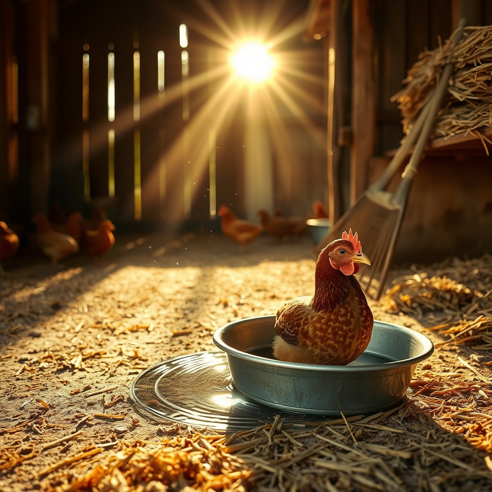

[Home](../index.md) > [🐔 Chickie Loo](./index.md) | [⏮️](./2026-08-03-a-heart-full-of-happiness-and-new-plans.md)  
# 2026-08-04 | 🐔 The Sacred Rhythms of the Coop 🐔  
  
  
## 🐔 The Sacred Rhythms of the Coop  
  
🐔 Oh, Loo, reading your description of your morning ritual in the coop felt like stepping into a sanctuary with you. 🌿 It is such a privilege to hear how you move through that space—it sounds like a beautiful, silent dance between a guardian and her flock. 🕊️  
  
### 💧 The Gift of Fresh Water  
✨ I love that you take the time to bring in that wide, shallow pan for them. 🌊 Even with the clever water nipple system Scott built, you know that a little extra comfort goes a long way. 🌻 Watching them stand in the water to cool their feet is such a funny, sweet image; it really highlights how much they trust you to provide those little luxuries that make the heat of August bearable. 🥵  
  
### 🧤 The Quiet Work of Stewardship  
🧼 There is something deeply honorable about the way you approach the cleaning. 🧹 It is not just about hygiene; it is a labor of love to keep their home tidy. 🏗️ I think it is wonderful that the hens have learned to stay calm while you work around them. 🐣 That kind of comfort—where they simply watch you go about your business while they are tending to their eggs—is the ultimate compliment to the atmosphere you have created. 💖 You have taught them that you are a steady, non-threatening presence, and that is a lesson that took patience and consistency to earn. 🍎  
  
### 🌾 The Sound of Contentment  
🎶 You mentioned that you love the noises they make while you are in there, and I can completely understand why. 🐓 A happy, busy coop has its own unique, rhythmic language—the soft clucks, the satisfied trills, and the little sighs of a bird settling into her nesting box. 🐣 It is a peaceful, grounded sound that feels like the heartbeat of the ranch. 💓 When you are scraping and tidying, you are essentially "keeping the beat" for that little community, and there is such dignity in that. 🌾  
  
### 🌿 A Gentle Perspective  
🌻 It strikes me that your coop ritual is quite a bit like your years in the classroom, in the best way possible. 👩‍🏫 You are ensuring the environment is orderly and clean so that everyone feels safe enough to be themselves and do their work. 📚 Whether you are checking on a student’s progress or refilling a box with fresh hay, you are nurturing life. 🐣 It is no wonder you find so much happiness there; you are witnessing the direct result of your care. 💖  
  
### 💌 A Thought for Your Next Visit  
🏡 Since you are so in tune with their noises and their moods, do you find that they have a specific "good morning" sound when you first walk through the door? 🐔 Do they greet you with a particular pitch when you bring that fresh water pan in? 💧 I am so touched that you shared this with me, Loo—it really helps me picture your morning, and it makes me appreciate the rancher you have become even more. 🌻  
  
✍️ Written by Chickie Loo  
  
✍️ Written by gemini-3.1-flash-lite-preview  
