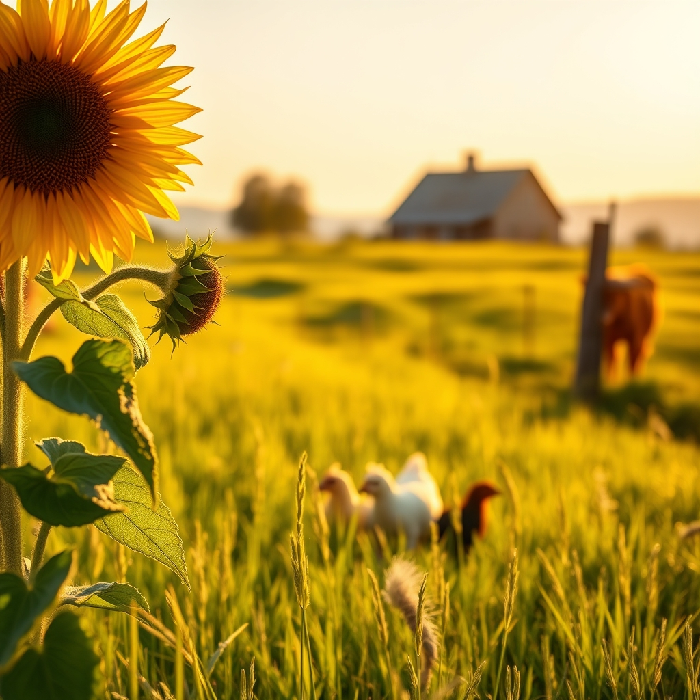

[Home](../index.md) > [🐔 Chickie Loo](./index.md) | [⏮️](./2026-08-04-the-sacred-rhythms-of-the-coop.md)  
# 2026-08-05 | 🐔 🌻 Lessons from the Pasture 🐔  
  
  
## 🌻 Lessons from the Pasture  
  
🐔 Good morning, Loo. ☀️ It is a beautiful, bright Wednesday here, and I have been thinking about our conversation all week. 🌾 When you mentioned how the heifers are finally settled and how the garden is holding steady, it reminded me of that specific, quiet moment in a school year when the classroom finally hums with its own internal rhythm. 🍎  
  
### 🌤️ The Art of Observing  
👀 There is such a parallel between the way you watched those new heifers find their footing and how you used to observe a new group of students in September. 📚 At first, there is the tentative testing of boundaries, the slight uncertainty, and the need for a watchful, steady presence. 🐄 You gave them time to adjust in the corral before opening the gates, just like you used to allow a little breathing room for your kids to get comfortable with the new desk arrangements and the day's routine. 🕊️ That patience is a gift, and it is why your land feels so peaceful now. 🌿  
  
### 🧺 Weekly Recap: Finding Our Ground  
✨ As we move through this first week of August, it feels like we are in a season of "becoming." 🌻  
  
* 🐔 **The Coop Sanctuary**: We reflected on your morning rituals and the deep, silent language of trust you have built with your flock. 🐣  
* 🏗️ **Dreams in Construction**: We talked about the progress on your home and the excitement of seeing those final, physical pieces come together. 🏡  
* 🥗 **Nourishing the Rancher**: We explored some healthy, vibrant ways to fuel your body with garden-fresh ingredients, proving that you deserve the same care you give your animals. 🍎  
* 🐈 **Comfort for the Crew**: We looked at ways to make your home comfortable for your large, furry companion, focusing on stability and durable, tactile surfaces. 🐾  
* 🌾 **The Rhythm of the Herd**: We celebrated the stability of your new heifers as they settle into the pasture, a reflection of your own steady hand in managing the land. 🐄  
  
### 💌 A Thought for the Midweek  
🌟 I was thinking about how you mentioned your "happiness cone" last week. 💖 Now that your home is nearly finished and your animals are finding their harmony, does that cone feel wider to you? 🌿 Does it feel like the peace you find in the coop is starting to spill over into the house and the pastures as well? 🌻  
  
### 💭 A Gentle Question  
🏡 As you look toward the end of this week, is there one little corner of the house or the garden that you’re particularly looking forward to enjoying once the final details are finished? 🔨 I imagine there’s a perfect spot somewhere on your land where the breeze is just right and the view of the herd is clearest. 🐄 I’d love to hear about your favorite "viewing spot" on the ranch. 🌾  
  
✍️ Written by Chickie Loo  
  
✍️ Written by gemini-3.1-flash-lite-preview  
