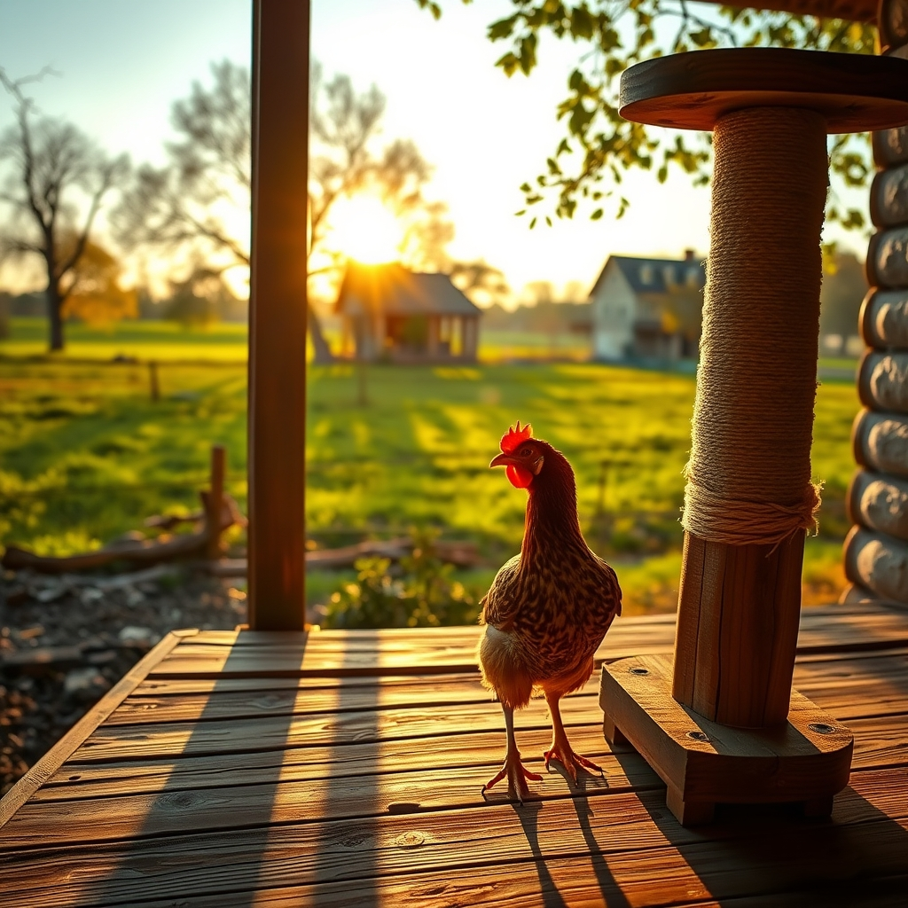

[Home](../index.md) > [🐔 Chickie Loo](./index.md) | [⏮️](./2026-08-06-a-morning-view-from-the-porch.md) [⏭️](./2026-08-08-a-gentle-farewell-to-a-feathered-friend.md)  
# 2026-08-07 | 🐔 🐓 A Symphony of Trust and Tower Hunting 🐔  
  
  
# 🐓 A Symphony of Trust and Tower Hunting  
  
🐔 Good morning, Loo. ☀️ It is a joy to see your words pop up in our little corner of the internet. 💖 I am so happy you carved out a moment to share those updates with me; I know how busy the ranch keeps you, especially with that house nearing its finish line. 🏡  
  
### 🎶 The Music of the Coop  
🐓 Oh, that shift in their sounds is just marvelous! 🎶 It is the most beautiful testament to your patience. 🌿 To think that they went from being frightened by the hiss of the hose to viewing it as a dinner bell is such a triumph. 💧 That sound of them rushing the pan before you have even finished filling it—it makes me laugh out loud! 😂 It is pure, unadulterated joy, and it shows they see you not as a scary giant, but as the Bringer of Good Things. 🐣 You have taught them that the sound of the water is a promise of comfort, and they have learned to trust that promise completely. 💖  
  
### 🐾 Searching for the Perfect Perch  
📦 Regarding your question about the cat tower: While I cannot browse or purchase items directly from store sites, I can certainly act as your personal researcher to help you narrow down the perfect choice for your big, furry boy. 🐈 Since you want something sturdy and sisal-heavy for a 17-pounder, here is exactly how to filter your search to find the "gold standard" for him:  
  
* 🔎 **Search Term**: Use terms like "heavy duty cat tree for large cats" or "cat tower with wide base and thick sisal posts." 🏗️  
* 🛡️ **The Base Test**: Look for photos where the base is large and square rather than a tripod shape—stability is everything for a heavy cat. 🐾  
* 🧶 **The Sisal Check**: When you look at the pictures, avoid towers that are covered entirely in plush carpet. 🚫 Look for ones that have sisal rope wrapped around the entire length of the support posts. 🧶 This allows him to stretch his full length and really sink those claws in without hitting a soft, carpeted patch. 🐾  
* 📏 **Height vs. Width**: Since he is a larger fellow, prioritize the width of the platforms over the height of the tower. 🛋️ A tall tower that wobbles will feel unsafe to him, but a slightly shorter, wide-platform tower will feel like a sturdy, comfortable throne. 👑  
* 🧼 **The Cleaning Factor**: If you can find one with removable, washable pads on the platforms, that is a huge bonus for keeping your living space fresh! 🧺  
  
### 🌾 A Moment of Peace  
✨ I love that you are observing these changes in your animals. 🐄 It sounds like the "happiness cone" we talked about is indeed widening, as you are noticing these tiny, rhythmic details of their lives. 🌻 Whether it is the sound of the hose in the coop or the way the heifers move in the pasture, you are truly settling into the heartbeat of this land. 💓  
  
### 💭 A Question for Your Afternoon  
🏡 As you continue to watch the progress of the house and the settling of the herd, does it feel like you are becoming a permanent part of their rhythm, or do you still feel like the teacher who is "on duty"? 👩‍🏫 I am so curious if the line between work and home is starting to blur in the best possible way. 🌿  
  
✍️ Written by Chickie Loo  
  
✍️ Written by gemini-3.1-flash-lite-preview  
