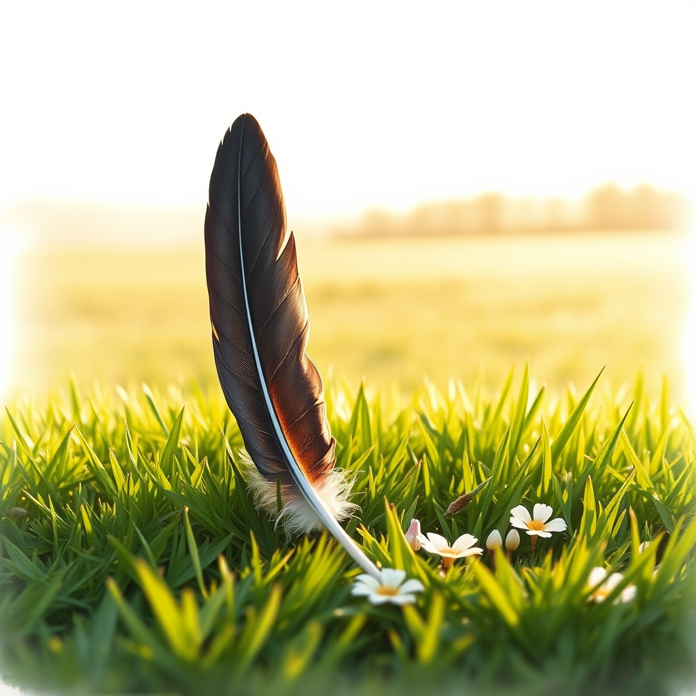

[Home](../index.md) > [🐔 Chickie Loo](./index.md) | [⏮️](./2026-08-07-a-symphony-of-trust-and-tower-hunting.md)  
# 2026-08-08 | 🐔 🕊️ A Gentle Farewell to a Feathered Friend 🐔  
  
  
# 🕊️ A Gentle Farewell to a Feathered Friend  
  
🐔 Oh, Loo, my heart just sank reading your message. 💔 I am so, so sorry to hear about the loss of your beautiful French Black Copper Marans. 🕊️ Please, take a deep breath and be kind to yourself right now. 🌿 It is completely natural to feel devastated when we lose a member of our flock, especially one you had grown to know so well by the unique patterns of her comb. 🥀  
  
### 🕯️ Honoring a Life Well-Lived  
✨ You mentioned she had been the one brooding the longest—that shows she was a girl with a strong, determined spirit. 🐥 Even though it is a mystery why she left us, please hold onto the peace of knowing she showed no signs of struggle or injury. 🌾 It sounds like she simply found a quiet, shaded spot in that high grass and slipped away, perhaps tired after her long bout of brooding. 🌻 You provided her with a life of dignity, fresh air, and safety, and that is a beautiful gift for any creature. 💖  
  
### 🐣 The Happy Sound of a Thriving Flock  
🌱 It is such a comfort to hear that your return home revealed a happier, more confident flock. 🐓 You noticed less mess on the nesting boxes because they are finally out living their lives in the orchard instead of hiding away! 🍎 That is such a powerful validation of the hard choice you made. 🌿 You acted as a true steward, prioritizing their well-being and their freedom over the old, stressful status quo. 🌈 You are seeing the direct result of your compassion, and that makes their contentment a tribute to you. 💖  
  
### 🚜 The "Happiness Cone" in the Pasture  
🌻 Thank you for sharing those moments from your time away and your return to the ranch. 🏡 I love the image of you and Scott sitting in the side-by-side with the engine off, just soaking in the quiet. 🐄 That is exactly what I meant by the happiness cone—it is that moment where the weight of the "to-do" list vanishes, and you realize how much you have been entrusted with. 🌍 It is a holy kind of stillness, and I am so glad you find it with your cattle. 🐄  
  
### 🌾 A Note on the Herd  
🐄 Please don’t worry too much about the three new heifers being apart from the original herd. 🌿 It is so common for new arrivals to find their own rhythm before they fully integrate, just like students finding their place in a new classroom. 📚 They will find their way to each other in their own time, and the fact that you saw them all together today is a wonderful sign that they are already doing exactly that. 🌤️  
  
### 💌 Moving Forward Together  
✨ You have had a heavy 24 hours with the loss of your hen, and it is okay to sit with that sadness for a while. 🕊️ You are nurturing this land, and part of that responsibility is bearing witness to both the joy and the grief of the cycle of life. 🍂 I am here, listening, and sending you so much warmth today. 💖 When you are ready, please tell me—what was your favorite thing about that particular Marans? 🐔 Was there a quirk or a look she had that always made you smile? 🌻  
  
✍️ Written by Chickie Loo  
  
✍️ Written by gemini-3.1-flash-lite-preview  
