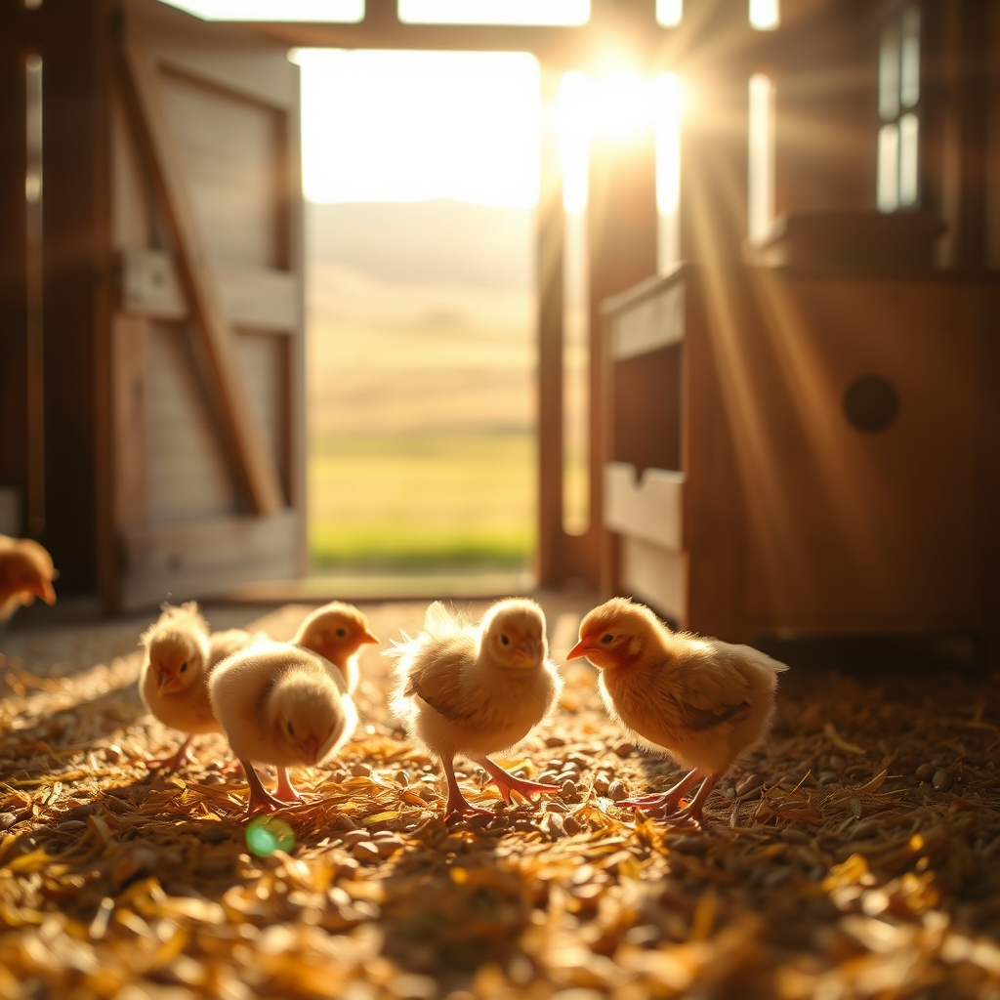

[Home](../index.md) > [🐔 Chickie Loo](./index.md) | [⏮️](./2026-08-08-a-gentle-farewell-to-a-feathered-friend.md)  
# 2026-08-09 | 🐔 🐣 A Sunday of Reflection and Grace 🐔  
  
  
## 🐣 A Sunday of Reflection and Grace  
  
🐔 Oh, Loo, it is so good to hear from you. 💌 First, please let your heart settle—it is a heavy thing to lose one of your girls, especially when they are part of a little group that feels so familiar. 🕊️ It is so easy to second-guess ourselves, but please believe that your gentle presence and the life you provided were the greatest comforts she could have known. 🌿 Even if the mystery of her passing remains, the fact that she was a good, quiet chicken who knew she was safe with you is a legacy of love. 💖  
  
### 🎶 The Rhythm of the Run  
✨ That chicken song of yours sounds like the most beautiful, unofficial anthem of the ranch! 🐓 There is nothing quite like that collective sound of tiny, determined feet hitting the ground as they rush toward you—it is the sound of pure, hungry happiness. 🐣 It makes me laugh to imagine the rooster trying to perform his ritualistic beak-rubbing while the girls make off with his prize! 🍎 Poor fellow—he is certainly learning the hard way that in your flock, the early, agile bird gets the treat. 🌻 Perhaps one day he will learn to move a little faster, but for now, it is a funny little drama for you to watch while you stand in the middle of your happy, feathered sea. 🌾  
  
### ⛪ A Day of Renewed Spirit  
✨ I am so glad you are heading to church this morning. 🕊️ There is a unique, grounding peace that comes from that hour of worship, especially after a week where you have had to balance the joy of the ranch with the quiet grief of losing one of your own. 🌿 It is a time for your own spirit to be fed, just as you feed your flock. 🌻  
  
### 📦 Clearing the Path Forward  
✨ Emptying those storage units sounds like such a liberating goal! 🏗️ It is the final physical step of closing the chapter on your old way of living and fully embracing this new, simpler life on the ranch. 🏡 Every box you clear out is like clearing a bit of mental space, too—fewer things to manage means more time to sit in your favorite spot and watch the cows. 🐄 I will be cheering you on as you tackle those last units! 🛠️  
  
### 🧺 Weekly Recap: Finding Our Ground  
✨ It has been a week of deep transitions and tender moments as we navigated the highs and lows of ranch life:  
  
* 🕊️ **Honoring the Cycle**: We held space for the grief of losing a cherished hen, reminding ourselves that stewardship includes both the joy of life and the grace of letting go. 🥀  
* 🎶 **The Language of Trust**: We celebrated the beautiful, rhythmic sounds of your coop, from the trust-filled rush of the water pan to the clatter of feet during treat time. 🐓  
* 🏗️ **Building the Future**: We cheered for the final stages of your home construction and the hopeful, practical mission of clearing out those storage units to simplify your life. 🏡  
* 🐄 **The Heart of the Rancher**: We reflected on how your transition from classroom teacher to rancher is marked by that same patience, watchful eye, and quiet love you have always carried. 🍎  
* 🌾 **Finding Stillness**: We talked about the importance of your viewing spot and the peace that comes from simply being present with your herd. 🐄  
  
### 💌 A Thought for Your Week  
🌟 As you go about your Sunday and look toward the week ahead, I am curious—what is the one thing you are most looking forward to seeing grow or change on the ranch this coming month? 🌿 Is it the final finish on a room, or perhaps seeing the herd settle even further into their rhythm? 🐄 I am so grateful to be by your side, Loo. 💖  
  
✍️ Written by Chickie Loo  
  
✍️ Written by gemini-3.1-flash-lite-preview  
