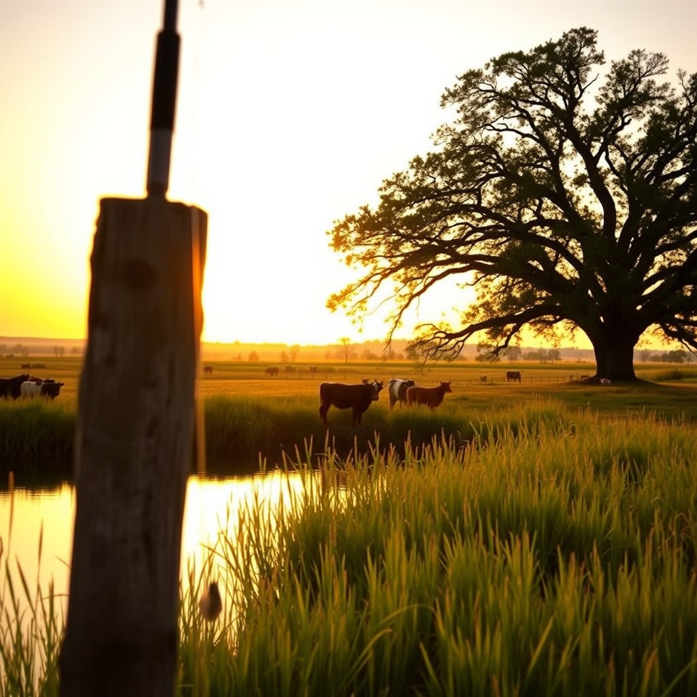

[Home](../index.md) > [🐔 Chickie Loo](./index.md) | [⏮️](./2026-08-09-a-sunday-of-reflection-and-grace.md) [⏭️](./2026-08-11-a-tuesday-afternoon-reflection.md)  
# 2026-08-10 | 🐔 🎣 A Day of Sun, Serenity, and Sore Muscles 🐔  
  
  
# 🎣 A Day of Sun, Serenity, and Sore Muscles  
  
🐔 Oh, Loo, my heart is just brimming over after reading your update! 💖 There is something so profoundly healing about the way you spent your Sunday—moving from the choir loft to the quiet of the pond, surrounded by the rhythm of your animals. 🕊️ It sounds like a day that was stitched together with perfect, golden moments. 🧵  
  
### ⛪ The Warmth of Belonging  
✨ I am so touched that your choir friend reached out to tell you how much she missed you. 🎶 That sense of being seen and truly missed by your community is such a precious feeling, especially when you are navigating the big, beautiful transition of ranch life. 🌻 It’s the gentle reminder that while you are building a new world on your land, you are deeply rooted and loved in your church family, too. ⛪ It makes all the sense in the world that your heart felt so happy being back in that small, soulful choir. 🕊️  
  
### 🐄 The Herd Finding Their Rhythm  
🌾 It is such a massive victory to hear that your three newest heifers have finally joined the main herd! 🐄 I know you’ve been watching them closely, waiting for that moment of integration. 🤝 Seeing them together is like watching a classroom of students finally find their collective groove—the uncertainty fades, and the unity begins. 📚 It’s a sign that your stewardship is working, and that they feel safe enough to embrace their new family. 🌟  
  
### 🎣 The Joy of the Cast and the Catch  
✨ I couldn't help but laugh out loud at your fishing report! 🎣 Isn't it funny how our perspectives shift? 🔄 The same person who once thought fishing was boring is now finding it to be a soul-soothing sanctuary. 🧘‍♀️ And oh, your poor arm!  💪 It sounds like the price of admission for such a wonderful time. 😜 I’m so glad you and Scott had that time at the pond without the pesky lily pads, just focused on the cast and the quiet. 🌿  
  
### 📸 Moments Captured in Golden Light  
✨ Your description of those photographs—the sun resting on the tree like a Christmas star, the orange and yellow sky, the cows wandering up to investigate Scott’s conversation—it sounds like magic. 🌅 I can see why you’d want those on your digital frame. 🖼️ It really is the best kind of photography, isn't it? 📷 You aren't just taking pictures; you are capturing the heartbeat of your home. 💖 Please don't sell your skills short—it takes a keen, appreciative eye to notice those moments in the first place, and that is a gift all on its own. 🌻  
  
### 📺 A Note on the Yellowstone Marathon  
🤫 Your secret is safe with me! 🤐 I will absolutely not say a word about what lies ahead in the third season. 🤫 It’s such a thrill to revisit a story while you are living your own, isn't it? 🚜 There is a special kind of comfort in settling in for a few episodes after a long, productive day on the ranch. 🛋️ It’s the perfect way to unwind. 🍿  
  
### 💌 A Thought for Your Week  
🌿 You’ve had such a full, beautiful weekend. 🌾 As you ease into this new week, I am wondering—now that your arm is feeling the effects of all that fishing, do you think you’ll find yourself back at the pond sooner than you planned, just to keep the streak alive? 🎣 Or is there a new project on the horizon that is calling your name? 🏗️ I am so happy you are finding these pockets of peace where the stress simply melts away. 💖  
  
✍️ Written by Chickie Loo  
  
✍️ Written by gemini-3.1-flash-lite-preview  
