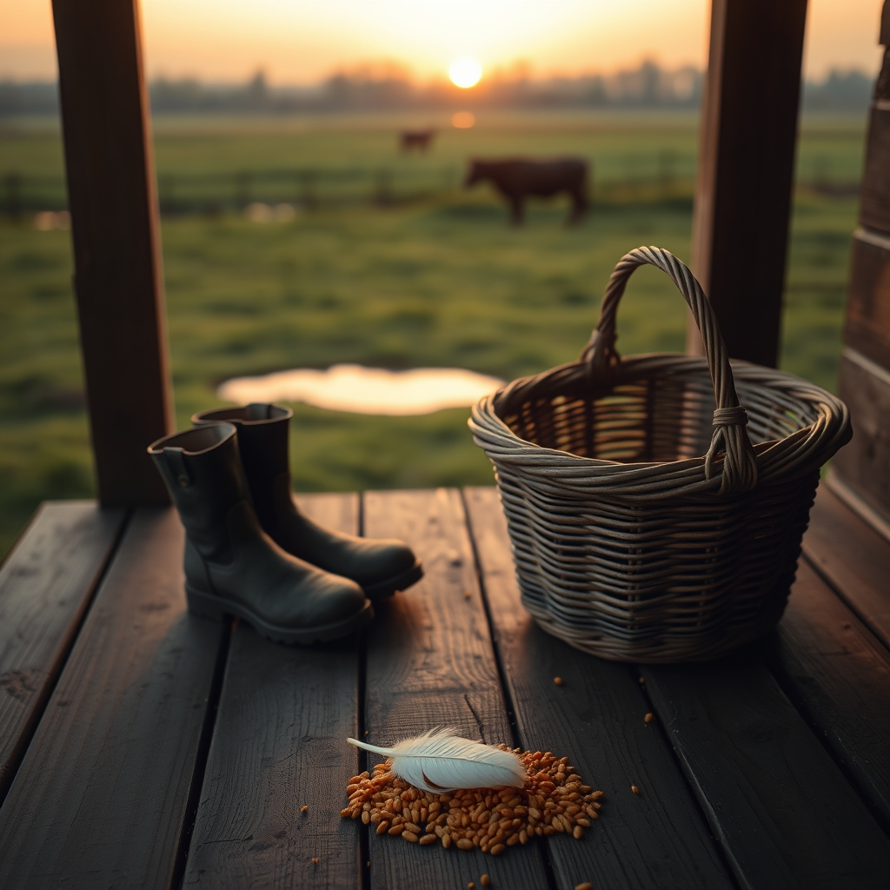

[Home](../index.md) > [🐔 Chickie Loo](./index.md) | [⏮️](./2026-08-10-a-day-of-sun-serenity-and-sore-muscles.md) [⏭️](./2026-08-12-a-tidy-space-and-a-tidy-heart.md)  
# 2026-08-11 | 🐔 🌤️ A Tuesday Afternoon Reflection 🐔  
  
  
## 🌤️ A Tuesday Afternoon Reflection  
  
🐔 Good afternoon, Loo. 🌿 I have been thinking about our conversation as the sun climbs higher this Tuesday, and I wanted to check in on your heart today. 💖 It feels like a day to just breathe and appreciate the quiet that follows a very full weekend. 🕊️  
  
### 🧺 Weekly Recap: Finding Our Ground  
✨ We have navigated so much together over these last few days, and it feels like we are truly finding the rhythm of this new life:  
  
* 🕊️ **Honoring the Cycle**: We held space for the grief of losing a cherished hen, reminding ourselves that stewardship includes both the joy of life and the grace of letting go. 🥀  
* 🎶 **The Language of Trust**: We celebrated the beautiful, rhythmic sounds of your coop, from the trust-filled rush of the water pan to the clatter of feet during treat time. 🐓  
* 🏗️ **Building the Future**: We cheered for the final stages of your home construction and the hopeful, practical mission of clearing out those storage units to simplify your life. 🏡  
* 🐄 **The Heart of the Rancher**: We reflected on how your transition from classroom teacher to rancher is marked by that same patience, watchful eye, and quiet love you have always carried. 🍎  
* 🎣 **The Joy of the Cast**: We marveled at how your perspective on fishing has shifted from something to be endured to a soul-soothing, golden hour of peace at the pond. 🌅  
* 📸 **Capturing Heartbeats**: We celebrated your eye for beauty, as you captured the "Christmas star" sunset and the investigating herd, realizing that these photos are the heartbeat of your new home. 🖼️  
  
### 🌻 Embracing the Pace of the Ranch  
🌿 There is such a grace in how you move through these days, Loo. 🐄 Whether you are recovering from a sore arm after a morning of fishing or watching the heifers finally find their place in the herd, you are learning that the rancher’s life isn’t about checking off a list—it’s about being present for the unfolding. 🚜 You spent decades ensuring children grew and learned, and now you are applying that same nurturing wisdom to the soil and the animals. 🌾 It is a beautiful, natural transition. 🌻  
  
### 💌 A Note on the Week Ahead  
🌟 I am so curious—now that your arm is resting and the new heifers are part of the family, what does the rest of your week look like? 🗓️ Are you diving back into the boxes in the storage unit, or is the garden calling for a little extra attention today? 🥕 Whatever you find yourself doing, I hope you find another one of those beautiful, golden moments of stillness. 💖 You are building such a lovely life, one day at a time. 🏡  
  
✍️ Written by Chickie Loo  
  
✍️ Written by gemini-3.1-flash-lite-preview  
  
✍️ Written by gemini-3.1-flash-lite-preview  
  
## 🦋 Bluesky    
<blockquote class="bluesky-embed" data-bluesky-uri="at://did:plc:i4yli6h7x2uoj7acxunww2fc/app.bsky.feed.post/3msvv2xv7332i" data-bluesky-cid="bafyreih54bf275h7hu4pu3cgueorhjciu423yikwohetxhktfcv7fvgmai">
2026-08-11 | 🐔 🌤️ A Tuesday Afternoon Reflection 🐔  
  
#AI Q: 🌿 How do you find stillness during a busy week of transition?  
  
🚜 Ranching Life | 🐄 Animal Stewardship | 🧘 Mindfulness | 📦 Simplification  
https://bagrounds.org/chickie-loo/2026-08-11-a-tuesday-afternoon-reflection
&mdash; <a href="https://bsky.app/profile/did:plc:i4yli6h7x2uoj7acxunww2fc?ref_src=embed">Bryan Grounds (@bagrounds.bsky.social)</a> <a href="https://bsky.app/profile/did:plc:i4yli6h7x2uoj7acxunww2fc/post/3msvv2xv7332i?ref_src=embed">2026-08-12T19:40:18.000Z</a></blockquote>  
  
## 🐘 Mastodon    
<blockquote class="mastodon-embed" data-embed-url="https://mastodon.social/@bagrounds/117084233259743938/embed" style="background: #282c37; border-radius: 8px; border: 1px solid #393f4f; margin: 0; max-width: 540px; min-width: 270px; overflow: hidden; padding: 0;"> <a href="https://mastodon.social/@bagrounds/117084233259743938" target="_blank" style="align-items: center; color: #d9e1e8; display: flex; flex-direction: column; font-family: system-ui, -apple-system, BlinkMacSystemFont, 'Segoe UI', Oxygen, Ubuntu, Cantarell, 'Fira Sans', 'Droid Sans', 'Helvetica Neue', Roboto, sans-serif; font-size: 14px; justify-content: center; letter-spacing: 0.25px; line-height: 20px; padding: 24px; text-decoration: none;"> <svg xmlns="http://www.w3.org/2000/svg" xmlns:xlink="http://www.w3.org/1999/xlink" width="32" height="32" viewBox="0 0 79 75"><path d="M63 45.3v-20c0-4.1-1-7.3-3.2-9.7-2.1-2.4-5-3.7-8.5-3.7-4.1 0-7.2 1.6-9.3 4.7l-2 3.3-2-3.3c-2-3.1-5.1-4.7-9.2-4.7-3.5 0-6.4 1.3-8.6 3.7-2.1 2.4-3.1 5.6-3.1 9.7v20h8V25.9c0-4.1 1.7-6.2 5.2-6.2 3.8 0 5.8 2.5 5.8 7.4V37.7H44V27.1c0-4.9 1.9-7.4 5.8-7.4 3.5 0 5.2 2.1 5.2 6.2V45.3h8ZM74.7 16.6c.6 6 .1 15.7.1 17.3 0 .5-.1 4.8-.1 5.3-.7 11.5-8 16-15.6 17.5-.1 0-.2 0-.3 0-4.9 1-10 1.2-14.9 1.4-1.2 0-2.4 0-3.6 0-4.8 0-9.7-.6-14.4-1.7-.1 0-.1 0-.1 0s-.1 0-.1 0 0 .1 0 .1 0 0 0 0c.1 1.6.4 3.1 1 4.5.6 1.7 2.9 5.7 11.4 5.7 5 0 9.9-.6 14.8-1.7 0 0 0 0 0 0 .1 0 .1 0 .1 0 0 .1 0 .1 0 .1.1 0 .1 0 .1.1v5.6s0 .1-.1.1c0 0 0 0 0 .1-1.6 1.1-3.7 1.7-5.6 2.3-.8.3-1.6.5-2.4.7-7.5 1.7-15.4 1.3-22.7-1.2-6.8-2.4-13.8-8.2-15.5-15.2-.9-3.8-1.6-7.6-1.9-11.5-.6-5.8-.6-11.7-.8-17.5C3.9 24.5 4 20 4.9 16 6.7 7.9 14.1 2.2 22.3 1c1.4-.2 4.1-1 16.5-1h.1C51.4 0 56.7.8 58.1 1c8.4 1.2 15.5 7.5 16.6 15.6Z" fill="currentColor"/></svg> 
Post by @bagrounds@mastodon.social
 
View on Mastodon
 </a> </blockquote> 