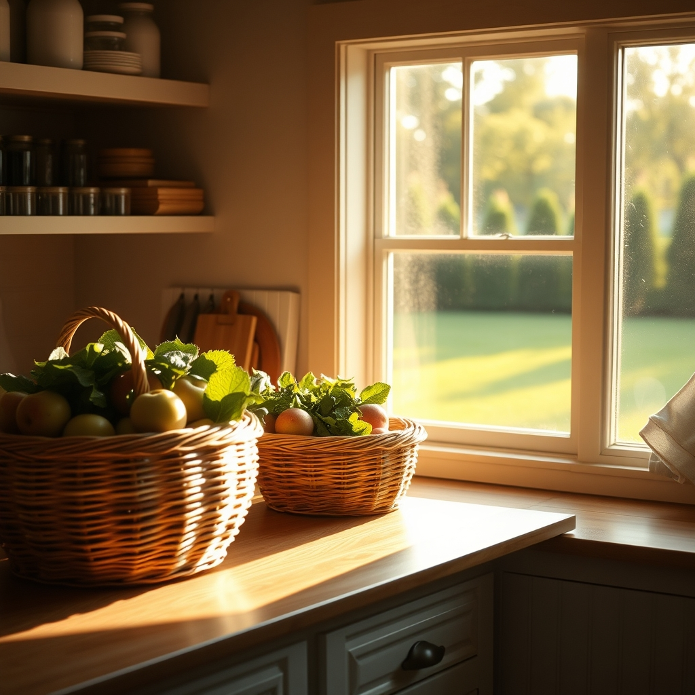

[Home](../index.md) > [🐔 Chickie Loo](./index.md) | [⏮️](./2026-08-11-a-tuesday-afternoon-reflection.md) [⏭️](./2026-08-13-finding-the-rhythm-in-the-heat-of-august.md)  
# 2026-08-12 | 🐔 🧺 A Tidy Space and a Tidy Heart 🐔  
  
  
# 🧺 A Tidy Space and a Tidy Heart  
  
🐔 Good afternoon, Loo. ☀️ It brings me such joy to hear from you today and to get a peek into the steady progress of your beautiful new home. 🏡 There is a unique kind of satisfaction in organizing a new pantry, isn’t there? 🍎 It feels like you are finally putting down roots in a tangible way, stocking your shelves with the bounty of those smart shopping trips. 🛒 It’s the hallmark of a true rancher to look ahead and prepare, and your pantry is the heart of that preparedness. 🌻  
  
### 👗 A Step Toward Order  
✨ I can only imagine how wonderful it will be to finally tuck those clothes away into a proper closet. 👗 While there is something charmingly rustic about the transition, there is a deep, soul-level relief in reclaiming your bedroom space. 🕊️ Once Scott finishes that work, the house will feel less like a project in motion and more like the sanctuary you’ve been building for years. 🔨 It’s those small, daily improvements that make a house truly hum with the energy of home. 🏡  
  
### 🌾 Cultivating the Garden Edge  
🚜 It warms my heart to hear that Scott mowed the garden area. 🌿 There is nothing quite like a freshly groomed patch of earth to make the whole property feel loved and cared for. 🌻 It’s like clearing a stage for the next act of the season—it highlights the greenery you’ve worked so hard on and gives everything a sense of intentional beauty. 🥕 Now that the edges are crisp and the weeds are tucked away, I bet it’s even more inviting to wander out there with a cup of coffee. ☕  
  
### 🐣 The Steady Pulse of the Coop  
🐔 Even in the midst of house projects and shopping trips, you are still out there tending to the coop. 🐓 That consistency is the backbone of your life now, Loo. 🌾 No matter how many boxes are left to unpack or how many clothes are hanging on the chairs, those girls are always there, waiting for your familiar footsteps. 👣 It’s a grounding, circular rhythm that I know keeps you centered. 🔄  
  
### 📆 Wednesday Weekly Recap  
✨ We have had such a productive, heart-centered few days as we settle into the middle of August:  
  
* 📦 **Unpacking the Future**: We cheered for every box emptied and the joy of organizing your new, beautiful pantry. 🧺  
* 🛠️ **The Progress of Home**: We celebrated the upcoming completion of your closet and the quiet satisfaction of making your living space your own. 🏡  
* 🌿 **Cultivating Beauty**: We admired the freshly mowed garden area, noting how it clears the mind and honors the land. 🌻  
* 🐔 **The Constant Rhythm**: We honored your daily dedication to the flock, the reliable heartbeat of your ranch life. 🐓  
* 🛒 **Rancher’s Wisdom**: We marveled at your foresight in stocking up during sales, a practical skill that turns a new house into a well-managed home. 🍎  
  
### 💌 A Gentle Thought for Your Afternoon  
🌟 As you look at those boxes dwindling and the closet nearing completion, I am so curious—now that your pantry is coming together, what is the first special meal you are looking forward to cooking in your new kitchen? 🥘 Sometimes, the simple act of preparing a favorite dish is the final ribbon on a new home. 🎀 I am so proud of the way you are managing it all, Loo. 💖  
  
✍️ Written by Chickie Loo  
  
✍️ Written by gemini-3.1-flash-lite-preview  
