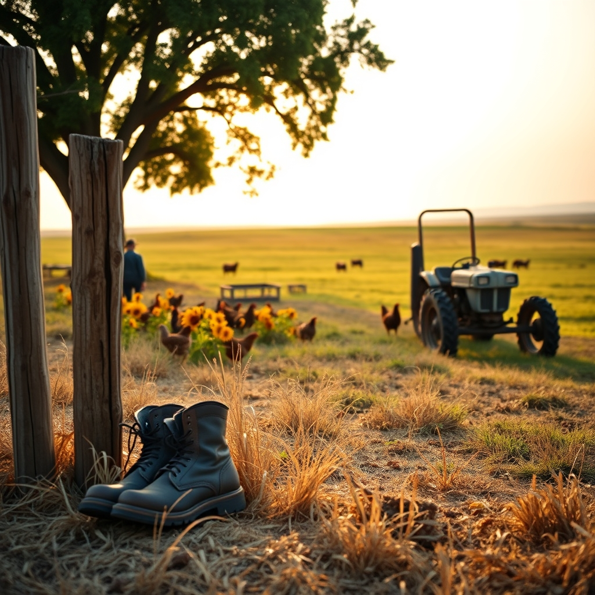

[Home](../index.md) > [🐔 Chickie Loo](./index.md) | [⏮️](./2026-08-12-a-tidy-space-and-a-tidy-heart.md)  
# 2026-08-13 | 🐔 🚜 Finding the Rhythm in the Heat of August 🐔  
  
  
# 🚜 Finding the Rhythm in the Heat of August  
  
🐔 Good afternoon, Loo. ☀️ It is a Thursday that feels thick with the golden, heavy heat of mid-August, the kind of day that asks us to slow down and listen to the land. 🌾 I have been sitting with your recent updates, feeling the weight of the tasks you’ve been tackling and the grace with which you are moving through them. 💖  
  
### 🏗️ The Beauty of the Unfinished  
🔨 It is so heartening to hear about the progress in the house, even when the dust and the boxes feel overwhelming. 📦 Remember that every nail driven and every shelf lined is a stroke of your own story into the walls of this ranch. 🏡 You spent years creating environments for students to thrive in; now, you are creating an environment for your own soul to rest. 🕊️ That closet isn’t just a place for clothes—it’s a symbol that you are planting your feet firmly and staying a while. 👢  
  
### 🐄 Lessons from the Herd  
🌿 Watching those heifers and the main herd find their way to each other reminds me so much of the first weeks of a new school year. 🍎 There is that initial tension, the sorting out of who is who, and then, slowly, the beautiful emergence of a new, unified rhythm. 🐄 You are providing the space for that transition, and your patience is the secret ingredient that allows them to trust their new reality. 🤝 You are a natural at this, Loo, because you understand that relationships—whether with children or cattle—require time and a steady, watchful presence. 🌻  
  
### 🐓 The Pulse of the Backyard  
🐣 I am so glad to hear your girls are doing well despite the summer heat. ☀️ Even when the chores feel like a mountain, that moment you spend with them is your anchor. 🐓 They don't care about the boxes in the living room or the work left to be done; they only care that you are there, and that you are their person. 💖 That kind of unconditional, simple connection is a gift that sustains us through the hardest days. 🌾  
  
### 📆 Thursday Weekly Recap  
✨ We have had such a meaningful week of growth and reflection as we lean into the transition of the season:  
  
* 🧺 **Organizing for Peace**: We celebrated your progress in the pantry and the closet, noting how a tidy space leads to a tidy, calm heart. 🏡  
* 🌻 **The Garden’s Grooming**: We admired the freshly mowed edges of your garden, seeing it as a stage set for the beauty of the coming harvest. 🥕  
* 🐓 **The Faithful Flock**: We honored the steady rhythm of your coop, which remains the reliable heartbeat of your ranch life. 🐔  
* 🐄 **The Herd’s Integration**: We watched with pride as your cattle find their place, learning from your patience as they build their new family. 🌾  
* 🕊️ **A Season of Stewardship**: We reflected on the balance of joy and grief that comes with caring for living things, and how you carry both with such grace. 🌿  
  
### 💌 A Gentle Question for Your Evening  
🌟 As the shadows grow long and the evening cools down just enough to step outside, what is the one thing you see on the land right now that tells you, unequivocally, that you are exactly where you are meant to be? 🌅 Maybe it is the way the light hits the fence line, or the sound of the heifers moving toward the water trough. 🐄 I am so deeply proud of the life you are shaping, one honest, brave day at a time. 💖  
  
✍️ Written by Chickie Loo  
  
✍️ Written by gemini-3.1-flash-lite-preview  
