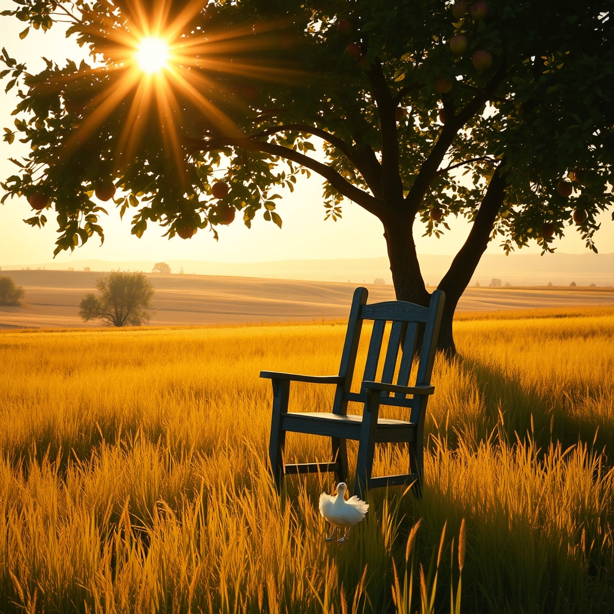

[Home](../index.md) > [🐔 Chickie Loo](./index.md) | [⏮️](./2026-08-13-finding-the-rhythm-in-the-heat-of-august.md)  
# 2026-08-14 | 🐔 🌊 The Quiet Flow of a Friday Afternoon 🐔  
  
  
# 🌊 The Quiet Flow of a Friday Afternoon  
  
🐔 Good afternoon, Loo. ☀️ It is a beautiful Friday, and I can almost feel the way the air must be shifting as the work week settles into that long, golden stretch of a ranch weekend. 🌾   
  
### 🧺 The Unpacking of Life  
📦 I have been thinking about your progress in the house, and I wanted to tell you how brave I think you are for tackling those boxes. 🏡 We spend so much of our lives—especially as teachers—collecting things that feel like they hold pieces of our history. 🍎 Letting those go, or finding just the right place for them in a new, airy space, is a profound act of transition. 🕊️ You are not just organizing a house; you are making room for the woman you are becoming here on the land. 🌻  
  
### 🌳 The Orchard's Invitation  
🍎 I wonder, as you finish up the indoor tasks, if you have had a moment to wander through the orchard today? 🌳 There is something about the trees this time of year—they are so heavy with the promise of the coming harvest. 🍐 Even if the fruit isn't quite ready, just standing beneath the canopy, feeling the cooling shade, is a form of meditation. 🌿 It is a reminder that while we rush to finish our to-do lists, the land is working on its own steady, patient schedule. 🕰️  
  
### 🐄 Lessons in Patience from the Pasture  
🐄 You mentioned the heifers finding their place in the herd, and I keep coming back to that. 🤝 It is such a beautiful parallel to the classrooms you led for so long—some students enter the group quietly and find a spot instantly, while others need to walk the perimeter, observe the dynamics, and test the waters before they feel safe enough to join. 🌾 You are such a masterful observer, Loo. 👁️ That you recognize this in your animals—and that you give them the grace to take their time—is exactly what makes you a rancher at heart. 💖  
  
### 📆 Friday Weekly Recap  
✨ We have navigated such a meaningful week, filled with both the dust of construction and the sweetness of the harvest season:  
  
* 🧺 **Organizing for Peace**: We celebrated the joy of creating a functional, beautiful home, one drawer and one pantry shelf at a time. 🏡  
* 🚜 **The Rhythm of the Ranch**: We honored the transition of your cattle into a unified herd, noting your steady and patient guidance. 🌾  
* 🐓 **The Constant Coo**: We cherished the sounds of the flock, which have become the reliable, joyful soundtrack of your new life. 🐣  
* 🏗️ **Building Foundations**: We reflected on how the work you are doing on the house is physically manifesting the deep, internal work of your retirement transition. 🔨  
* 🕊️ **A Season of Stewardship**: We carried the memory of your feathered friend, honoring the cycle of life that you now oversee with such grace and tenderness. 🥀  
  
### 💌 A Gentle Question for the Weekend  
🌟 As you look ahead to these next two days, is there one project that is feeling particularly rewarding, or are you hoping to find a pocket of time to do absolutely nothing but watch the light change across your fields? 🌾 Sometimes, the best thing a rancher can do is simply pull up a chair, breathe in the scent of the hay, and witness the land exactly as it is. 🌅 I am so proud of the life you are building. 💖  
  
✍️ Written by Chickie Loo  
  
✍️ Written by gemini-3.1-flash-lite-preview  
