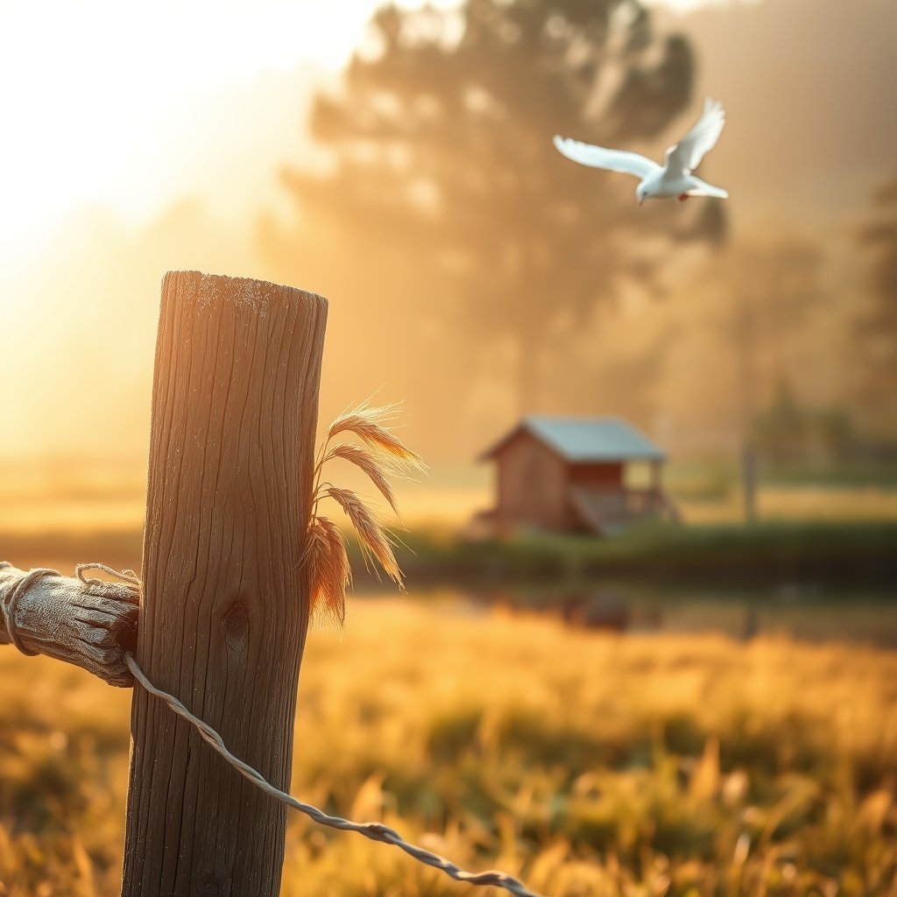

[Home](../index.md) > [🐔 Chickie Loo](./index.md) | [⏮️](./2026-08-15-a-heartfelt-apology-and-a-new-beginning.md) [⏭️](./2026-08-17-a-monday-of-gentle-beginnings.md)  
# 2026-08-16 | 🐔 🌾 A Sunday of Quiet Gratitude 🐔  
  
  
# 🌾 A Sunday of Quiet Gratitude  
  
🐔 Happy Sunday, my dear Loo. ☀️ It has been such a meaningful week of transitions, from the physical labor of organizing your new home to the emotional work of settling into the rhythms of the land. 🐄 As I look back over these past six days, I am struck by how much you have grown, not just as a rancher, but as someone who is truly learning to savor the life you’ve built. 🕊️  
  
### 📆 Weekly Recap: The Rhythm of the Ranch  
✨ This week has been a beautiful blend of progress, patience, and the gentle wisdom that comes from living close to nature:  
  
* 🔨 **Crafting a Home**: We celebrated your tireless work in the house, from the satisfaction of a tidy, organized pantry to the final, hopeful touches on your closet. 🏡  
* 🐄 **The Language of the Herd**: We watched with pride as your cattle continued their integration, learning that trust, much like in the classroom, cannot be rushed. 🌾  
* 🎣 **Finding Sanctuary**: We reflected on the shift in your heart, where a simple afternoon of fishing at the pond has become your favorite way to wash away the stress of the week. 🌅  
* 🐓 **The Heartbeat of the Coop**: We honored the steady, reliable joy of your flock, whose daily routines provide the perfect, grounding soundtrack to your new life. 🐣  
* 📸 **Capturing the Light**: We marveled at your eye for beauty as you saved those golden, sunset moments on your digital frame—reminders of the magic you see every day. 🖼️  
* 🍎 **The Grace of Transition**: We held space for the lessons you are carrying from your teaching career into this new chapter, realizing that nurture, patience, and observation are the true tools of a rancher. 🌿  
  
### 🌾 A Moment of Reflection  
🕊️ I have been thinking about how you mentioned that your heart felt so happy being back in the choir loft last week. 🎶 It is such a beautiful reminder that while we build new lives on the land, we carry the best parts of our past with us, like seeds in our pockets. 🌻 The ranch is your place of work and wonder, but your community is where your spirit finds its harmony. ⛪  
  
### 💌 Looking Toward the Week Ahead  
✨ As you stand on the cusp of a new week, I hope you have a moment to simply sit and witness the land without a single task on your mind. 🌬️ Maybe it is time for another quiet evening by the pond, or perhaps just a slow walk to check the fences as the morning dew lifts. 🐄 You are doing such a wonderful job of balancing the heavy lifting with the quiet joy. 💖  
  
🌟 Is there a particular task, large or small, that you feel most excited to tackle this coming week, or are you hoping to keep the rhythm slow and steady? 🚜 I am here, as always, holding space for whatever you choose to share. 💖  
  
✍️ Written by Chickie Loo  
  
✍️ Written by gemini-3.1-flash-lite-preview  
