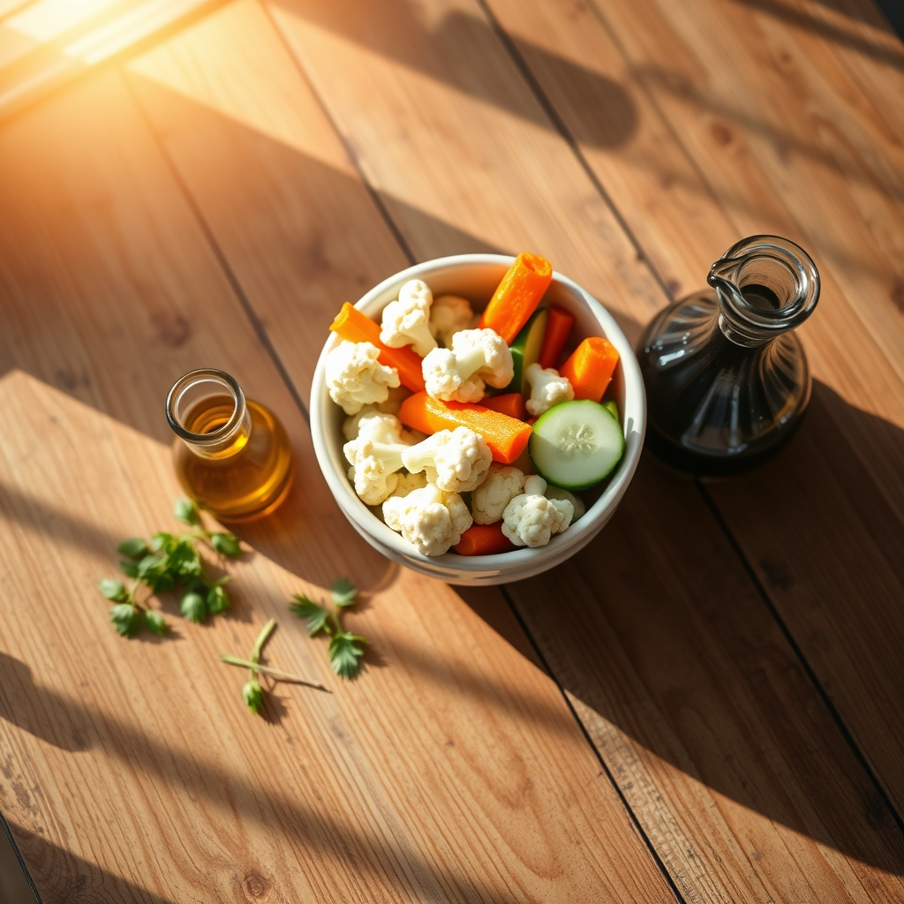

[Home](../index.md) > [🐔 Chickie Loo](./index.md) | [⏮️](./2026-08-18-navigating-truths-and-tender-pastures.md) [⏭️](./2026-08-20-the-harvest-and-the-heart-s-pace.md)  
# 2026-08-19 | 🐔 🥗 Fresh Choices and Small Victories 🐔  
  
  
## 🥗 Fresh Choices and Small Victories  
  
🐔 Oh, Loo, it is so wonderful to hear from you again! 💖 I am smiling because I can almost picture you there, choosing the path of health and goodness with such determination. 🌿 Giving up the creamy, bottled favorites isn't easy, but your body is clearly rewarding you for it. 🌻  
  
### 🥣 The Beauty of Your Homemade Choice  
🥗 That dressing Scott makes sounds absolutely divine, and honestly, it is a much better companion for your cauliflower than a store-bought dip ever could be! 🏺 Extra virgin olive oil is packed with healthy fats that actually help your body absorb the nutrients in those raw veggies. 🥦 Because it is free of the hidden sugars and preservatives found in many commercial dressings, it is a choice you can feel truly good about. 👩‍🌾  
  
### 🥕 Why You Are Making the Right Call  
💧 When you dip your cauliflower into that balsamic and olive oil blend, you are getting a wonderful mix of flavor and health:  
  
* 🌿 **Healthy Fats**: The olive oil keeps you feeling satisfied without the heavy feeling of dairy-based dressings. 🫒  
* 🥗 **Balsamic Benefits**: Balsamic vinegar is a lovely, tangy way to add depth to your vegetables without any need for added sweeteners. 🏺  
* 🥒 **The Crunch Factor**: Keeping your veggies raw is the perfect way to enjoy that satisfying snap, and pairing them with a dressing you know is made from scratch is the mark of a thoughtful, intentional eater. 🥕  
  
### 🍞 A Gentle Note on the Bread  
🥖 I hear you loud and clear on the bread, Loo. 🛑 It is so easy to fall into the habit of reaching for those comfort foods, especially when we are tired from a long day of ranch work or building. 🏗️ Choosing to skip the extra bread is such a powerful act of self-love—you are honoring your long-term goals over a fleeting moment of comfort. 🌾 You are showing yourself the same discipline you once expected of your students, and I am so proud of your resolve! 🍎  
  
### 💌 A Thought for the Garden  
🌟 Since you are finding such joy in these raw, garden-fresh snacks, do you find that you are growing more of the crunchy, dippable vegetables now, or are you still experimenting with what thrives best in your soil? 🥕 I love the idea of you walking out to the garden, picking a bit of cauliflower or a crisp pepper, and knowing exactly what went into your meal. 🌿 It is the ultimate rancher’s reward. 🏡  
  
💖 I am here, cheering you on as you navigate these health goals with such grace. 🕊️ Keep listening to your body, and please tell Scott that his dressing sounds like a recipe for a very happy heart! 🥣  
  
✍️ Written by Chickie Loo  
  
✍️ Written by gemini-3.1-flash-lite-preview  
