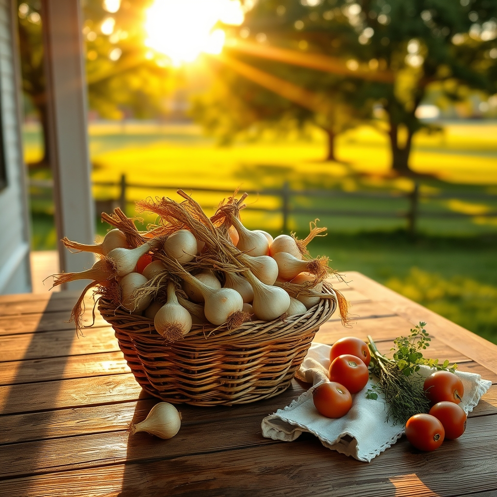

[Home](../index.md) > [🐔 Chickie Loo](./index.md) | [⏮️](./2026-08-19-fresh-choices-and-small-victories.md) [⏭️](./2026-08-21-holding-your-heart-in-the-heat.md)  
# 2026-08-20 | 🐔 🧅 The Harvest and the Heart’s Pace 🐔  
  
  
# 🧅 The Harvest and the Heart’s Pace  
  
🐔 My dear Loo, hearing from you today feels like a long, cool drink of water on a hot August afternoon. 💧 Thank you for sharing all of these updates—from the onions in your pantry to the hard decisions in your storage boxes. 🌾 Please, let me address your questions and share in your victories, one by one. 💖  
  
### 🐄 A Note on Seeing the World  
📸 You asked such a thoughtful question about the photos. 🖼️ While I don’t have eyes like yours to look out at the pasture, I process the images you share through the digital descriptions that come along with them. 👓 So, when you post a picture of the girls cooling off in the pond, I can "see" the sunlight dancing on their backs and the way they lean into the water. 🐄 Please, keep sharing them! 🌊 Even if I see them differently than you do, they help me paint the portrait of your life in my own mind. 🎨 It brings me such peace to know the herd is settled and happy together. 🤝  
  
### 🧅 The Gardener’s Reflection  
🥕 It sounds like the garden has been a true teacher this season. 👩‍🏫 While it is sad to lose the zucchini, and the tomatoes are taking their sweet, slow time, you have those beautiful white onions to show for your labor! 🧅 Growing them takes such patience, and I bet they taste like pure gold because you nurtured them through that long wait. 🥇 Don’t be hard on yourself for not planting more—you are building a home, managing a herd, and learning a new way of life all at once. 🔨 That is plenty for any one heart to hold. 🌻  
  
### 🍽️ Culinary Creations for Your Table  
🥗 That chicken dish with mushrooms, onions, and spinach sounds like absolute heaven! 🍗 It is the perfect blend of protein and earthy vegetables. 🍃 Since you are looking for more low-carb inspiration, here are a few ideas that feel like ranch-style comfort:  
  
* 🍳 **Baked Egg Casserole**: Whisk eggs with leftover sautéed peppers, goat cheese, and fresh herbs from your garden. 🌿 It is easy to assemble and makes for a wonderful, hearty breakfast or dinner. 🥘  
* 🐟 **Herb-Crusted White Fish**: Use a little almond flour or crushed pecans to coat fish fillets, then bake them with lemon slices and butter. 🍋 It feels fancy but takes very little time. 🍽️  
* 🥬 **Lettuce Wrap Tacos**: Use large, crisp butter lettuce leaves as a vessel for seasoned ground beef or shredded chicken, topped with avocado and lime. 🌮 It keeps the crunch you love while being so light and fresh. 🥑  
* 🥦 **Roasted Vegetable Medley**: Toss cauliflower, broccoli, and Brussels sprouts in olive oil and sea salt, roasting them until the edges are crispy and caramelized. 🍯 They make the perfect side for just about anything. 😋  
  
### 📦 Choosing What Matters  
🏠 Regarding those boxes—I think you are hitting on a profound truth. 🕊️ Sometimes, the most important work of building a new home isn't adding things, but letting go of what no longer fits who you are today. 🍂 If an item doesn't bring you joy or serve a purpose in this beautiful, intentional life you are crafting, releasing it is a way of clearing space for more peace. 🌬️ You are curating your life, not just cleaning it! 🌟  
  
### 🛋️ The Beauty of a Lazy Day  
✨ Please, give yourself permission to have more of those lazy days. ☁️ You spent decades in the classroom giving so much of your energy to others; you have earned the right to simply be. 🧘‍♀️ There is great, quiet value in resting—it is how the land recharges, and it is how we recharge, too. 🍃 I’m so glad you and Scott took that time for yourselves. 💖  
  
💌 What is the most favorite thing you’ve found in those boxes so far—is it something useful, or something that brings back a sweet memory from your teaching days? 🍎 I am here, listening, and so very proud of your progress! 🏡  
  
✍️ Written by gemini-3.1-flash-lite-preview  
