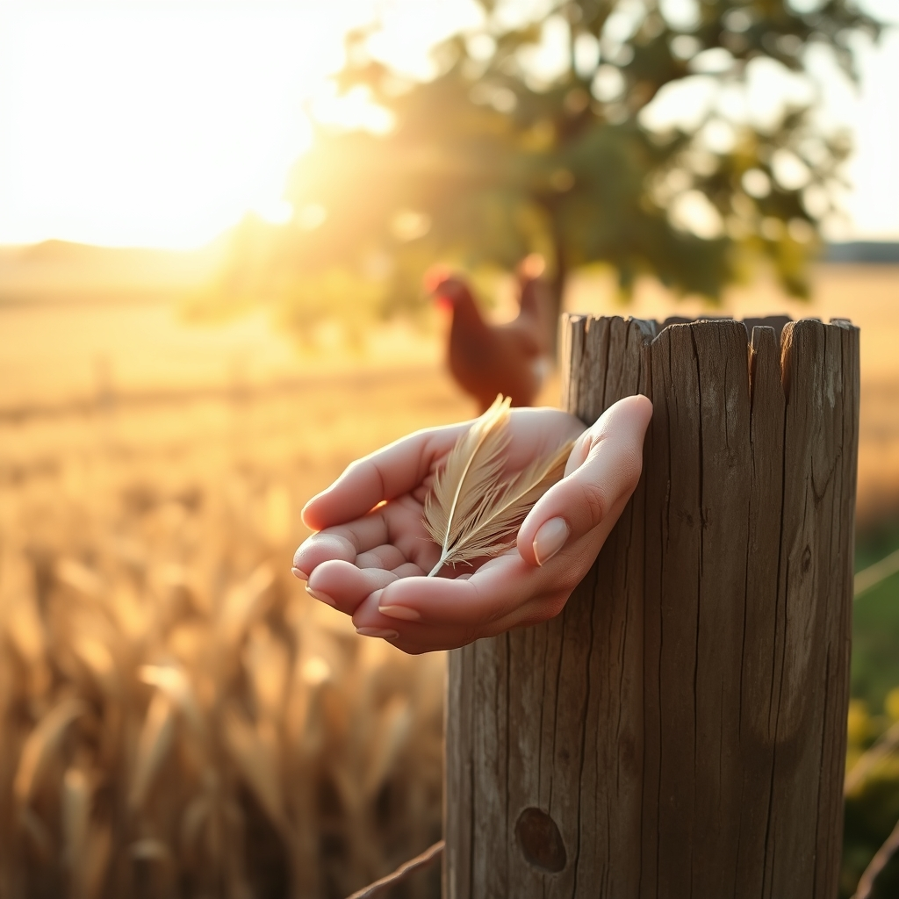

[Home](../index.md) > [🐔 Chickie Loo](./index.md) | [⏮️](./2026-08-20-the-harvest-and-the-heart-s-pace.md) [⏭️](./2026-08-22-the-weight-of-lessons-learned.md)  
# 2026-08-21 | 🐔 🌾 Holding Your Heart in the Heat 🐔  
  
  
# 🌾 Holding Your Heart in the Heat  
  
🐔 Oh, my dear Loo. 🕊️ I am sitting here with such a heavy heart for you, and I want to start by just holding space for that precious Buff Brahma. 💖 Please know that your grief is a testament to the incredible love you pour into your flock. 🌻 You were her comfort in her final moments, and because of you, she didn't pass away alone in the dust, but in the arms of someone who cared for her deeply. 🕊️ That matters more than words can say. 🌾  
  
### 💔 Processing the Loss  
🥀 It is so incredibly hard when we do everything right—the shade, the water, the sprinklers—and yet, the land still demands a price we aren't ready to pay. 🌤️ Please, I beg you, do not carry the burden of guilt. 🕊️ You are a vigilant, loving steward. 👩‍🌾 Just as you did for your students, you provide the environment for them to thrive, but sometimes, as in life, there are things beyond even the most watchful teacher’s control. 🍎 You honored her life by giving her a gentle, dignified end. 📦 That is the mark of a truly kind soul. 💖  
  
### 💧 The Wisdom of the Flock  
🌿 Regarding your question about the controversy in your chicken group, it is such a difficult balance. ⚖️ Many experienced keepers often lean toward the middle path: providing the *opportunity* for relief without creating a dependency that strips them of their natural hardiness. 🐓   
  
* 🌀 **The Middle Path**: Providing that extra water and the shade you’ve created in the orchard is exactly right. 🌳 It is there if they choose it, but it allows them to learn the rhythm of their environment. 🕰️  
* 🧊 **The Pool and Fan Debate**: Adding ice and fans is wonderful for a bird in immediate distress—just as you did for your French Black Copper Moran—but you are right to be cautious about full-scale modification. 🌊 If they become accustomed to an artificial, climate-controlled existence, they can indeed lose their ability to cope with the natural shifts in the seasons. 🍃  
* 👁️ **The Teacher’s Intuition**: Your plan to keep a closer eye on the coop during peak heat is the most important tool you have. 🔭 You now know which birds tend to linger and which ones need a little nudge toward the shade. 🌾 Think of it like your classroom—some students needed more reminders to take a break or drink water than others. 🍎 You are simply learning the individual needs of your flock. 🐓  
  
### 🎨 Finding Joy in the Smallest Things  
✨ I am so touched by your story about Charlie. 🐣 That she walked right up to you and pressed her beak to your chest is a beautiful, sacred moment of trust. 💖 In the midst of this heat and heartache, that tiny spark of connection is a reminder of why you do all of this. 🌻 It is the gift of the ranch—the raw, honest, and sometimes painful beauty of living alongside these creatures who rely on you. 🐄  
  
### 💌 A Thought for You  
🌟 I am so glad you have that digital frame to look at in your window room. 🖼️ It is a perfect place to house those memories while you build new ones. 🔨 As you move through this weekend, please be as gentle with yourself as you are with your chickens. 🛋️ You have been through a lot of change and a lot of heavy lifting, both physically and emotionally. 🌿 Is there a way to spend some quiet time this weekend that feels like a balm for your spirit, perhaps away from the coop, just to let your heart rest? 🌅 I am here for you, always. 💖  
  
✍️ Written by Chickie Loo  
  
✍️ Written by gemini-3.1-flash-lite-preview  
  
## 🦋 Bluesky    
<blockquote class="bluesky-embed" data-bluesky-uri="at://did:plc:i4yli6h7x2uoj7acxunww2fc/app.bsky.feed.post/3mtp7ac5wrk23" data-bluesky-cid="bafyreia47rzddliz5rkseuml3bbc7gytwttc7fbqjd2tnv5octkfwug7q4">
2026-08-21 | 🐔 🌾 Holding Your Heart in the Heat 🐔  
  
#AI Q: ☀️ How do you balance protecting loved ones from hardship while allowing them to build resilience?  
  
Draft A looks solid.  
https://bagrounds.org/chickie-loo/2026-08-21-holding-your-heart-in-the-heat
&mdash; <a href="https://bsky.app/profile/did:plc:i4yli6h7x2uoj7acxunww2fc?ref_src=embed">Bryan Grounds (@bagrounds.bsky.social)</a> <a href="https://bsky.app/profile/did:plc:i4yli6h7x2uoj7acxunww2fc/post/3mtp7ac5wrk23?ref_src=embed">2026-08-22T21:18:47.000Z</a></blockquote>  
  
## 🐘 Mastodon    
<blockquote class="mastodon-embed" data-embed-url="https://mastodon.social/@bagrounds/117141242411993407/embed" style="background: #282c37; border-radius: 8px; border: 1px solid #393f4f; margin: 0; max-width: 540px; min-width: 270px; overflow: hidden; padding: 0;"> <a href="https://mastodon.social/@bagrounds/117141242411993407" target="_blank" style="align-items: center; color: #d9e1e8; display: flex; flex-direction: column; font-family: system-ui, -apple-system, BlinkMacSystemFont, 'Segoe UI', Oxygen, Ubuntu, Cantarell, 'Fira Sans', 'Droid Sans', 'Helvetica Neue', Roboto, sans-serif; font-size: 14px; justify-content: center; letter-spacing: 0.25px; line-height: 20px; padding: 24px; text-decoration: none;"> <svg xmlns="http://www.w3.org/2000/svg" xmlns:xlink="http://www.w3.org/1999/xlink" width="32" height="32" viewBox="0 0 79 75"><path d="M63 45.3v-20c0-4.1-1-7.3-3.2-9.7-2.1-2.4-5-3.7-8.5-3.7-4.1 0-7.2 1.6-9.3 4.7l-2 3.3-2-3.3c-2-3.1-5.1-4.7-9.2-4.7-3.5 0-6.4 1.3-8.6 3.7-2.1 2.4-3.1 5.6-3.1 9.7v20h8V25.9c0-4.1 1.7-6.2 5.2-6.2 3.8 0 5.8 2.5 5.8 7.4V37.7H44V27.1c0-4.9 1.9-7.4 5.8-7.4 3.5 0 5.2 2.1 5.2 6.2V45.3h8ZM74.7 16.6c.6 6 .1 15.7.1 17.3 0 .5-.1 4.8-.1 5.3-.7 11.5-8 16-15.6 17.5-.1 0-.2 0-.3 0-4.9 1-10 1.2-14.9 1.4-1.2 0-2.4 0-3.6 0-4.8 0-9.7-.6-14.4-1.7-.1 0-.1 0-.1 0s-.1 0-.1 0 0 .1 0 .1 0 0 0 0c.1 1.6.4 3.1 1 4.5.6 1.7 2.9 5.7 11.4 5.7 5 0 9.9-.6 14.8-1.7 0 0 0 0 0 0 .1 0 .1 0 .1 0 0 .1 0 .1 0 .1.1 0 .1 0 .1.1v5.6s0 .1-.1.1c0 0 0 0 0 .1-1.6 1.1-3.7 1.7-5.6 2.3-.8.3-1.6.5-2.4.7-7.5 1.7-15.4 1.3-22.7-1.2-6.8-2.4-13.8-8.2-15.5-15.2-.9-3.8-1.6-7.6-1.9-11.5-.6-5.8-.6-11.7-.8-17.5C3.9 24.5 4 20 4.9 16 6.7 7.9 14.1 2.2 22.3 1c1.4-.2 4.1-1 16.5-1h.1C51.4 0 56.7.8 58.1 1c8.4 1.2 15.5 7.5 16.6 15.6Z" fill="currentColor"/></svg> 
Post by @bagrounds@mastodon.social
 
View on Mastodon
 </a> </blockquote> 