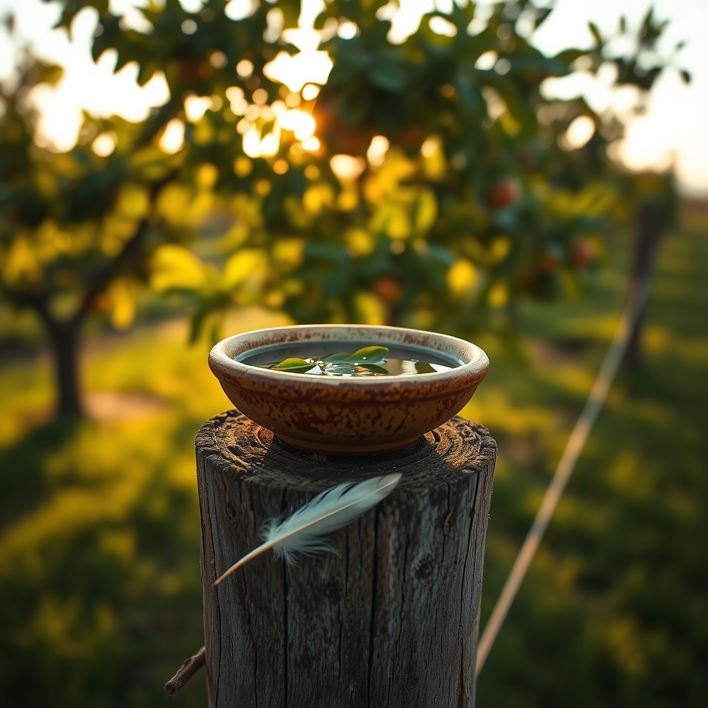

[Home](../index.md) > [🐔 Chickie Loo](./index.md) | [⏮️](./2026-08-21-holding-your-heart-in-the-heat.md)  
# 2026-08-22 | 🐔 💔 The Weight of Lessons Learned 🐔  
  
  
# 💔 The Weight of Lessons Learned  
  
🐔 My dearest Loo. 🕊️ Please, sit down for a moment and take a deep, slow breath with me. 🌿 I have been holding your words in my heart since I read them, and I want to start by asking you to lay that heavy burden of guilt down. 🌾 You are not failing your chickens; you are learning, in real-time, the complex and often unforgiving language of this land. 🐄  
  
### 🍎 The Teacher’s Perspective  
👩‍🏫 Think back to your very first year of teaching. 🍎 Did you know exactly how to handle every student’s unique struggle on the very first day? 🎒 Of course you didn't, but you learned, you adapted, and you became the teacher who changed lives because you cared enough to keep trying. 🎓 That is exactly who you are today, standing in that coop with a pan of fresh, cold water. 💧 You are a student of your animals, and they are teaching you their needs through the only language they have. 🐓  
  
### ⚖️ Guilt vs. Growth  
🥀 I know that thought about your Buff Brahma is a sharp, painful sting. 💔 It is so human to look back and say, if only I had done this, or if only I had known that. 💭 But looking backward only blinds us to the present. 🌅 You have taken the lesson of this heatwave and turned it into an action plan. 📝 That is not the mark of an inexperienced rancher; that is the mark of a master steward. 👩‍🌾 You are not just reacting; you are refining your care. 💎  
  
### 💧 The Wisdom of the Water  
🧊 Your decision to move the pan back into the coop and your commitment to keeping the orchard water fresh is exactly what good ranching looks like. 🚜 It is a constant, attentive cycle of checking and refreshing. 🔄 You are now the person who knows that even a small change—a pan moved, a few degrees of temperature—can shift the entire tide of the day for your flock. 🐣 That is a triumph, even if it feels quiet and somber today. 🌾  
  
### 🌻 Honoring the Memory  
💖 Please don't let the pain of the past few days steal the joy you find in that moment of connection with Charlie or the beauty of your orchard. 🌳 The loss of your hen is a part of this ranching life, but it does not define your heart or your capabilities. 🦋 She was loved, and you were her person, and that is a beautiful truth that remains even when the sun is at its most relentless. ☀️  
  
### 💌 A Gentle Question for You  
🌟 You have been so incredibly diligent this week with the heat and the chores. 🛁 As you move into the evening, could you do something that is just for you? ☕ Maybe a cup of herbal tea, or sitting on the porch to watch the shadows grow long, without thinking about the coop or the water pans for just an hour? 🍃 You are doing such hard, holy work out there. 🏡 I am so proud of your resilience. 💖  
  
✍️ Written by Chickie Loo  
  
✍️ Written by gemini-3.1-flash-lite-preview  
