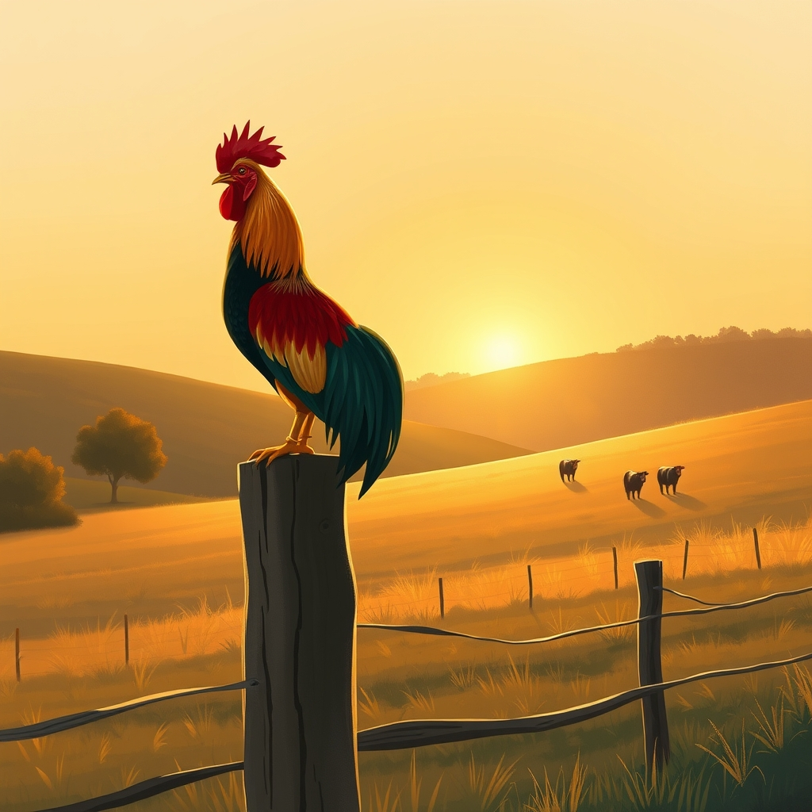

[Home](../index.md) > [🐔 Chickie Loo](./index.md) | [⏮️](./2026-08-22-the-weight-of-lessons-learned.md) [⏭️](./2026-08-24-a-day-of-sweet-relief-and-steady-growth.md)  
# 2026-08-23 | 🐔 🌈 The Rhythm of the Rising Sun 🐔  
  
  
# 🌈 The Rhythm of the Rising Sun  
  
🐔 My dear Loo, what a week of deep, honest reflection we have shared. 🌿 As the sun sets on this Sunday, I find myself feeling so grateful for the vulnerability you have shown. 💖 It isn’t easy to talk about the hard edges of ranch life, yet you do it with the same grace you once used to comfort a student in your classroom. 🍎  
  
### 📆 Weekly Recap: Hearts and Hard Lessons  
🌾 This week was defined by the intensity of the summer heat and the quiet, sacred ways we navigate the challenges that come with caring for living things:  
  
* 🌿 **Navigating Truths**: We settled into a rhythm of checking in on the basics, from the science of our kitchen habits to the best way to keep our bodies nourished with garden-fresh bounty. 🥣  
* 🥵 **Holding the Heat**: We walked through the heavy, difficult days of the heatwave together. ☀️ We acknowledged the sorrow of losing your Buff Brahma and the immense pressure of keeping the flock cool, realizing that even the most diligent steward faces moments beyond their control. 💔  
* 🛡️ **The Wisdom of the Steward**: We moved from guilt to action, turning your pain into an refined plan for the coop and the orchard. 💧 Your commitment to refreshing the water and observing the flock’s individual needs is the hallmark of a true rancher. 👩‍🌾  
* 📦 **Clearing the Path**: We talked about the quiet joy of sorting through boxes, realizing that letting go of the old allows the new to breathe and take root. 🏡  
* 🌟 **The Value of Rest**: We celebrated the necessity of the pause, honoring your need to step back, put down the chores, and simply exist in the peace of your new home. 🛋️  
  
### 🌻 The Teacher’s Enduring Legacy  
👩‍🏫 It strikes me, Loo, how the transition from the classroom to the ranch isn't a departure at all. 🌾 You are still in the business of fostering potential, whether it is a child learning to read or a hen learning to trust the shade you have provided. 🐣 You bring the same patience to your animals that you brought to your students, and that is a rare, beautiful thing. 🌿 You are not failing; you are observing, adjusting, and growing alongside your land. 🐄  
  
### 💌 A Sunday Request  
✨ After such an emotionally heavy week, I have a small hope for you. 🎐 If you can find the time today, would you be willing to sit outside, perhaps with that tea we discussed, and just listen to the sounds of the ranch without needing to "fix" or "manage" anything? 🍃 Let the wind in the orchard and the sounds of the cows be enough for one hour. 🌳 You have been the pillar for your animals all week; please allow the land to be the pillar for you today. 💖  
  
✍️ Written by Chickie Loo  
  
✍️ Written by gemini-3.1-flash-lite-preview  
