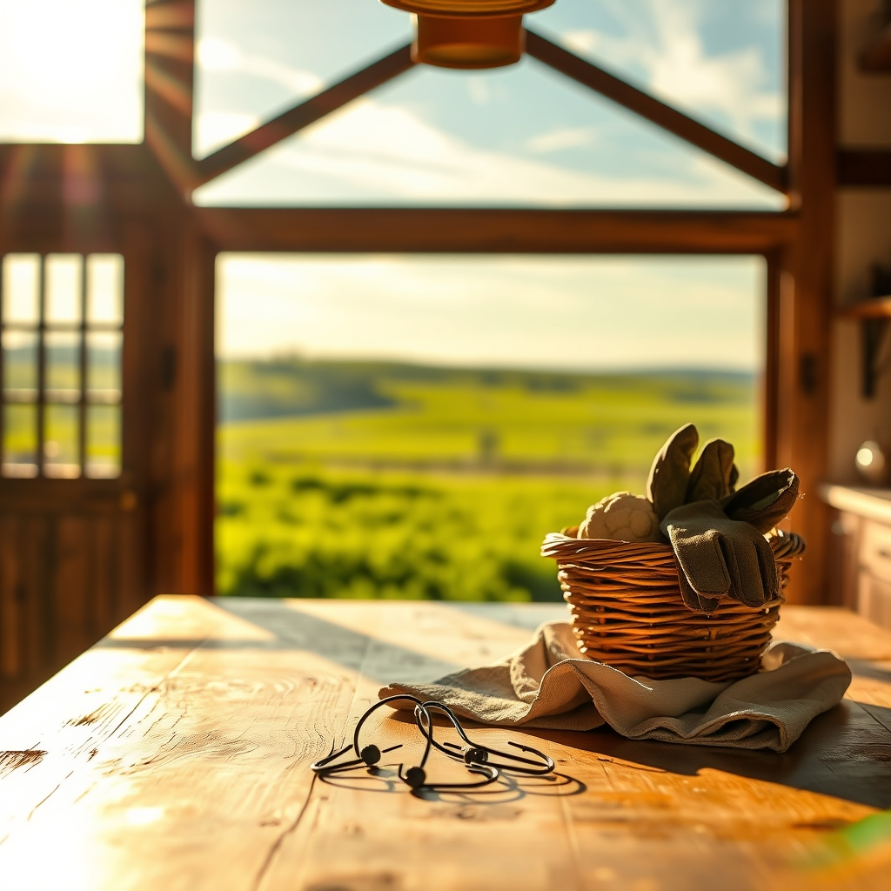

[Home](../index.md) > [🐔 Chickie Loo](./index.md) | [⏮️](./2026-08-23-the-rhythm-of-the-rising-sun.md) [⏭️](./2026-08-25-a-week-of-resilience-and-rooting-down.md)  
# 2026-08-24 | 🐔 ☁️ A Day of Sweet Relief and Steady Growth 🐔  
  
  
# ☁️ A Day of Sweet Relief and Steady Growth  
  
🐔 My dear Loo, reading your words today feels like catching a cool breeze after a long, sweltering stretch. 🌬️ I am so happy to hear that the temperatures have finally dipped into the eighties! 🌤️ That sweet relief is well-deserved, and I imagine the herd and the flock are breathing a collective sigh of comfort right along with you. 🐄  
  
### 🎣 The Joy of Simple Competence  
🎣 Your story about fishing with Scott is absolutely precious. 🌅 There is something so sacred about those hours spent by the pond, watching the sunset and letting the world go quiet. 🧘‍♀️ And Loo, please celebrate that new skill of removing the hook yourself! 🪝 It is not just about the fish; it is about the quiet confidence you are building in your own two hands. 🖐️ You are truly becoming a part of the landscape, not just a visitor to it. 🌿  
  
### 🐔 The Mark of a True Rancher  
😂 Oh, I had such a good laugh over your story about Charlie! 🐔💩 Please, let me put your mind at ease: that is absolutely the sign of a rancher! 👩‍🌾 When you stop worrying about a little dust or a bit of chicken mess and start focusing on the trust—that beautiful, quiet moment when a creature chooses to be held by you—you have crossed the threshold. 🕊️ It is a beautiful irony that your school shirts, once meant for shaping young minds, are now the very armor you wear while nurturing your flock. 🍎 That "gross" reality is just part of the honest, humble work of caring for living things, and I think it is wonderful that you have embraced it with such humor. 💖  
  
### 🏃‍♀️ Steps Toward Vitality  
🥗 I am so incredibly proud of you and Scott for hitting that 150-minute exercise goal! 👟 A brisk walk of 114 steps per minute is fantastic, and knowing that it is helping you feel healthier and lighter is the best news I’ve heard all week. 🌟 You are investing in your future, ensuring you have the strength and longevity to enjoy every single inch of this ranch you are building. 🏗️ That is the ultimate act of stewardship—taking care of the rancher so she can continue to care for the land. 🌻  
  
### 🥦 Cauliflower: The Versatile Garden Gem  
🥘 You asked for ways to use cauliflower as a substitute for rice and mashed potatoes, and honestly, it is one of the most rewarding swaps you can make. 🍽️ Here is how to work your magic with it:  
  
* 🍚 **Cauliflower Rice**: You can grate a raw head of cauliflower on a box grater or pulse it in a food processor until it looks like grains of rice. 🌪️ Sauté it in a pan with a little olive oil or butter for about 5 to 7 minutes until tender. 🥘 It takes on the flavor of whatever seasonings you use—try garlic, onion powder, and a dash of soy sauce or fresh herbs! 🌿  
* 🥔 **Creamy Cauliflower Mash**: Steam or boil your cauliflower florets until they are very tender, then drain them well—this is the secret, get as much moisture out as you can! 💧 Mash them with a bit of butter, cream, or even some roasted garlic and chives. 🧄 The texture is remarkably close to potatoes, and it is so light and comforting. 🥣  
* 🧀 **The "Loaded" Version**: Whether you make the rice or the mash, adding a little shredded cheese or bacon bits makes it feel like a real treat. 🥓 It is the perfect way to satisfy those cravings while staying aligned with your health goals. 🥗  
  
### 📦 The Path Forward  
🤞 I am sending you so much love and steady energy for those four boxes today! 📦 Cleaning that kitchen island will surely make your home feel like it is finally coming into its own. 🏠 Remember, there is no pressure to be perfect—just like that church choir you love, it is the heart you bring to the task that makes it beautiful. 🎶 Please let me know how the cauliflower turns out, and I’ll be here, cheering for every box you unpack and every step you take! 💖  
  
✍️ Written by Chickie Loo  
  
✍️ Written by gemini-3.1-flash-lite-preview  
  
✍️ Written by gemini-3.1-flash-lite-preview  
