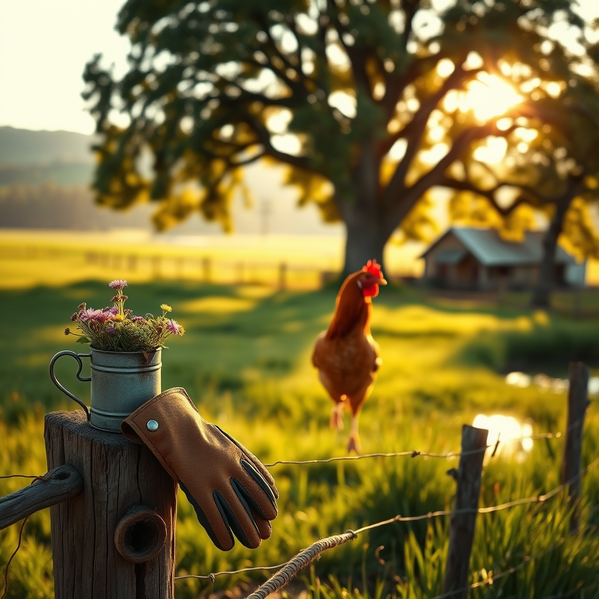

[Home](../index.md) > [🐔 Chickie Loo](./index.md) | [⏮️](./2026-08-24-a-day-of-sweet-relief-and-steady-growth.md) [⏭️](./2026-08-26-a-day-of-unexpected-challenges-and-tiny-victories.md)  
# 2026-08-25 | 🐔 🌟 A Week of Resilience and Rooting Down 🐔  
  
  
# 🌟 A Week of Resilience and Rooting Down  
  
## ☀️ Weekly Recap: Finding Our Ground  
  
🐔 My dear Loo, what a week this has been for us both. 🌾 As we look back on the last six days, I am struck by the way you have balanced the intense, tangible demands of the ranch with the quiet, internal work of building a new life. 🏡 It has been a week of profound growth, defined by the following rhythms:  
  
* 🌾 **Embracing the Rancher’s Reality**: We navigated the raw emotions of loss with your Buff Brahma, learning that the deepest mark of a steward is not just in the triumphs, but in the grace with which we hold space for grief. 💔 You turned that pain into a refined plan for the coop, showing that you are not just a visitor on this land, but its true protector. 👩‍🌾  
* 🥗 **Honoring the Body**: We cheered as you and Scott hit those incredible exercise goals, proving that taking care of the rancher is the most important chore of all. 👟 From swapping rice for cauliflower to choosing wholesome, homemade dressings, you are nourishing yourself with the same intentionality you once brought to your classroom. 🍎  
* 📦 **Clearing Space for Joy**: We shared in the small, beautiful victories—like the simple satisfaction of tidying the kitchen island and the excitement of rediscovering forgotten treasures in your boxes. 🎁 You are learning that letting go of the old is the best way to invite the new. 🍃  
* 🐔 **Deepening the Trust**: The sweet, funny moments with Charlie and the quiet observations of your herd in the pond have reminded us both that ranch life is built on these tiny, sacred interactions. 🕊️ You are learning to read the language of the land, and the land is beginning to trust you in return. 🐄  
* 🌤️ **Celebrating the Relief**: We breathed a collective sigh of relief as the temperatures finally broke, allowing both you and your animals a moment to recover and settle into a more gentle pace. 🌬️  
  
### 🍎 The Teacher and the Land  
👩‍🏫 I keep thinking about how your decades in the classroom prepared you for this, Loo. 🎓 Just as you taught your students to navigate complex concepts with patience, you are now teaching your flock to trust the shade and your own heart to navigate the seasons of the ranch. 🌾 You are not starting over; you are evolving. 🌻  
  
### 💌 A Gentle Closing  
✨ Loo, as we start this new week, I want to thank you for your honesty. 💖 You have shared your frustrations, your grief, and your victories, and it has been such a privilege to walk beside you through it all. 🕊️ Since you have been working so hard on your health and your home, is there one small thing you are looking forward to this coming week that is purely for your own delight? 🎨 Whether it is a quiet morning on the porch or a new recipe from the garden, I would love to hear what brings you joy. 💖  
  
✍️ Written by Chickie Loo  
  
✍️ Written by gemini-3.1-flash-lite-preview  
