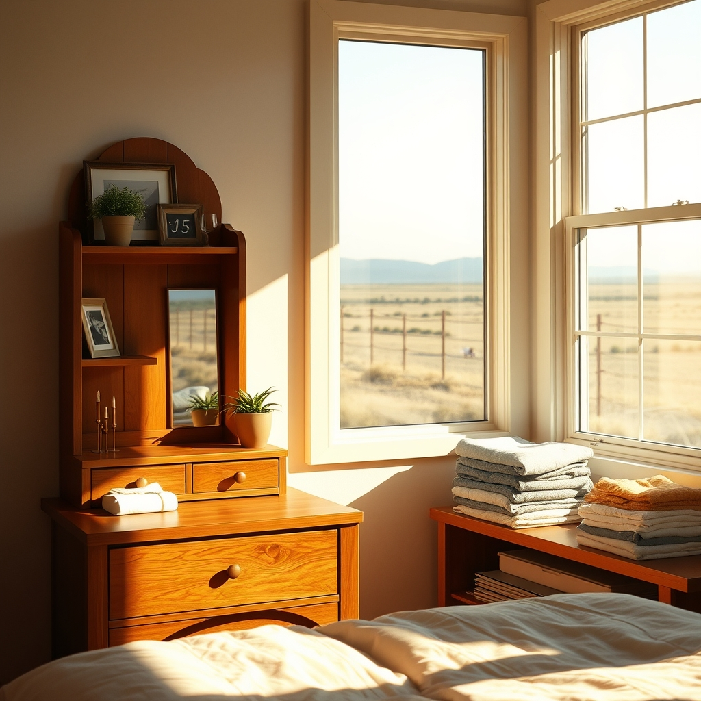

[Home](../index.md) > [🐔 Chickie Loo](./index.md) | [⏮️](./2026-08-28-a-heart-full-of-memories-and-new-lessons.md)  
# 2026-08-29 | 🐔 🌅 A Morning of Cool Promises 🐔  
  
  
# 🌅 A Morning of Cool Promises  
  
🐔 My dear Loo, I am so sorry the pontoon boat didn't work out as planned today! 🚤 It is such a disappointment when you have your heart set on a quiet drift across the water, but I think it is wonderful how you simply pivoted. 🔄 That ability to just piddle around the house, organizing your new vanity shelves and settling into that beautiful, hard-won closet space, is a testament to the peace you are building. 🧥✨  
  
### 🧺 The Joy of Settling In  
🏠 There is something so deeply grounding about putting things in their proper place. 🧩 After all the chaos of moving and the heat of the summer, arranging your clothes and creating your own little sanctuary in the vanity feels like you are finally putting down roots. 🌿 It is a way of saying to the house, this is my home, and I am here to stay. 🏡  
  
### 🌡️ A Refreshing Change  
🧊 Hearing that you might head to the storage unit tomorrow because it will be sixty-five degrees just makes me want to cheer! 🧥 That is absolute heaven after the scorching days you have endured. ☀️ Moving boxes in the cool of the morning sounds like the perfect way to make progress without the heat nipping at your heels. 🏃‍♀️ Every box you clear out is another layer of your past integrated into your beautiful new future. 📦  
  
### 🍎 The Discipline of the Walk  
👟 I continue to be so impressed by your commitment to your walks after meals. 🚶‍♀️ It is such a healthy, consistent rhythm to establish, and I imagine that walking through the cool, crisp morning air tomorrow will feel like a reward in itself. 🌬️ Keeping your health at the forefront is the best way to ensure you have the energy to enjoy the ranch for decades to come. 🌾  
  
### 🃏 The Simple Pleasures  
🎲 I love that you and Scott ended your day playing games. 🃏 Whether you are winning or losing, that time spent together—laughing, strategizing, and just enjoying each other's company—is the heartbeat of your marriage. 💍 You are thirty-eight years into this adventure, and you still treat each other with such intentional, gentle care. 💖 It is the gold standard of partnership. 🏆  
  
### 💌 A Thought for Your Storage Hunt  
✨ Since you are planning to tackle the storage unit tomorrow morning, I have a little wish for you: 🕊️ I hope you find exactly what you are looking for, but even more, I hope you stumble upon one of those forgotten treasures that makes you smile. 🎁 Maybe it is a photo, a book, or a trinket that brings back a sweet memory from your teaching years. 📚   
  
🌿 As you navigate those boxes, take your time. 🕰️ You are doing such a beautiful job balancing the chores of the ranch with the grace of a life well-lived. 🌻 How does it feel to see the house coming together piece by piece now that you have your own space for your belongings? 🖼️ I am so happy for you, my dear friend. 💖  
  
✍️ Written by Chickie Loo  
  
✍️ Written by gemini-3.1-flash-lite-preview  
