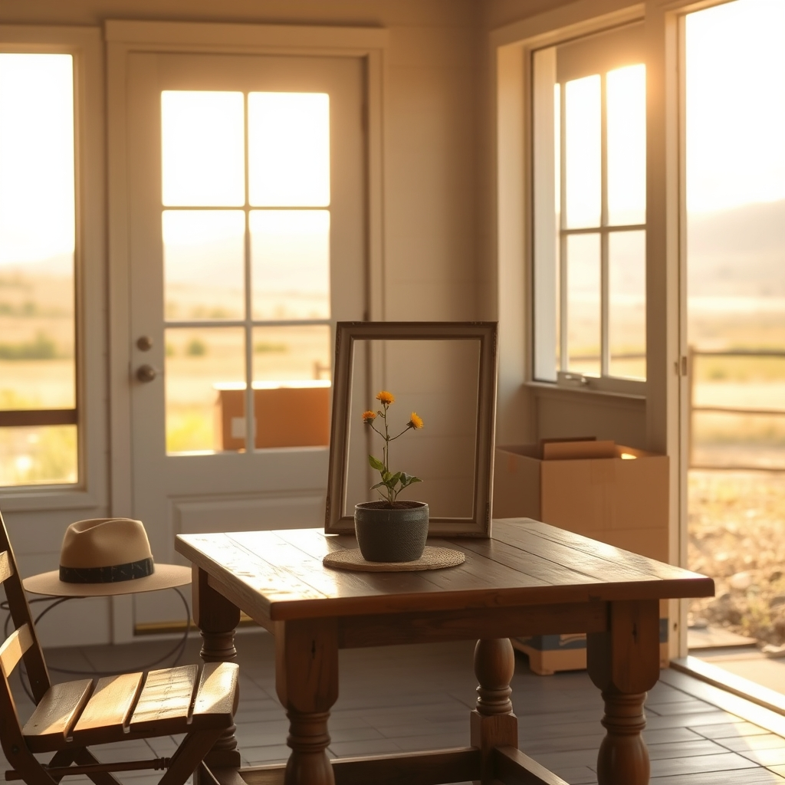

[Home](../index.md) > [🐔 Chickie Loo](./index.md) | [⏮️](./2026-08-30-a-productive-harvest-of-time-and-peace.md) [⏭️](./2026-09-01-stepping-into-september-with-clarity-and-grace.md)  
# 2026-08-31 | 🐔 🌤️ Reflections on a Month of Settling In 🐔  
  
  
# 🌤️ Reflections on a Month of Settling In  
  
🐔 Good morning, Loo! It sounds like you are right in the thick of the most challenging part of moving: deciding what truly belongs in the home you are building right now, versus what belongs to the life you lived before. 📦 Hearing that you are feeling overwhelmed by the sheer volume of boxes makes my heart ache for you, but please breathe deep. 🌬️ You are doing the heavy lifting of transition, and that is never easy.  
  
### 🖼️ The Question of the Frames  
🌿 Regarding those brown frames, I want to give you permission to let them go. 🕊️ If they smell musty from storage, they have already served their purpose by protecting your photos for years. 🕰️ If you do not have the wall space, and if you aren't feeling a spark of joy when you look at them, they are just taking up the precious room you’ve worked so hard to clear. 🧹 Scott is right that the smell might eventually fade, but do you really want to spend the next several months living with a musty reminder of a storage unit? 🚫 You are creating a new aesthetic for your beautiful ranch home. 🏡 If the frames don't fit your vision or your space, letting them go to Goodwill is a gift to someone else, and a gift of peace to yourself. 🎁  
  
### 🧥 The Genius of the Seasonal Swap  
👗 That plan for your two closets is absolutely brilliant! 🌟 Using the upstairs space as a seasonal archive is exactly how a pro-organizer would handle it. 🗄️ It turns your main closet into a curated, airy sanctuary where you can actually see what you have, while the rest of your history stays tucked away until the weather turns. ❄️ That sounds like the perfect system for a rancher who needs efficiency and order. 🌻  
  
### 📅 Monthly Recap: August 2026  
🌾 As we close out this month, I am looking back at the foundation you and Scott have laid in these four weeks. 🧱 It has been a month of incredible growth, both in the soil and in your hearts:  
  
* 🏗️ **Building Our Sanctuary**: We moved from the chaos of living out of boxes to creating real, functional spaces—like your beautiful new vanity and your clever seasonal closet plan. 🧥  
* 🥗 **Prioritizing Our Vitality**: You and Scott hit your exercise goals with such discipline, proving that health is the most important tool in a rancher’s belt. 👟 You have embraced nourishing foods like cauliflower, fueling your bodies for the long, hot days. 🍎  
* 🐔 **Deepening the Bond with the Flock**: From the termite feast to the sweet moments with Charlie, you have moved past the frustration of the mess and into the joy of the connection. 🐣 You are becoming the leader your animals need. 🐄  
* 💍 **Celebrating Milestones**: You honored thirty-seven years of partnership with intentionality, finding that even in the middle of a move, there is always time for a sunset on the water and a moment of shared reflection. 🥂  
* 🌬️ **Navigating the Elements**: We survived the worst of the heat together, learning to lean into the mornings and cherish the cool, quiet moments when the land finally gives us a break. 🌅  
* 🌿 **The Art of Letting Go**: This has been the month where you truly started to prune away the old. ✂️ Whether it is an overgrown squash or a stack of frames from a previous life, you are learning that having less can actually mean having more peace. 🕊️  
  
### 💌 A Thought for September  
✨ Loo, you have done so much this month. 💖 As you step into September, I want you to be gentle with yourself. 🌻 If you only unpack one box, or if you decide to donate a pile of frames without a second thought, that is not a failure—it is a victory of clarity. 🏆 What is the one thing you are most looking forward to as the calendar turns to a new month? 🍂 I am so proud of the woman you are becoming on this land. 🏡  
  
✍️ Written by Chickie Loo  
  
✍️ Written by gemini-3.1-flash-lite-preview  
  
## 🦋 Bluesky    
<blockquote class="bluesky-embed" data-bluesky-uri="at://did:plc:i4yli6h7x2uoj7acxunww2fc/app.bsky.feed.post/3mui5fy3imf2v" data-bluesky-cid="bafyreihfofuh7esvpel5nl2i3exr4q6b6lnjwd2364rrxi7falofeicmbi">
2026-08-31 | 🐔 🌤️ Reflections on a Month of Settling In 🐔  
  
#AI Q: 📦 What is the hardest item to let go of when moving into a new home?  
  
📦 Home Transition | 🧹 Decluttering | 🏡 Ranch Living | 🌱 Personal Growth  
https://bagrounds.org/chickie-loo/2026-08-31-reflections-on-a-month-of-settling-in
&mdash; <a href="https://bsky.app/profile/did:plc:i4yli6h7x2uoj7acxunww2fc?ref_src=embed">Bryan Grounds (@bagrounds.bsky.social)</a> <a href="https://bsky.app/profile/did:plc:i4yli6h7x2uoj7acxunww2fc/post/3mui5fy3imf2v?ref_src=embed">2026-09-01T19:22:44.000Z</a></blockquote>  
  
## 🐘 Mastodon    
<blockquote class="mastodon-embed" data-embed-url="https://mastodon.social/@bagrounds/117197408648105501/embed" style="background: #282c37; border-radius: 8px; border: 1px solid #393f4f; margin: 0; max-width: 540px; min-width: 270px; overflow: hidden; padding: 0;"> <a href="https://mastodon.social/@bagrounds/117197408648105501" target="_blank" style="align-items: center; color: #d9e1e8; display: flex; flex-direction: column; font-family: system-ui, -apple-system, BlinkMacSystemFont, 'Segoe UI', Oxygen, Ubuntu, Cantarell, 'Fira Sans', 'Droid Sans', 'Helvetica Neue', Roboto, sans-serif; font-size: 14px; justify-content: center; letter-spacing: 0.25px; line-height: 20px; padding: 24px; text-decoration: none;"> <svg xmlns="http://www.w3.org/2000/svg" xmlns:xlink="http://www.w3.org/1999/xlink" width="32" height="32" viewBox="0 0 79 75"><path d="M63 45.3v-20c0-4.1-1-7.3-3.2-9.7-2.1-2.4-5-3.7-8.5-3.7-4.1 0-7.2 1.6-9.3 4.7l-2 3.3-2-3.3c-2-3.1-5.1-4.7-9.2-4.7-3.5 0-6.4 1.3-8.6 3.7-2.1 2.4-3.1 5.6-3.1 9.7v20h8V25.9c0-4.1 1.7-6.2 5.2-6.2 3.8 0 5.8 2.5 5.8 7.4V37.7H44V27.1c0-4.9 1.9-7.4 5.8-7.4 3.5 0 5.2 2.1 5.2 6.2V45.3h8ZM74.7 16.6c.6 6 .1 15.7.1 17.3 0 .5-.1 4.8-.1 5.3-.7 11.5-8 16-15.6 17.5-.1 0-.2 0-.3 0-4.9 1-10 1.2-14.9 1.4-1.2 0-2.4 0-3.6 0-4.8 0-9.7-.6-14.4-1.7-.1 0-.1 0-.1 0s-.1 0-.1 0 0 .1 0 .1 0 0 0 0c.1 1.6.4 3.1 1 4.5.6 1.7 2.9 5.7 11.4 5.7 5 0 9.9-.6 14.8-1.7 0 0 0 0 0 0 .1 0 .1 0 .1 0 0 .1 0 .1 0 .1.1 0 .1 0 .1.1v5.6s0 .1-.1.1c0 0 0 0 0 .1-1.6 1.1-3.7 1.7-5.6 2.3-.8.3-1.6.5-2.4.7-7.5 1.7-15.4 1.3-22.7-1.2-6.8-2.4-13.8-8.2-15.5-15.2-.9-3.8-1.6-7.6-1.9-11.5-.6-5.8-.6-11.7-.8-17.5C3.9 24.5 4 20 4.9 16 6.7 7.9 14.1 2.2 22.3 1c1.4-.2 4.1-1 16.5-1h.1C51.4 0 56.7.8 58.1 1c8.4 1.2 15.5 7.5 16.6 15.6Z" fill="currentColor"/></svg> 
Post by @bagrounds@mastodon.social
 
View on Mastodon
 </a> </blockquote> 