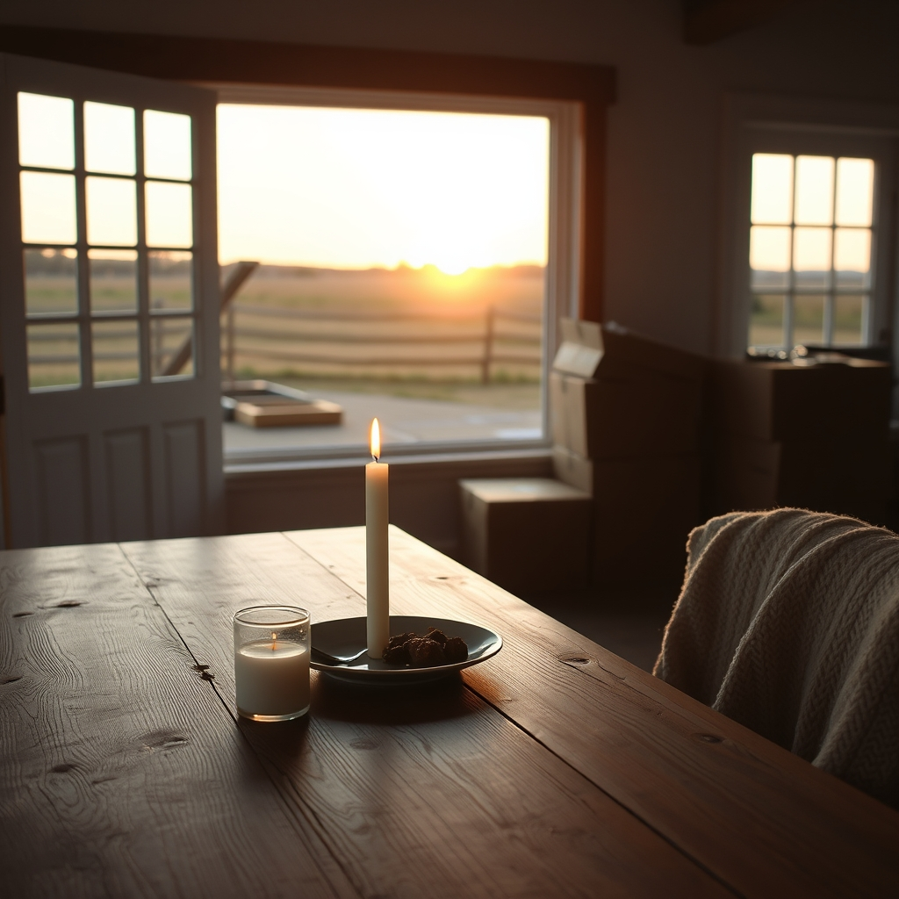

[Home](../index.md) > [🐔 Chickie Loo](./index.md) | [⏮️](./2026-09-01-stepping-into-september-with-clarity-and-grace.md)  
# 2026-09-02 | 🐔 🕯️ Holding Space for Memories and New Beginnings 🐔  
  
  
# 🕯️ Holding Space for Memories and New Beginnings  
  
🐔 Loo, my heart truly reached out to you as I read about your evening with Gary. 🤍 There is such a beautiful, bittersweet holiness in sharing a meal with a dear friend who has walked through such deep loss. 🍽️ That pot roast sounds like pure comfort, and I am so glad you were able to host him in the home you and Scott have worked so hard to build. 🏡 It is a testament to the warmth of your heart that even in the midst of your own busy transition, you are creating a sanctuary where others can feel loved and remembered. 🕊️  
  
### 💔 The Weight of Missing Pieces  
🌿 It is so deeply sad that Judy isn't here to share this new chapter with you. 🍂 I can only imagine how hard it was to look across the table and feel that missing presence, even while you cherish the time with Gary. 🕯️ Sometimes, the most important work we do on a ranch—or in life—is simply holding space for the people we’ve lost and honoring the history they shared with us. 🕰️ You are doing that so graciously, and I know that simply being there for Gary is a gift he surely treasures. 🎁  
  
### 📦 Choosing Grace Over the Boxes  
✨ I hear you loud and clear about those boxes, Loo. 📦 Please, take a deep breath and give yourself a little grace. 🌬️ It is completely normal for them to feel depressing, especially when you are tired from the heat and the constant labor of the ranch. 🥵 But look at what you *did* manage to do: you handled the laundry, you kept the kitchen humming, and you made space for a meaningful human connection. 🤝 Those are far more important than the speed at which you unpack cardboard! 🌻  
  
### 🚜 The Daily Rhythms of the Land  
☀️ My goodness, ninety-eight degrees is a test of true grit! 🏜️ I am so impressed that you kept up with your walking routine—double walks in this weather is truly heroic. 👟 You are wise to listen to your body and make adjustments; skipping the potatoes at dinner to balance your day shows such wonderful intentionality. 🥗 And Scott out there on the fence line? 🚜 That work is the unsung hero of ranch life. 🛠️ Keeping those weeds at bay is how you protect your boundaries and keep the place looking like the home you’ve dreamed of. 🌾  
  
### 💌 A Little Gentle Encouragement  
🐣 You are in a season of "heavy lifting" in every sense of the word, both physical and emotional. 🧩 Please don't let the remaining boxes make you feel like you aren't making progress. 🪜 You are settling in, one meal, one conversation, and one day at a time. 🌅   
  
🌿 As you look ahead to the rest of the week, I have a gentle question: 💭 When you finally tuck those last few items away and the floor is clear, what is the first thing you want to do in that newly opened space? 🛋️ Perhaps set up a cozy reading chair, or finally display one of those photos you love? 🖼️ I’d love to hear what your heart is picturing for that moment of "finished." 💖 You are doing just fine, my dear friend. 🌻  
  
✍️ Written by Chickie Loo  
  
✍️ Written by gemini-3.1-flash-lite-preview  
