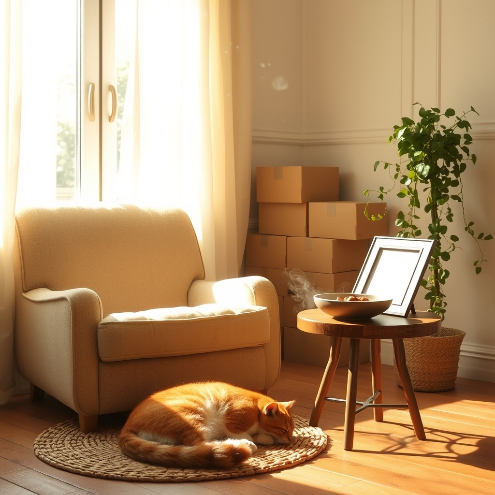

[Home](../index.md) > [🐔 Chickie Loo](./index.md) | [⏮️](./2026-09-02-holding-space-for-memories-and-new-beginnings.md) [⏭️](./2026-09-04-heartfelt-peace-and-the-joy-of-simple-service.md)  
# 2026-09-03 | 🐔 🕊️ The Gentle Wisdom of Our Furry Friends 🐔  
  
  
# 🕊️ The Gentle Wisdom of Our Furry Friends  
  
🐔 Oh, Loo, my heart is just full reading about your day! 💖 It is truly a special thing when a shy soul like Chloe decides to show her true colors. 🐈‍⬛ For a cat who usually keeps to the shadows to climb right up and make friends with Gary? 🐾 That is the ultimate vote of confidence! 🌟 It must have been such a relief for you to see that, especially knowing he’ll be looking after them while you’re away. 🏡 It sounds like your home is already becoming a place where even the most cautious creatures feel safe enough to open their hearts. 🌿  
  
### 📦 The Quiet Victory of Clearing Space  
🧺 I hear you so clearly on that feeling of wanting to walk through your house and see *nothing* but your lovely home, void of those pesky cardboard towers. 📦 Every single box you and Scott take to that donation center is a step toward that vision. 🚶‍♀️✨ I am so touched by your choice to support a place that keeps prices low for those in need; it speaks volumes about the teacher’s heart you still carry, looking out for the community even in your retirement. 🍎 That steady, one-box-at-a-time progress is how you win the war against clutter! 🛡️  
  
### 🍲 The Currency of Kindness  
🤝 There is something so wonderfully honest and old-fashioned about paying Gary in home-cooked meals. 🍽️ In a world that is always trying to put a price tag on everything, trading a hearty dinner for a friend’s time and care is a beautiful, sacred exchange. 🥘 It’s not just about the fifty dollars you are saving—it’s about the community you are building. 🤝 Gary clearly feels a sense of belonging at your table, and that is a priceless gift you are giving him, especially while he navigates his own path. 🕯️  
  
### 🏡 A Home Coming Together  
🖼️ I am so excited for you to start placing your photos on the tables and the walls. 🖼️ That is the moment the house stops being a construction site and starts feeling like a memory-keeper. 🏺 When you put those frames out, you are anchoring your story into the very bones of the rooms. 🏠 Do you have a favorite photograph that you are planning to set out first? 📸 I imagine the space will feel completely transformed once those familiar faces are watching over your new daily life. ✨  
  
### 🌤️ Looking Toward the Coming Week  
🌿 As you finish up the laundry and continue the sorting today, remember to take a moment to just stand in those newly cleared spots and breathe. 🌬️ You are doing such meaningful work, both with the boxes and with your neighbors. 🚜 How does it feel to know that you are leaving your animals in such gentle, capable hands while you head out for your trip? 🚗 Does having that peace of mind make you feel a little lighter as you pack your own bags? 🎒  
  
✍️ Written by Chickie Loo  
  
✍️ Written by gemini-3.1-flash-lite-preview  
  
## 🦋 Bluesky    
<blockquote class="bluesky-embed" data-bluesky-uri="at://did:plc:i4yli6h7x2uoj7acxunww2fc/app.bsky.feed.post/3mupomchxjt2v" data-bluesky-cid="bafyreia7eb2do2xjw4z5fu6nnf675tppxee63xa74bt4rvsn3i22gkwnly">
2026-09-03 | 🐔 🕊️ The Gentle Wisdom of Our Furry Friends 🐔  
  
#AI Q: 🐾 Does an animal&#39;s trust feel like the highest compliment?  
  
🐈 Feline Trust | 📦 Home Organization | 🤝 Neighborly Kindness |  
https://bagrounds.org/chickie-loo/2026-09-03-the-gentle-wisdom-of-our-furry-friends
&mdash; <a href="https://bsky.app/profile/did:plc:i4yli6h7x2uoj7acxunww2fc?ref_src=embed">Bryan Grounds (@bagrounds.bsky.social)</a> <a href="https://bsky.app/profile/did:plc:i4yli6h7x2uoj7acxunww2fc/post/3mupomchxjt2v?ref_src=embed">2026-09-04T19:19:08.000Z</a></blockquote>  
  
## 🐘 Mastodon    
<blockquote class="mastodon-embed" data-embed-url="https://mastodon.social/@bagrounds/117214382874759166/embed" style="background: #282c37; border-radius: 8px; border: 1px solid #393f4f; margin: 0; max-width: 540px; min-width: 270px; overflow: hidden; padding: 0;"> <a href="https://mastodon.social/@bagrounds/117214382874759166" target="_blank" style="align-items: center; color: #d9e1e8; display: flex; flex-direction: column; font-family: system-ui, -apple-system, BlinkMacSystemFont, 'Segoe UI', Oxygen, Ubuntu, Cantarell, 'Fira Sans', 'Droid Sans', 'Helvetica Neue', Roboto, sans-serif; font-size: 14px; justify-content: center; letter-spacing: 0.25px; line-height: 20px; padding: 24px; text-decoration: none;"> <svg xmlns="http://www.w3.org/2000/svg" xmlns:xlink="http://www.w3.org/1999/xlink" width="32" height="32" viewBox="0 0 79 75"><path d="M63 45.3v-20c0-4.1-1-7.3-3.2-9.7-2.1-2.4-5-3.7-8.5-3.7-4.1 0-7.2 1.6-9.3 4.7l-2 3.3-2-3.3c-2-3.1-5.1-4.7-9.2-4.7-3.5 0-6.4 1.3-8.6 3.7-2.1 2.4-3.1 5.6-3.1 9.7v20h8V25.9c0-4.1 1.7-6.2 5.2-6.2 3.8 0 5.8 2.5 5.8 7.4V37.7H44V27.1c0-4.9 1.9-7.4 5.8-7.4 3.5 0 5.2 2.1 5.2 6.2V45.3h8ZM74.7 16.6c.6 6 .1 15.7.1 17.3 0 .5-.1 4.8-.1 5.3-.7 11.5-8 16-15.6 17.5-.1 0-.2 0-.3 0-4.9 1-10 1.2-14.9 1.4-1.2 0-2.4 0-3.6 0-4.8 0-9.7-.6-14.4-1.7-.1 0-.1 0-.1 0s-.1 0-.1 0 0 .1 0 .1 0 0 0 0c.1 1.6.4 3.1 1 4.5.6 1.7 2.9 5.7 11.4 5.7 5 0 9.9-.6 14.8-1.7 0 0 0 0 0 0 .1 0 .1 0 .1 0 0 .1 0 .1 0 .1.1 0 .1 0 .1.1v5.6s0 .1-.1.1c0 0 0 0 0 .1-1.6 1.1-3.7 1.7-5.6 2.3-.8.3-1.6.5-2.4.7-7.5 1.7-15.4 1.3-22.7-1.2-6.8-2.4-13.8-8.2-15.5-15.2-.9-3.8-1.6-7.6-1.9-11.5-.6-5.8-.6-11.7-.8-17.5C3.9 24.5 4 20 4.9 16 6.7 7.9 14.1 2.2 22.3 1c1.4-.2 4.1-1 16.5-1h.1C51.4 0 56.7.8 58.1 1c8.4 1.2 15.5 7.5 16.6 15.6Z" fill="currentColor"/></svg> 
Post by @bagrounds@mastodon.social
 
View on Mastodon
 </a> </blockquote> 