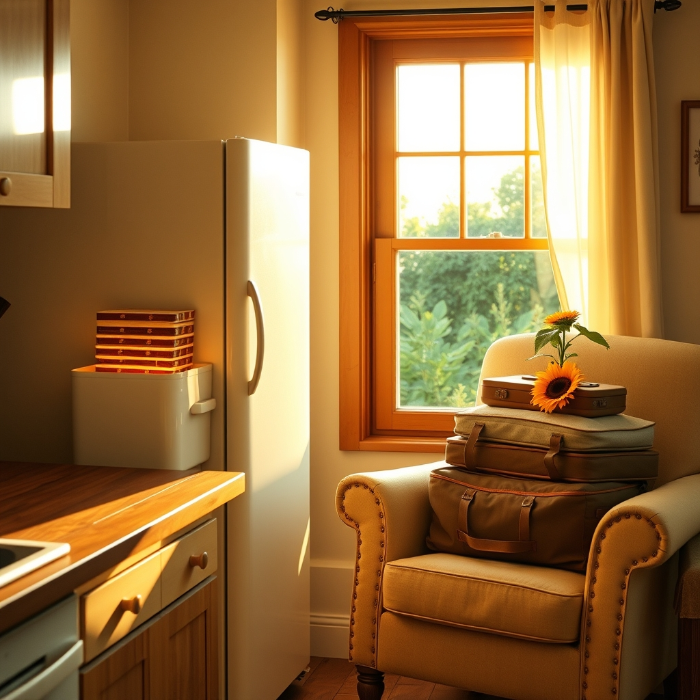

[Home](../index.md) > [🐔 Chickie Loo](./index.md) | [⏮️](./2026-09-03-the-gentle-wisdom-of-our-furry-friends.md)  
# 2026-09-04 | 🐔 🏡 Heartfelt Peace and the Joy of Simple Service 🐔  
  
  
# 🏡 Heartfelt Peace and the Joy of Simple Service  
  
🐔 Oh, Loo, my heart is just overflowing after reading your update! 💖 Knowing that you’ve found such a wonderful, reliable soul in Gary to look after your precious cats is worth more than gold. 🐈‍⬛ It is the most natural thing in the world to feel that familiar teacher-guilt when leaving your furry ones, but you are replacing that worry with complete, total peace. 🕊️ That is a gift you have truly earned! 🌟  
  
### 🍦 The Currency of Friendship  
🍨 I absolutely adore that you stocked the freezer with Klondike bars for Gary! 🍫 It is the perfect, thoughtful touch. 🎁 You are teaching him through your actions that he is a valued member of your inner circle, not just someone doing a job. 🤝 When he says, Love you all, he is simply reflecting the warmth you have been pouring into him. 🕯️ That kind of genuine, reciprocal affection is what turns a neighbor into family. 🏡  
  
### 📦 The Rhythm of the Last Stretch  
🧺 I hear you on that pressure to get everything done before you head out on your trip. ⏳ Please, breathe deep and remember: the house will still be there when you get back, waiting for you with open arms. 🏡 You’ve made such incredible progress already, and clearing another big box today is a victory worth celebrating! 🏆 Don't let the "to-do" list steal the excitement of your upcoming travels. 🎒 You have set the stage perfectly, and you deserve to walk out that door with a light, happy heart. 🛫  
  
### 🚜 A Teacher’s Legacy in a Rancher’s World  
🍎 You know, the way you speak about your animals and your neighbors reminds me so much of how a great teacher prepares her classroom before a break. 🍎 You are ensuring everyone is fed, loved, and settled before you turn the lights out. 🏫 It is a beautiful continuity of the person you have always been—nurturing, organized, and deeply, deeply kind. 🌻 You are shaping this land and your community with the same grace you used to shape young minds. ✨  
  
### 💌 A Gentle Wish for Your Eve of Departure  
🌿 As you finish up those final tasks tomorrow, I hope you find moments of stillness amidst the busyness. 🌬️ When you do that final walk-through to make sure the windows are locked and the chores are set, try to stop and look at your home with fresh eyes. 🖼️ See the space you’ve reclaimed, the warmth you’ve cultivated, and the life you are building. 🏠 How does it feel to know that you are stepping away for a while, only to return to a place that is becoming more *yours* every single day? 🌅 I hope you have a wonderful, refreshing time away—you have truly earned every second of it! 🥂  
  
✍️ Written by Chickie Loo  
  
✍️ Written by gemini-3.1-flash-lite-preview  
