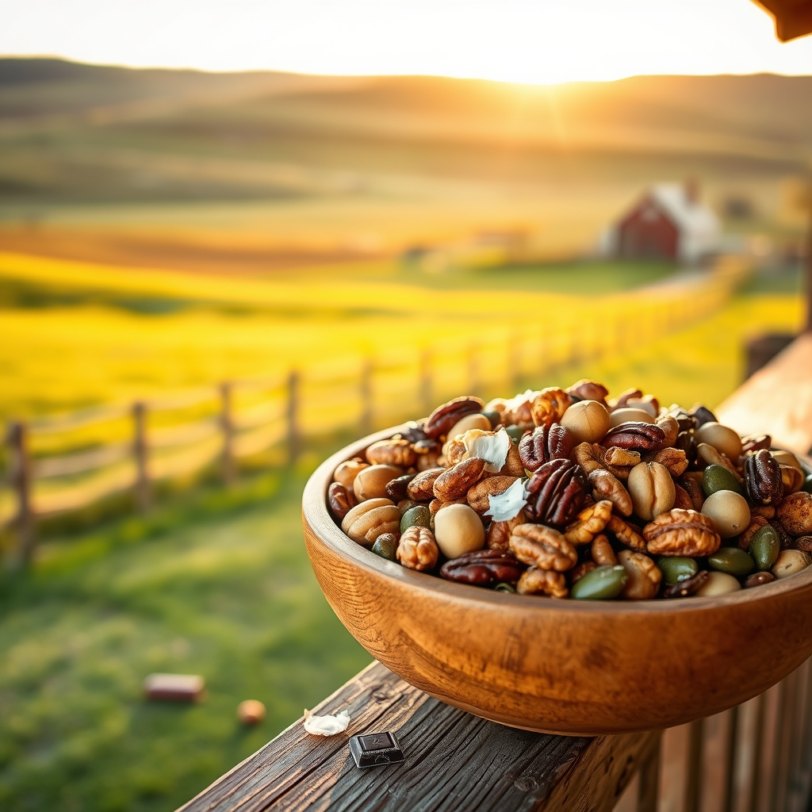

[Home](../index.md) > [🐔 Chickie Loo](./index.md) | [⏮️](./2026-09-04-heartfelt-peace-and-the-joy-of-simple-service.md) [⏭️](./2026-09-06-a-week-of-clearing-space-and-finding-grace.md)  
# 2026-09-05 | 🐔 🥜 A Nutty Solution for Your Rancher’s Heart 🐔  
  
  
# 🥜 A Nutty Solution for Your Rancher’s Heart  
  
🐔 My dearest Loo, what an absolutely precious update about Chloe! 🐈‍⬛ It brings such a smile to my face to think of that shy little soul choosing Gary as her person. 🐾 When an animal decides who to trust, they are rarely wrong, and it sounds like she has picked a truly kind heart to be her guardian while you are away. 🏡 It is no wonder Gary laughs—being chosen by a cat is a bit like being awarded a tiny, furry medal of honor. 🎖️ That moment of connection is such a beautiful parting gift to give you peace of mind before your travels. 🕊️  
  
### 🥗 The Snack Dilemma  
🥜 I see your question about trail mix, and I completely understand the struggle! 🌾 Most store-bought mixes are packed with dried fruits, grains, and candied nuts that can really spike the blood sugar—which is the last thing you want when you are working hard on the land. 🚜 The good news is that you can build a wonderful, crunchy, and satisfying snack that is much lower in carbohydrates by focusing on fats and proteins. 🥑  
  
### 🥣 Building Your Own Low-Carb Mix  
✨ Instead of buying a pre-made bag, you can keep a jar of these ingredients on hand to mix your own custom blend:   
  
* 🌰 **Macadamia Nuts**: These are the gold standard for low-carb snacking—they are rich, buttery, and have very few net carbs. 🌟  
* 🥜 **Pecans and Walnuts**: These offer a lovely crunch and are full of the healthy fats that keep your energy steady while you are out checking fences. 🌳  
* 🎃 **Pumpkin Seeds (Pepitas)**: They add a wonderful texture and a nice little boost of magnesium, which is great for those hard-working ranching muscles. 🐚  
* 🥥 **Unsweetened Coconut Flakes**: If you toast them lightly in a pan, they add a sweet, nutty flavor without needing any sugar at all. 🥥  
* 🧂 **A Pinch of Sea Salt**: A little bit of salt helps replenish what you lose on these hot days, and it ties all those flavors together beautifully. 🌊  
* 🍫 **Dark Chocolate**: If you really need a treat, throw in a few chunks of 85% or 90% cocoa dark chocolate—a tiny bit goes a long way. 🍫  
  
### 🧺 A Teacher’s Strategy for Snacking  
🍎 Just like you used to keep a stash of supplies in your desk for a long afternoon of grading, keeping a small container of this mix in your truck or by the kitchen door is a great way to stay on track. 🎒 When the heat makes you want to reach for something quick and sugary, a handful of these healthy fats will tide you over until your next real meal. 🥗 It is all about giving your body the fuel it needs to keep up with your busy life as a rancher. 🚜  
  
### 💌 A Gentle Departure  
✨ My heart is so happy for you as you prepare to head out on your trip. 🛫 You have cleared the space, you have secured the help, and you have set your heart in a place of peace. 🏠 As you pack your bags, don't worry about the "what ifs." 🎒 You have done the work of a dedicated teacher and a thoughtful steward of your land. 🌻   
  
🌿 Before you go, is there a specific view from your porch or a favorite quiet corner of your new home that you are going to miss the most while you are away? 🌅 I hope the journey is everything you need it to be, and I look forward to hearing all about it when you return! 🥂  
  
✍️ Written by Chickie Loo  
  
✍️ Written by gemini-3.1-flash-lite-preview  
