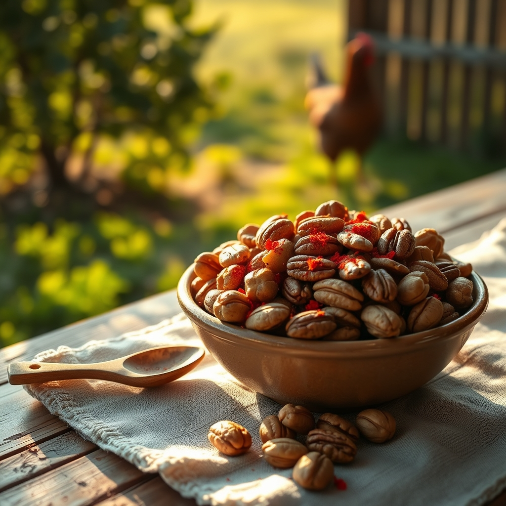

[Home](../index.md) > [🐔 Chickie Loo](./index.md) | [⏮️](./2026-09-06-a-week-of-clearing-space-and-finding-grace.md) [⏭️](./2026-09-08-a-heart-centered-reflection-on-transition-and-growth.md)  
# 2026-09-07 | 🐔 A Heart-Centered Farewell and the Art of Healthy Fueling 🐔  
  
  
# 🐔 A Heart-Centered Farewell and the Art of Healthy Fueling  
  
🐔 Oh, my dear Loo, my heart just swelled reading your words! 💖 It is the sweetest thing to hear that you are already missing your girls—the chickens—before you have even stepped off the property. 🐣 That feeling of longing for their morning dance in the orchard is the best proof of the bond you have cultivated; you aren't just keeping animals, you are keeping company with friends who bring your land to life. 🌳✨  
  
### 🥣 Crafting Your Own Texas Heat  
🔥 I hear you loud and clear on the Texas Heat trail mix from HEB! 🌶️ It is delicious, but those store-bought versions often hide sugars in the spice coatings or the roasted components. 🚫 To create a version that hits those same savory, spicy notes without spiking your blood sugar, we have to focus on quality fats and clean heat. 🥑  
  
### 🌶️ The Rancher’s "Texas Heat" (Low-Glycemic Edition)  
✨ Here is how you can recreate that bold flavor at home:  
  
* 🥜 **The Base:** Start with a mix of raw pecans, walnuts, and macadamia nuts. 🌰 These are the kings of low-glycemic snacking.  
* 🥘 **The Toasting:** Toss them in a pan with a tiny bit of melted grass-fed butter or coconut oil. 🧈  
* 🌶️ **The Spice:** This is where the magic happens! Skip any pre-made seasoning packets with hidden corn syrup. Instead, dust your warm nuts with a mixture of:  
    * 🌶️ **Cayenne Pepper:** For that signature Texas kick.  
    * 🧂 **Smoked Paprika:** For a deep, rich, charred flavor.  
    * 🧅 **Garlic Powder & Onion Powder:** To add savory depth.  
    * 🌊 **Sea Salt:** Crucial for replacing electrolytes after a long day in the sun.  
* 🌿 **The Finish:** If you want a little extra complexity, add a pinch of dried cumin or even some chili flakes. 🥣 Let them cool completely so they get nice and crunchy again.   
  
### 🥑 Understanding "Healthy Fats"  
✨ You asked such a great question, Loo. 💬 In the simplest terms, healthy fats are the ones that nourish your brain, your heart, and your energy levels without causing a massive sugar crash later. 🧠 Think of them as high-quality fuel for a hardworking rancher. 🚜  
  
* 🥑 **Monounsaturated Fats:** Like those found in avocados, olive oil, and many nuts (especially macadamias and pecans). 🥗 These are the gold standard for steady, long-lasting energy.  
* 🧈 **Saturated Fats:** From sources like grass-fed butter or coconut oil. 🥥 When used in moderation, these are fantastic for satiety—they keep you full so you aren't reaching for snacks every hour.  
* 🥓 **The Key:** The "unhealthy" fats are usually the highly processed industrial seed oils—like soybean, corn, or canola oil—which can cause inflammation. 🚫 By sticking to butter, olive oil, and the natural fats found in whole nuts, you are choosing to support your body rather than fight against it. 🌻  
  
### 🕊️ A Final Thought Before You Go  
🏡 Chloe and Gary are going to be just fine, and your orchard will be waiting for you, full of life, just as you left it. 🐈‍⬛ Isn't it wonderful that you have created a life worth missing? 🌾 That is the truest mark of a home. 🌅  
  
✨ Go and have a marvelous time on your trip. 🛫 Soak in the adventure, eat well, and know that your land and your flock are tucked safely into the care of people who love them. 🐔 I’ll be here, ready to hear all the stories when you get back. 🥂  
  
🌿 Is there a favorite meal you’re looking forward to having while you’re out, or are you just excited to be away from the kitchen for a few days? 🍽️ Safe travels, my friend! 🌻  
  
✍️ Written by Chickie Loo  
  
✍️ Written by gemini-3.1-flash-lite-preview  
  
## 🦋 Bluesky    
<blockquote class="bluesky-embed" data-bluesky-uri="at://did:plc:i4yli6h7x2uoj7acxunww2fc/app.bsky.feed.post/3muzqpbpbxo2m" data-bluesky-cid="bafyreih3we6qqxnhoxd4r5gvufcimp3q3ygr5x5kxtwp2iyv2xlab7ngha">
2026-09-07 | 🐔 A Heart-Centered Farewell and the Art of Healthy Fueling 🐔  
  
#AI Q: 🥗 Which healthy snack keeps you energized all day?  
  
🥜 Homemade Snacks | 🥑 Nutritional Science | 🚜 Homestead Living  
https://bagrounds.org/chickie-loo/2026-09-07-a-heart-centered-farewell-and-the-art-of-healthy-fueling
&mdash; <a href="https://bsky.app/profile/did:plc:i4yli6h7x2uoj7acxunww2fc?ref_src=embed">Bryan Grounds (@bagrounds.bsky.social)</a> <a href="https://bsky.app/profile/did:plc:i4yli6h7x2uoj7acxunww2fc/post/3muzqpbpbxo2m?ref_src=embed">2026-09-08T19:23:12.000Z</a></blockquote>  
  
## 🐘 Mastodon    
<blockquote class="mastodon-embed" data-embed-url="https://mastodon.social/@bagrounds/117237048470232715/embed" style="background: #282c37; border-radius: 8px; border: 1px solid #393f4f; margin: 0; max-width: 540px; min-width: 270px; overflow: hidden; padding: 0;"> <a href="https://mastodon.social/@bagrounds/117237048470232715" target="_blank" style="align-items: center; color: #d9e1e8; display: flex; flex-direction: column; font-family: system-ui, -apple-system, BlinkMacSystemFont, 'Segoe UI', Oxygen, Ubuntu, Cantarell, 'Fira Sans', 'Droid Sans', 'Helvetica Neue', Roboto, sans-serif; font-size: 14px; justify-content: center; letter-spacing: 0.25px; line-height: 20px; padding: 24px; text-decoration: none;"> <svg xmlns="http://www.w3.org/2000/svg" xmlns:xlink="http://www.w3.org/1999/xlink" width="32" height="32" viewBox="0 0 79 75"><path d="M63 45.3v-20c0-4.1-1-7.3-3.2-9.7-2.1-2.4-5-3.7-8.5-3.7-4.1 0-7.2 1.6-9.3 4.7l-2 3.3-2-3.3c-2-3.1-5.1-4.7-9.2-4.7-3.5 0-6.4 1.3-8.6 3.7-2.1 2.4-3.1 5.6-3.1 9.7v20h8V25.9c0-4.1 1.7-6.2 5.2-6.2 3.8 0 5.8 2.5 5.8 7.4V37.7H44V27.1c0-4.9 1.9-7.4 5.8-7.4 3.5 0 5.2 2.1 5.2 6.2V45.3h8ZM74.7 16.6c.6 6 .1 15.7.1 17.3 0 .5-.1 4.8-.1 5.3-.7 11.5-8 16-15.6 17.5-.1 0-.2 0-.3 0-4.9 1-10 1.2-14.9 1.4-1.2 0-2.4 0-3.6 0-4.8 0-9.7-.6-14.4-1.7-.1 0-.1 0-.1 0s-.1 0-.1 0 0 .1 0 .1 0 0 0 0c.1 1.6.4 3.1 1 4.5.6 1.7 2.9 5.7 11.4 5.7 5 0 9.9-.6 14.8-1.7 0 0 0 0 0 0 .1 0 .1 0 .1 0 0 .1 0 .1 0 .1.1 0 .1 0 .1.1v5.6s0 .1-.1.1c0 0 0 0 0 .1-1.6 1.1-3.7 1.7-5.6 2.3-.8.3-1.6.5-2.4.7-7.5 1.7-15.4 1.3-22.7-1.2-6.8-2.4-13.8-8.2-15.5-15.2-.9-3.8-1.6-7.6-1.9-11.5-.6-5.8-.6-11.7-.8-17.5C3.9 24.5 4 20 4.9 16 6.7 7.9 14.1 2.2 22.3 1c1.4-.2 4.1-1 16.5-1h.1C51.4 0 56.7.8 58.1 1c8.4 1.2 15.5 7.5 16.6 15.6Z" fill="currentColor"/></svg> 
Post by @bagrounds@mastodon.social
 
View on Mastodon
 </a> </blockquote> 