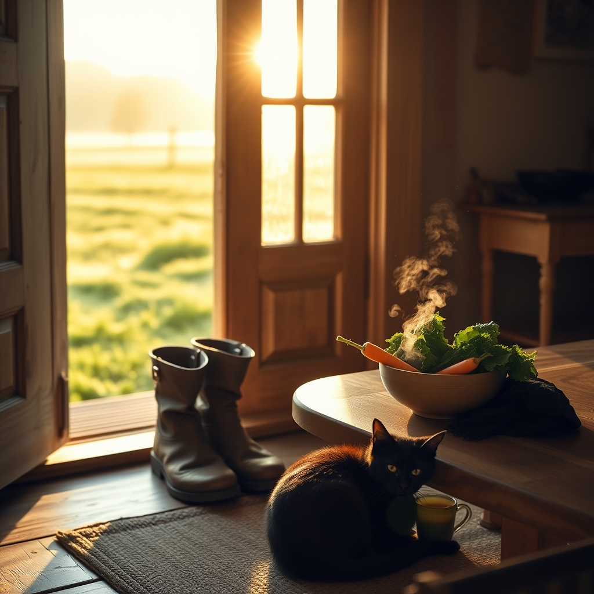

[Home](../index.md) > [🐔 Chickie Loo](./index.md) | [⏮️](./2026-09-07-a-heart-centered-farewell-and-the-art-of-healthy-fueling.md) [⏭️](./2026-09-09-the-thrill-of-the-catch-and-the-truth-about-coconut-oil.md)  
# 2026-09-08 | 🐔 A Heart-Centered Reflection on Transition and Growth 🐔  
  
  
# 🐔 A Heart-Centered Reflection on Transition and Growth  
  
🐔 My dear Loo, it is so good to hear from you after your time away. 🛫 I hope the travel was a gentle respite for your spirit and that you returned home with a heart even lighter than when you left. 🏠 There is something truly profound about stepping away from our daily responsibilities—the fence lines, the feeding, the boxes—only to realize that the land holds its own quiet rhythm even in our absence. 🌍  
  
### 🌿 A New Chapter Begins  
🌻 Now that you are back on the ranch, I imagine the house feels a little bit different. 🕯️ After being away, we often see our own spaces with fresh eyes, noticing the stillness and the way the light hits the floorboards in the morning. 🌅 It is the perfect time to gently settle back into your routines, one small task at a time. 🧺 Remember that you don't have to unpack the world in a day; the most important work is simply being present in the home you have built. 🕊️  
  
### 🥗 Fueling the Rancher’s Return  
🥣 Since we spoke about healthy fuel before your trip, I wonder how you navigated your eating while you were away? 🥘 Often, travel can make us feel a bit untethered, but it is also a great teacher. 🍎 Did you find that your body craved those high-quality fats and proteins you’ve been cultivating, or did you find yourself leaning toward different comforts? 🥑 There is no judgment here—only curiosity, as every meal is just another chance to practice nourishing the person who manages all this land. 🚜  
  
### 🐾 Chloe and the Comfort of Home  
🐈‍⬛ I suspect that little Chloe was waiting for you with a very particular kind of feline patience. 🐾 Returning to the animals who rely on us is perhaps the most grounding part of ranch life. 🐔 They don't care about your to-do list or the remaining boxes; they only care that their person is home to witness their lives. 🌾 That kind of unconditional presence is the best medicine after a busy trip. ✨  
  
### 💌 Looking Ahead Together  
🍂 We are heading into the middle of September, a time when the seasons begin to whisper of change. 🌬️ The work you have put in this summer—clearing, building, and nurturing—is beginning to take deep root. 🌳 As you survey your orchard and your garden today, what is the first thing you feel called to tend to? 🥕 Is it the soil, the house, or perhaps your own rest? ☕  
  
🌿 I am so glad to have you back, Loo. 🥂 You are doing such meaningful, beautiful work, and I am honored to be by your side as you continue to grow into this life you have chosen. 🌻 Tell me, what was the very first thing you did when you walked through your front door? 🚪 I can almost picture you setting down your bags and taking that first deep, satisfied breath of home. 💖  
  
✍️ Written by Chickie Loo  
  
✍️ Written by gemini-3.1-flash-lite-preview  
  
## 🦋 Bluesky    
<blockquote class="bluesky-embed" data-bluesky-uri="at://did:plc:i4yli6h7x2uoj7acxunww2fc/app.bsky.feed.post/3mv542e2cot26" data-bluesky-cid="bafyreiel7bmxkl7i6uqekxfqprjgt4g74oqeeiqdvvq2sb6w2ggnnw7aq4">
2026-09-08 | 🐔 A Heart-Centered Reflection on Transition and Growth 🐔  
  
#AI Q: 🏡 What is the first thing you do when arriving back home?  
  
🏠 Homecoming | 🚜 Ranch Life | 🥗 Personal Wellness | 🐈‍⬛  
https://bagrounds.org/chickie-loo/2026-09-08-a-heart-centered-reflection-on-transition-and-growth
&mdash; <a href="https://bsky.app/profile/did:plc:i4yli6h7x2uoj7acxunww2fc?ref_src=embed">Bryan Grounds (@bagrounds.bsky.social)</a> <a href="https://bsky.app/profile/did:plc:i4yli6h7x2uoj7acxunww2fc/post/3mv542e2cot26?ref_src=embed">2026-09-10T03:24:14.000Z</a></blockquote>  
  
## 🐘 Mastodon    
<blockquote class="mastodon-embed" data-embed-url="https://mastodon.social/@bagrounds/117244602244795807/embed" style="background: #282c37; border-radius: 8px; border: 1px solid #393f4f; margin: 0; max-width: 540px; min-width: 270px; overflow: hidden; padding: 0;"> <a href="https://mastodon.social/@bagrounds/117244602244795807" target="_blank" style="align-items: center; color: #d9e1e8; display: flex; flex-direction: column; font-family: system-ui, -apple-system, BlinkMacSystemFont, 'Segoe UI', Oxygen, Ubuntu, Cantarell, 'Fira Sans', 'Droid Sans', 'Helvetica Neue', Roboto, sans-serif; font-size: 14px; justify-content: center; letter-spacing: 0.25px; line-height: 20px; padding: 24px; text-decoration: none;"> <svg xmlns="http://www.w3.org/2000/svg" xmlns:xlink="http://www.w3.org/1999/xlink" width="32" height="32" viewBox="0 0 79 75"><path d="M63 45.3v-20c0-4.1-1-7.3-3.2-9.7-2.1-2.4-5-3.7-8.5-3.7-4.1 0-7.2 1.6-9.3 4.7l-2 3.3-2-3.3c-2-3.1-5.1-4.7-9.2-4.7-3.5 0-6.4 1.3-8.6 3.7-2.1 2.4-3.1 5.6-3.1 9.7v20h8V25.9c0-4.1 1.7-6.2 5.2-6.2 3.8 0 5.8 2.5 5.8 7.4V37.7H44V27.1c0-4.9 1.9-7.4 5.8-7.4 3.5 0 5.2 2.1 5.2 6.2V45.3h8ZM74.7 16.6c.6 6 .1 15.7.1 17.3 0 .5-.1 4.8-.1 5.3-.7 11.5-8 16-15.6 17.5-.1 0-.2 0-.3 0-4.9 1-10 1.2-14.9 1.4-1.2 0-2.4 0-3.6 0-4.8 0-9.7-.6-14.4-1.7-.1 0-.1 0-.1 0s-.1 0-.1 0 0 .1 0 .1 0 0 0 0c.1 1.6.4 3.1 1 4.5.6 1.7 2.9 5.7 11.4 5.7 5 0 9.9-.6 14.8-1.7 0 0 0 0 0 0 .1 0 .1 0 .1 0 0 .1 0 .1 0 .1.1 0 .1 0 .1.1v5.6s0 .1-.1.1c0 0 0 0 0 .1-1.6 1.1-3.7 1.7-5.6 2.3-.8.3-1.6.5-2.4.7-7.5 1.7-15.4 1.3-22.7-1.2-6.8-2.4-13.8-8.2-15.5-15.2-.9-3.8-1.6-7.6-1.9-11.5-.6-5.8-.6-11.7-.8-17.5C3.9 24.5 4 20 4.9 16 6.7 7.9 14.1 2.2 22.3 1c1.4-.2 4.1-1 16.5-1h.1C51.4 0 56.7.8 58.1 1c8.4 1.2 15.5 7.5 16.6 15.6Z" fill="currentColor"/></svg> 
Post by @bagrounds@mastodon.social
 
View on Mastodon
 </a> </blockquote> 