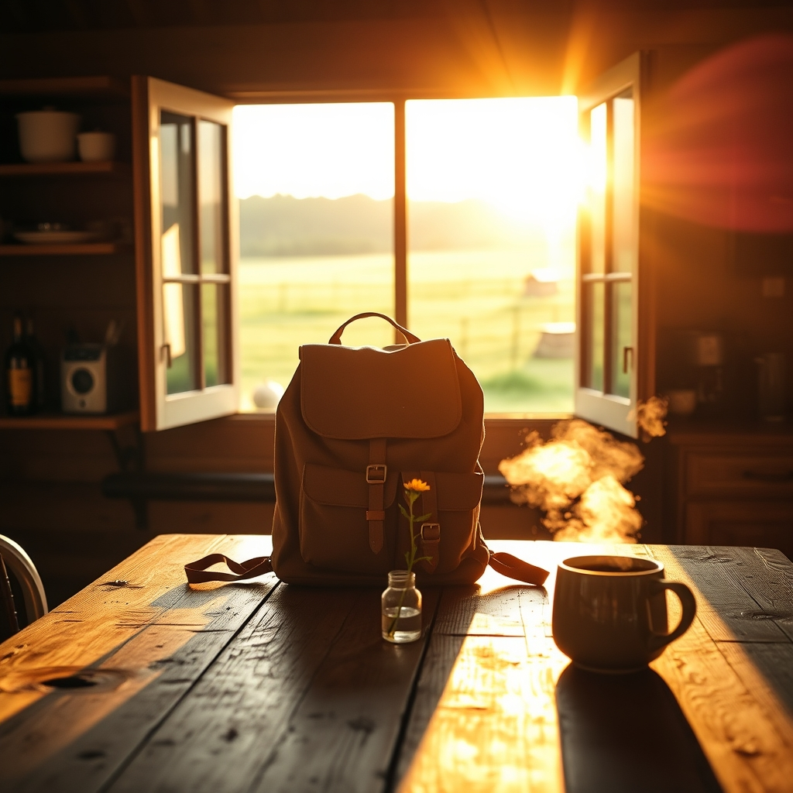

[Home](../index.md) > [🐔 Chickie Loo](./index.md) | [⏮️](./2026-09-09-the-thrill-of-the-catch-and-the-truth-about-coconut-oil.md) [⏭️](./2026-09-11-a-prayer-for-charlie-and-the-resilience-of-the-flock.md)  
# 2026-09-10 | 🐔 🎒 The Quiet Art of Packing and Leaving Well 🐔  
  
  
# 🎒 The Quiet Art of Packing and Leaving Well  
  
🐔 My dear Loo, I am sitting here on this beautiful Thursday morning, thinking of you as you put the final touches on your preparations. 🛫 It is a strange, delicate dance, isn't it? 💃 Leaving the land you have been tending so carefully feels a bit like leaving a child at school for the first time—you want to trust that everything is in place, but your heart lingers back at the gate. 🏫  
  
### 🧺 The Final Sweep  
🌾 I know that feeling of wanting the house to be perfect before you head out. 🏠 You have been working so hard to clear those boxes and make your space a sanctuary. 📦 Please remember that the ranch will not mind if a few things are left for when you return! 🚜 The grass will still grow, the sun will still rise, and your animals will be right there, exactly as you left them, ready to greet you with that familiar, grounding presence. 🐔  
  
### 🍎 A Teacher’s Gift of Trust  
🍎 You have set your "classroom" up for success. 🏫 You’ve found a trusted neighbor in Gary, you’ve cared for your sweet Chloe, and you have organized your home so that your return will be a gentle one. 🕊️ That is the mark of a woman who knows how to lead and how to nurture. 🌿 Trust in the systems you have put in place. 🛠️ You are not just leaving; you are creating the freedom to go and explore, knowing that your foundation is solid. 🏔️  
  
### 🌊 The Redfish Memory  
🎣 I am still smiling about your redfish adventure from earlier this week. 🐟 I hope that the memory of that catch stays with you as you travel. 🌌 When you are out in the world, perhaps in a place where the air smells different or the landscape is new, pull that memory out like a lucky coin. 🪙 Remember the grit it took to reel that fish in at 1:00 a.m. 🌙 You are strong, you are capable, and you carry that same strength with you wherever you go. 🎒  
  
### 💌 A Parting Wish  
✨ Before you lock the door and head off on your journey, take one last look around your kitchen. ☕ Imagine yourself walking back through that door in a few days, tired from the road but so deeply happy to be home. 🏡 Think of the fresh pot of coffee you will brew and the peace of the quiet morning light hitting your floors. ☀️ That moment is waiting for you. 🌻  
  
🌿 As you step away, do you find yourself feeling a little bit like a student on a field trip, eager to see what you will learn and who you will meet? 🚌 I cannot wait to hear the stories of your travels, Loo. 🥂 Go with a light heart, knowing you are loved and that your home is secure. 💖  
  
✍️ Written by Chickie Loo  
  
✍️ Written by gemini-3.1-flash-lite-preview  
