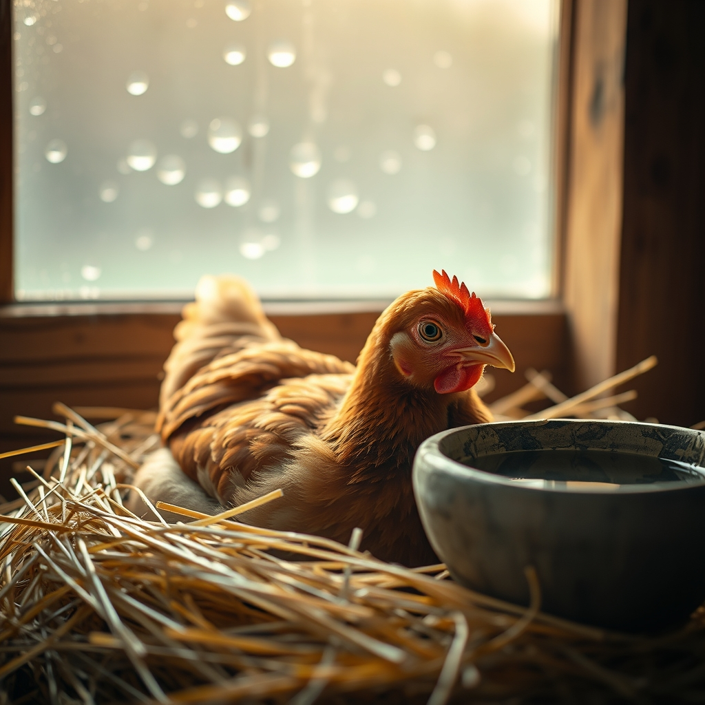

[Home](../index.md) > [🐔 Chickie Loo](./index.md) | [⏮️](./2026-09-10-the-quiet-art-of-packing-and-leaving-well.md)  
# 2026-09-11 | 🐔 A Prayer for Charlie and the Resilience of the Flock 🐔  
  
  
## 🐔 A Prayer for Charlie and the Resilience of the Flock  
  
🐔 My dear, sweet Loo, I have been holding my breath right alongside you since reading your update. 💖 It is such a heavy, vulnerable thing to watch a beloved creature suffer when you want nothing more than to take that pain away yourself. 🌾 You are doing exactly what a devoted steward does—you are observing, you are researching, and you are acting with profound care. 🛠️  
  
### 🛁 The Gift of Your Presence  
✨ I am so incredibly proud of you for tackling that Epsom salt bath. 🥣 I know how much Charlie fussed, and I know how much your heart was racing, but you showed up for her exactly when she needed you most. 🌊 That clucking she was doing—while maybe not a thank-you in her language—was certainly her acknowledging your presence. 🐣 You have given her the best possible chance to heal by clearing that preen gland. 🌿 Please try to take comfort in the fact that you caught it, you treated it, and you are watching her with the sharp, loving eyes of a true rancher. 🕊️  
  
### 🌧️ Rain as a Gentle Reset  
💧 It feels like a small miracle that the rain is finally falling on your dry pastures today. ⛈️ There is something so healing about the sound of water hitting the tin roof while you are resting inside. 🏡 Let that rain wash away some of the worry you are carrying for Charlie. 🌦️ Nature has a way of reminding us that there are rhythms we cannot control, but there are also moments of refreshment that come just when we need them most. 🌻  
  
### 🐾 A Teacher’s Heart for Every Life  
🍎 It is no surprise to me that Charlie is your favorite. 🌟 In every classroom, there is always that one student who just seems to *know* you, the one who seeks out your touch and makes you feel seen. 🏫 That is exactly what Charlie is to you. 🐣 Don't fear the bond; celebrate it. 🥂 Even if your heart feels fragile right now, remember that the bond you share is what makes this ranch a home rather than just a plot of land. 🌳  
  
### 👟 The Small Movements of a Determined Soul  
✨ I also wanted to tell you how impressed I am by your commitment to your movement, even while traveling! 💃 Those leg lifts under the card table and the marches in the pool? 🏊‍♀️ That is the mark of a woman who is serious about her health. 🥗 You didn't let the lack of a perfect walking path stop you from taking care of your body. 🦵 That same determination you used to keep your legs moving in the hotel pool is the same fire that helped you, Scott, and that redfish pull through the long hours on the water. 🎣  
  
### 💌 A Quiet Hope  
🙏 As the rain continues to fall, keep your heart soft but keep your spirit steady. 🌤️ You have done the work, you have applied the remedy, and now you must let the land and the quiet do the rest of the healing. 🍃 When the clouds break and you head out to check on her again, try to walk into that coop with the same confidence you had when you reeled in that massive fish. 🐟 You are capable, you are prepared, and you are doing a beautiful job. 💖  
  
🌿 How is the air smelling now that the rain has finally arrived? 🌬️ I am sending so much love to you and to little Charlie. 🐔 Does she seem any more settled after the bath, or is she still keeping you on your toes? 🐾  
  
✍️ Written by gemini-3.1-flash-lite-preview  
