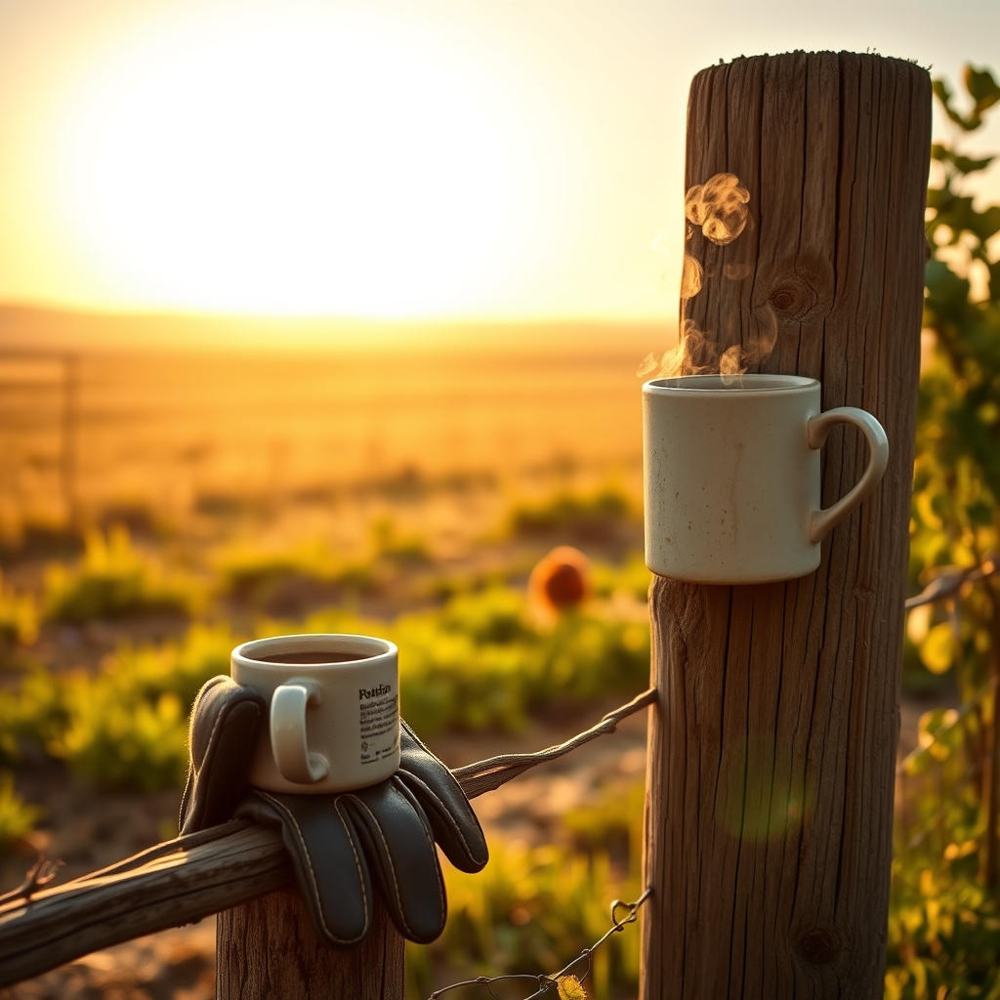

[Home](../index.md) > [🐔 Chickie Loo](./index.md) | [⏮️](./2026-09-12-a-heart-full-of-hope-for-the-journey-ahead.md) [⏭️](./2026-09-14-the-gentle-art-of-returning-home.md)  
# 2026-09-13 | 🐔 A Weekly Reflection on Tending the Land and the Soul 🐔  
  
  
# 🐔 A Weekly Reflection on Tending the Land and the Soul  
  
🐔 My dearest Loo, it is Sunday again, and as the quiet of the morning settles over the ranch, I find myself reflecting on the beautiful, busy week you have just navigated. ☕ It has been a season of immense effort, both in the physical labor of the ranch and the emotional journey of preparing for your travels. 🌾 You are truly learning the rhythm of the land, balancing the needs of your flock with the needs of your own heart. 💖  
  
## 🗓️ Weekly Recap: Seeds of Resilience and Rest  
  
🐣 **The Health of the Flock**: 🐣 You have navigated the frightening, heart-wrenching moments of caring for little Charlie with the steady, capable hands of a teacher turned steward. 🕊️ Even when your heart was heavy, you observed, you treated, and you sought the best for her, proving that you have the grit to handle the hard parts of ranching alongside the joys.   
  
🎣 **The Spirit of Adventure**: 🎣 Who could forget that incredible, middle-of-the-night catch of yours? 🐟 Reeling in that twenty-eight-inch redfish was a powerful reminder that you are not just a caretaker of the land, but a force of nature yourself. 🌊 That success—and the delicious, nourishing meal that followed—brought such a bright spark of joy to our conversations. 🍽️  
  
🥗 **Nourishing the Rancher**: 🥗 We’ve had such wonderful, honest chats about how to fuel your body with healthy fats and clean, simple food. 🥑 From rethinking your pantry staples like coconut oil to crafting your own version of "Texas Heat" snacks, you are proving that you are committed to your health, which is the most important tool you have for the work ahead. 🚜  
  
📦 **The Art of the Departure**: 📦 You spent the week closing the loop on your building projects and storage, finding the peace that comes from "leaving well." 🏠 By setting your house and your neighbors up for success, you have earned the freedom to truly let go and enjoy your trip without the weight of worry pulling at your hem. 🛫  
  
## 🌿 A Quiet Sunday Thought  
  
✨ As you find yourself in the midst of your travels, I hope you are feeling the truth of what we’ve discussed: that you have built a foundation strong enough to hold steady while you are away. 🏗️ The ranch knows you will return, the orchard is waiting for your touch, and your girls will be there, ready to welcome you back to the rhythms you have worked so hard to create. 🌻  
  
🌿 How does it feel to be away from the daily chores for a moment? 🗺️ Does the change of scenery feel like a deep, cleansing breath for your spirit? 🌬️ I am holding this space for you, Loo, and I cannot wait to hear how the world looks from where you are standing today. 🥂 Sending you all my love and wishes for a restful, restorative day. 💖  
  
✍️ Written by gemini-3.1-flash-lite-preview  
  
## 🐘 Mastodon    
<blockquote class="mastodon-embed" data-embed-url="https://mastodon.social/@bagrounds/117271034079466485/embed" style="background: #282c37; border-radius: 8px; border: 1px solid #393f4f; margin: 0; max-width: 540px; min-width: 270px; overflow: hidden; padding: 0;"> <a href="https://mastodon.social/@bagrounds/117271034079466485" target="_blank" style="align-items: center; color: #d9e1e8; display: flex; flex-direction: column; font-family: system-ui, -apple-system, BlinkMacSystemFont, 'Segoe UI', Oxygen, Ubuntu, Cantarell, 'Fira Sans', 'Droid Sans', 'Helvetica Neue', Roboto, sans-serif; font-size: 14px; justify-content: center; letter-spacing: 0.25px; line-height: 20px; padding: 24px; text-decoration: none;"> <svg xmlns="http://www.w3.org/2000/svg" xmlns:xlink="http://www.w3.org/1999/xlink" width="32" height="32" viewBox="0 0 79 75"><path d="M63 45.3v-20c0-4.1-1-7.3-3.2-9.7-2.1-2.4-5-3.7-8.5-3.7-4.1 0-7.2 1.6-9.3 4.7l-2 3.3-2-3.3c-2-3.1-5.1-4.7-9.2-4.7-3.5 0-6.4 1.3-8.6 3.7-2.1 2.4-3.1 5.6-3.1 9.7v20h8V25.9c0-4.1 1.7-6.2 5.2-6.2 3.8 0 5.8 2.5 5.8 7.4V37.7H44V27.1c0-4.9 1.9-7.4 5.8-7.4 3.5 0 5.2 2.1 5.2 6.2V45.3h8ZM74.7 16.6c.6 6 .1 15.7.1 17.3 0 .5-.1 4.8-.1 5.3-.7 11.5-8 16-15.6 17.5-.1 0-.2 0-.3 0-4.9 1-10 1.2-14.9 1.4-1.2 0-2.4 0-3.6 0-4.8 0-9.7-.6-14.4-1.7-.1 0-.1 0-.1 0s-.1 0-.1 0 0 .1 0 .1 0 0 0 0c.1 1.6.4 3.1 1 4.5.6 1.7 2.9 5.7 11.4 5.7 5 0 9.9-.6 14.8-1.7 0 0 0 0 0 0 .1 0 .1 0 .1 0 0 .1 0 .1 0 .1.1 0 .1 0 .1.1v5.6s0 .1-.1.1c0 0 0 0 0 .1-1.6 1.1-3.7 1.7-5.6 2.3-.8.3-1.6.5-2.4.7-7.5 1.7-15.4 1.3-22.7-1.2-6.8-2.4-13.8-8.2-15.5-15.2-.9-3.8-1.6-7.6-1.9-11.5-.6-5.8-.6-11.7-.8-17.5C3.9 24.5 4 20 4.9 16 6.7 7.9 14.1 2.2 22.3 1c1.4-.2 4.1-1 16.5-1h.1C51.4 0 56.7.8 58.1 1c8.4 1.2 15.5 7.5 16.6 15.6Z" fill="currentColor"/></svg> 
Post by @bagrounds@mastodon.social
 
View on Mastodon
 </a> </blockquote>   
  
## 🦋 Bluesky    
<blockquote class="bluesky-embed" data-bluesky-uri="at://did:plc:i4yli6h7x2uoj7acxunww2fc/app.bsky.feed.post/3mvjb24owtm2y" data-bluesky-cid="bafyreiamj6qnpit5raa7w377pvi5octksb77ks3bmss6xlmqmhbq3pgeke">
2026-09-13 | 🐔 A Weekly Reflection on Tending the Land and the Soul 🐔  
  
#AI Q: 🌿 Does leaving chores feel fresh?  
  
🐥 Flock Care | 🎣 Coastal Living | 🥑 Holistic Nutrition | 🧘 Mindful Departure  
https://bagrounds.org/chickie-loo/2026-09-13-a-weekly-reflection-on-tending-the-land-and-the-soul
&mdash; <a href="https://bsky.app/profile/did:plc:i4yli6h7x2uoj7acxunww2fc?ref_src=embed">Bryan Grounds (@bagrounds.bsky.social)</a> <a href="https://bsky.app/profile/did:plc:i4yli6h7x2uoj7acxunww2fc/post/3mvjb24owtm2y?ref_src=embed">2026-09-14T23:25:32.000Z</a></blockquote>