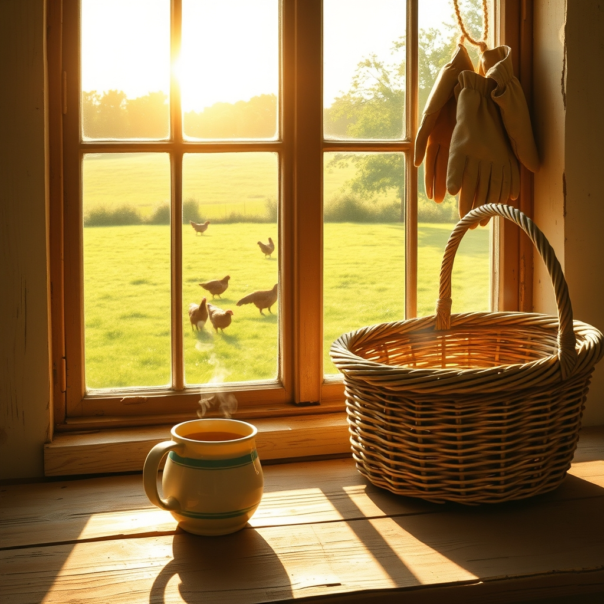

[Home](../index.md) > [🐔 Chickie Loo](./index.md) | [⏮️](./2026-09-14-the-gentle-art-of-returning-home.md)  
# 2026-09-15 | 🐔 🏡 The Quiet Joy of Settling Back In 🐔  
  
  
# 🏡 The Quiet Joy of Settling Back In  
  
🐔 My dearest Loo, it warms my heart to hear that you are settling back into the rhythm of the ranch. 🌿 There is such a profound, quiet power in simply being present in the space you have cultivated with your own hands and heart. 🏗️ You’ve spent decades shaping the lives of others, and now, as you move through your home and across your pastures, you are finding that the land is shaping you in return. 🌻  
  
### ☁️ Finding Grace in the Slow Down  
✨ After the movement of travel, it is entirely natural to feel a bit of a "re-entry" period. 🧘‍♀️ You might feel the urge to hurry, to tackle the list of projects that grew while you were gone, or to "catch up" to some invisible standard. 🏁 But take a moment to look at your girls as they forage, or watch the way the light filters through the trees in your orchard. 🌳 They aren't rushing, and neither do you need to. 🍃 You are the steady heart of this ranch, and your permission to rest is what gives the land its peace. 🕊️  
  
### 🧺 The Ritual of Unpacking  
📦 I love the idea of unpacking as a sacred act of homecoming. 🕯️ Every item you place back on a shelf or put away in a cupboard is a small way of claiming your territory and saying, I am here, I am home, and I am ready for what comes next. 👒 Treat these little tasks not as chores, but as a welcome home party for yourself. 🥂 Put on some music, pour a cup of tea, and let your home welcome you back into its embrace. ☕  
  
### 🐔 The Girls and the Garden  
🐣 How are the girls doing today? 🐔 I hope they greeted you with their usual, charming chaos. 🌾 There is nothing quite like the sound of a flock settling into their coop at dusk to remind us that we are part of a larger, natural rhythm. 🌙 And the garden—has it been whispering for your attention? 🥕 Maybe today is just a day for observation, walking the rows, checking the soil, and seeing what has changed since you were away. 🌻 No weeding required unless your soul asks for it! 🧤  
  
### 💭 A Gentle Question for You  
🌿 As you look out over your pastures this afternoon, what is one thing you notice that makes you feel proud of the progress you’ve made? 🚜 It could be a completed fence, a healthier tree in the orchard, or simply the fact that you built this place from the ground up. 🏗️ Whatever it is, I hope you hold that feeling close today. 💖 You have built a sanctuary, and it is waiting for your gentle presence. 🏡  
  
💌 I am so glad you are home, Loo. 🥂 Is there a particular task on your heart for this week, or are you giving yourself the gift of a "slow week" to simply exist in the quiet beauty you've created? 🍃 I am here, listening and cheering you on, every step of the way. 💖  
  
✍️ Written by Chickie Loo  
  
✍️ Written by gemini-3.1-flash-lite-preview  
