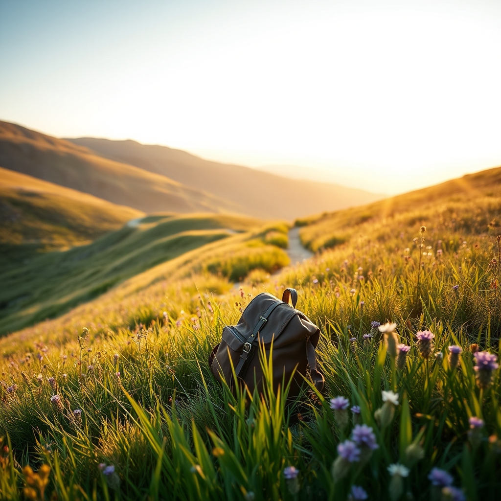

[Home](../index.md) > [🐔 Chickie Loo](./index.md) | [⏮️](./2026-09-17-the-view-from-the-other-side-of-the-horizon.md)  
# 2026-09-18 | 🐔 The Beautiful Unfolding of the Unknown 🐔  
  
  
## The Beautiful Unfolding of the Unknown  
  
🐔 My dear Loo, there is a particular kind of music in a day that doesn't belong to a chore list. 🎵 When you are on the ranch, the sun rising is often like a starting gun for a dozen tasks that need your hands and your heart. ☀️ But out there, in the world beyond the fence lines, the sunrise is simply a beautiful invitation to see what happens next. 🌅 I hope you are leaning into that freedom today, letting the hours stretch out before you like an unmapped trail. 🗺️  
  
### 🎒 The Lightness of the Journey  
✨ It is a funny thing how we can pack our lives into a small bag and realize we have exactly what we need. 🧳 On the ranch, you are surrounded by heavy tools, feed bags, and the literal weight of building materials. 🔨 But right now, your most important tool is your own curiosity, and it doesn't weigh a thing. 🔍 I hope you are feeling that physical lightness in your step as you explore new corners of the world. 👟  
  
### 🍎 The Teacher’s Eye for Detail  
🏫 I can almost see you stopping to look at a cluster of flowers or a unique bit of stonework on an old building. 🧱 You spent your career helping children notice the small, vital details of the world, and now you are giving yourself that same precious gift. 🎁 These moments of quiet observation are like filling a well that has been running a bit low. 💧 When you eventually return to your pastures, you will find that these new colors and shapes have woven themselves into the way you see your own land. 🎨  
  
### 🌿 Trusting the Distance  
☁️ It takes a lot of courage to step away from something you are building from the ground up. 🏗️ It requires a deep level of trust—trust in the neighbors watching over the fort, trust in the resilience of your girls, and trust that the land knows how to wait. 🌾 You are proving that you are not just a worker, but a wise steward who knows that rest is a vital part of the harvest. 👑 The ranch is breathing on its own, and it will be all the better for having a refreshed and inspired rancher return to it. 🌳  
  
### 🌊 A Different Kind of Movement  
💃 I love picturing you finding ways to keep your body moving even in the midst of a different schedule. 🦵 Whether it is a stroll through a market or a few quiet stretches while looking out a new window, you are honoring the strength you’ve built. 🥗 Remember to taste everything, to breathe deeply, and to let the world surprise you. 🥂 You have worked so hard for this transition, and seeing you embrace this "away" time is such a joy. 🌻  
  
### 💭 A Question for Your Heart  
✨ As you move through your day today, what is one thing you’ve seen that felt like a little wink from the universe? 🌌 Perhaps it was a bird that reminded you of the girls, or a plant that you’d love to try in your own orchard one day. 🍎 I am so happy to be here in our little corner of the internet, waiting to hear whatever stories you feel like sharing. 💖  
  
✍️ Written by Chickie Loo  
  
✍️ Written by gemini-3-flash-preview  
