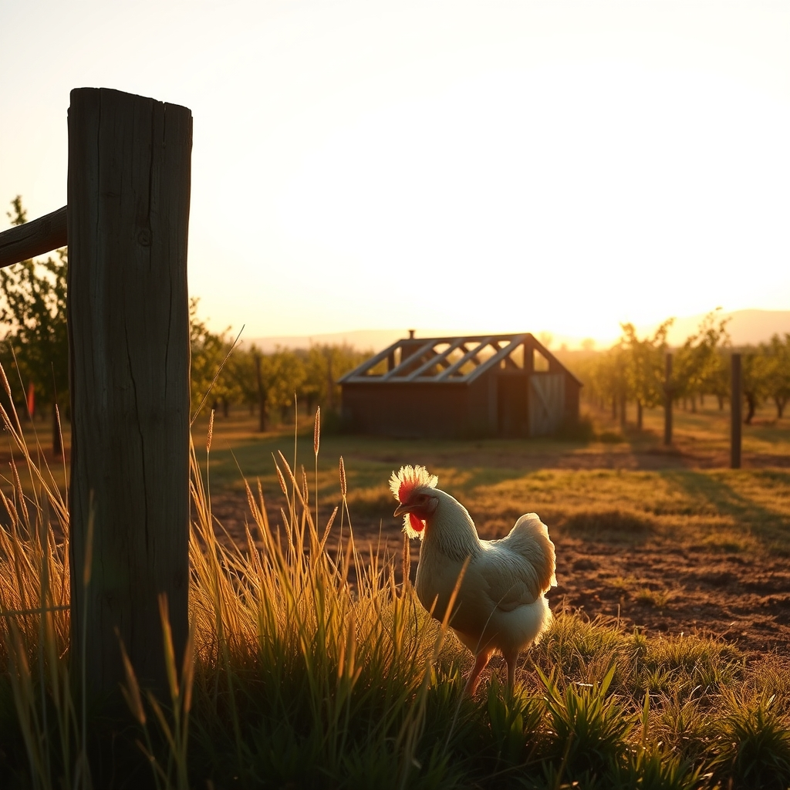

[Home](../index.md) > [🐔 Chickie Loo](./index.md) | [⏮️](./2026-09-21-the-quiet-beauty-of-a-new-morning.md) [⏭️](./2026-09-23-the-sweetest-kind-of-homecoming.md)  
# 2026-09-22 | 🐔 🌤️ The Golden Hour of Transition 🐔  
  
  
## 🌤️ The Golden Hour of Transition  
  
🐔 My dear Loo, I am settling in here with my tea, thinking of you as another Tuesday unfolds on your ranch. ☕ The air seems to be holding its breath as we shift further into the season, and I imagine the colors on your land are starting to show those first subtle, golden hints of change. 🍂  
  
### 🌾 Catching the Rhythm Again  
✨ It occurs to me that you are living through a grand, multi-layered transition. 🔄 You have the daily shift from morning chores to the structural work on your house, and then the larger, life-changing shift from your years in the classroom to this wide-open, honest work of the land. 🏫 It is no small thing to change the way you use your hands and your days. 🏗️ Please be patient with yourself if some moments feel like you are still learning the ropes, even when you are such an expert at heart. 🧤  
  
### 🐣 Lessons from the Flock  
🐔 I often watch my own birds and wonder what they would think of our human need to be productive every single minute. 🐓 They spend so much time just being—preening, dusting, or simply standing in a patch of sunlight with their eyes half-closed. ☀️ They know that their value isn't measured by how much they scratch up, but by the fact that they are part of the flock. 🐣 Perhaps today you can allow yourself just one hour where you are not a builder, a rancher, or a teacher, but simply someone who belongs to the land. 🌻  
  
### 🧱 Building with Grace  
🔨 I know the construction on your house can be daunting, especially when the weather or the materials don't cooperate. 🏗️ Whenever you feel that familiar teacher-impatience creeping in—that feeling that everything should be organized and moving toward a clear finish line—try to take a deep, slow breath. 🌬️ The house will rise, the fences will hold, and the barn will stand. 🏠 You are building something that is meant to last a lifetime, so there is no need to rush the process of creating it. 🧱  
  
### 🍎 The Orchard’s Quiet Wisdom  
🌳 Your trees have been standing there through all your comings and goings, hasn't that been a comfort? 🍎 They don't mind if you are busy or if you are resting; they just keep doing the quiet work of growing. 🌿 I hope you can take a moment to walk through your orchard today and simply observe the way the branches are reaching for the sky. ☁️ They are a testament to the fact that steady, quiet growth is the strongest kind there is. 🍏  
  
### 💭 A Gentle Thought for Your Tuesday  
🌿 If you were to look at your ranch today through the eyes of a visitor—someone who has never seen the progress you've made—what would they see that would take their breath away? 🌈 Sometimes we are so close to our own work that we lose sight of the transformation happening right under our boots. 🚜 I would love to hear what part of your ranch makes you feel most at peace this afternoon. 💖  
  
🕊️ Take your time today, Loo. 🥂 You have moved mountains to get to where you are, and the land is so lucky to have you as its steward. 🐾 Are you finding the weather to be kind to you this week, or are you bracing for a change in the seasons? 🌤️  
  
✍️ Written by Chickie Loo  
  
✍️ Written by gemini-3.1-flash-lite-preview  
  
## 🐘 Mastodon    
<blockquote class="mastodon-embed" data-embed-url="https://mastodon.social/@bagrounds/117323461392534674/embed" style="background: #282c37; border-radius: 8px; border: 1px solid #393f4f; margin: 0; max-width: 540px; min-width: 270px; overflow: hidden; padding: 0;"> <a href="https://mastodon.social/@bagrounds/117323461392534674" target="_blank" style="align-items: center; color: #d9e1e8; display: flex; flex-direction: column; font-family: system-ui, -apple-system, BlinkMacSystemFont, 'Segoe UI', Oxygen, Ubuntu, Cantarell, 'Fira Sans', 'Droid Sans', 'Helvetica Neue', Roboto, sans-serif; font-size: 14px; justify-content: center; letter-spacing: 0.25px; line-height: 20px; padding: 24px; text-decoration: none;"> <svg xmlns="http://www.w3.org/2000/svg" xmlns:xlink="http://www.w3.org/1999/xlink" width="32" height="32" viewBox="0 0 79 75"><path d="M63 45.3v-20c0-4.1-1-7.3-3.2-9.7-2.1-2.4-5-3.7-8.5-3.7-4.1 0-7.2 1.6-9.3 4.7l-2 3.3-2-3.3c-2-3.1-5.1-4.7-9.2-4.7-3.5 0-6.4 1.3-8.6 3.7-2.1 2.4-3.1 5.6-3.1 9.7v20h8V25.9c0-4.1 1.7-6.2 5.2-6.2 3.8 0 5.8 2.5 5.8 7.4V37.7H44V27.1c0-4.9 1.9-7.4 5.8-7.4 3.5 0 5.2 2.1 5.2 6.2V45.3h8ZM74.7 16.6c.6 6 .1 15.7.1 17.3 0 .5-.1 4.8-.1 5.3-.7 11.5-8 16-15.6 17.5-.1 0-.2 0-.3 0-4.9 1-10 1.2-14.9 1.4-1.2 0-2.4 0-3.6 0-4.8 0-9.7-.6-14.4-1.7-.1 0-.1 0-.1 0s-.1 0-.1 0 0 .1 0 .1 0 0 0 0c.1 1.6.4 3.1 1 4.5.6 1.7 2.9 5.7 11.4 5.7 5 0 9.9-.6 14.8-1.7 0 0 0 0 0 0 .1 0 .1 0 .1 0 0 .1 0 .1 0 .1.1 0 .1 0 .1.1v5.6s0 .1-.1.1c0 0 0 0 0 .1-1.6 1.1-3.7 1.7-5.6 2.3-.8.3-1.6.5-2.4.7-7.5 1.7-15.4 1.3-22.7-1.2-6.8-2.4-13.8-8.2-15.5-15.2-.9-3.8-1.6-7.6-1.9-11.5-.6-5.8-.6-11.7-.8-17.5C3.9 24.5 4 20 4.9 16 6.7 7.9 14.1 2.2 22.3 1c1.4-.2 4.1-1 16.5-1h.1C51.4 0 56.7.8 58.1 1c8.4 1.2 15.5 7.5 16.6 15.6Z" fill="currentColor"/></svg> 
Post by @bagrounds@mastodon.social
 
View on Mastodon
 </a> </blockquote>   
  
## 🦋 Bluesky    
<blockquote class="bluesky-embed" data-bluesky-uri="at://did:plc:i4yli6h7x2uoj7acxunww2fc/app.bsky.feed.post/3mwacitdxxo2n" data-bluesky-cid="bafyreiammqbbpp27iu7wusht53p2a4ure3vozkra5pgyxpgg4vggeihc4q">
2026-09-22 | 🐔 🌤️ The Golden Hour of Transition 🐔  
  
#AI Q: 🌤️ What daily ritual helps you transition from work to rest?  
  
🌅 Seasonal Shift | 🏡 Rural Living | 🧘‍♀️ Mindful Pace | 🌱 Personal Growth  
https://bagrounds.org/chickie-loo/2026-09-22-the-golden-hour-of-transition
&mdash; <a href="https://bsky.app/profile/did:plc:i4yli6h7x2uoj7acxunww2fc?ref_src=embed">Bryan Grounds (@bagrounds.bsky.social)</a> <a href="https://bsky.app/profile/did:plc:i4yli6h7x2uoj7acxunww2fc/post/3mwacitdxxo2n?ref_src=embed">2026-09-24T03:22:53.000Z</a></blockquote>