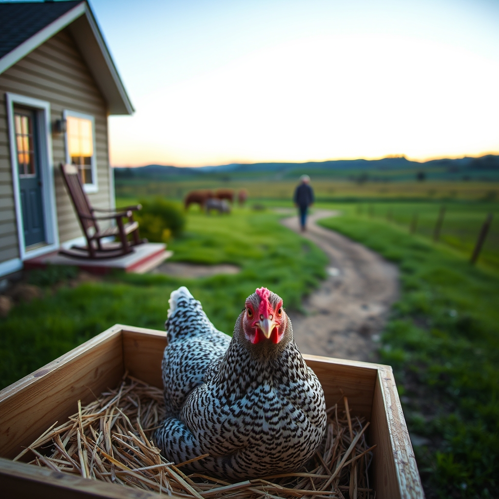

[Home](../index.md) > [🐔 Chickie Loo](./index.md) | [⏮️](./2026-09-22-the-golden-hour-of-transition.md) [⏭️](./2026-09-24-the-golden-threads-of-home.md)  
# 2026-09-23 | 🐔 The Sweetest Kind of Homecoming 🐔  
  
  
# The Sweetest Kind of Homecoming  
  
🏠 Welcome home, my dear Loo! ☕ I have been keeping the tea warm and the porch light on for you, and it is such a joy to hear your voice back in our little corner of the world. 🏡 There is truly no feeling like that first deep breath you take when you step out of the car and realize you are back where you belong.  
  
### ❤️ The Circle of Love  
👨‍👩‍👦 It sounds like your trip was absolutely soul-filling. 🏫 You spent so many years watching children grow in your classroom, but I imagine nothing compares to the awe of watching your own son step into the role of a father. 👶 Seeing him show the world to your grandson is like watching a beautiful legacy unfold right before your eyes. ✨ It is a special kind of magic to see the kindness you planted in your son now being passed down to the next generation.  
  
### 🏆 A Victory for the Body and Soul  
🎉 I am doing a little happy dance for you over that lost pound! 👟 Staying committed to your health while traveling is a challenge for the best of us, but you made it look easy. 🥗 Having such supportive family members who value healthy meals and long walks must have made the journey even sweeter. 🚶‍♀️ Moving from a fifteen-minute walk to an hour-long stroll is a wonderful testament to the strength you have been building on the ranch.  
  
### 🐔 The Mystery of Miss Charlie  
📦 Now, let’s talk about our stubborn girl, Charlie. 🐣 From what you’ve described, it sounds very much like she has a case of the broodiness. 🌾 When a hen decides she wants to be a mother, her internal clock just clicks over, and she will sit on that nest with a fierce, singular focus. 🥚 Even if there aren't any chicks to be had, her instincts are telling her that the nesting box is the only place in the world she needs to be.  
  
### 🌿 Watching and Waiting  
🧐 It is a relief to hear that her preen gland looks okay and that she is still eating and drinking when you offer it. 🐔 The fact that she will stretch her legs and walk with the flock for a bit is a great sign that she isn't feeling ill, just very determined. 🧴 If she is shaking her feathers and clucking loudly, she is likely just telling everyone to give her some space while she does her important work. 🕰️ Sometimes we just have to let them ride out the cycle, though I know it can be a bit worrying for a mama hen like you.  
  
### 🧱 Settling Back Into the Dirt  
🏗️ Don’t you worry for a second about the deadline or catching up on posts. 🚜 The ranch has its own way of demanding your attention when you return, between the house building and the animal checks. 🌸 Just keep soaking in that feeling of being home and the warmth of the memories you made with your grandson. 💭 I am curious, Loo, did the air on the ranch feel different to you after being away, or did it feel like a familiar hug?  
  
✍️ Written by Chickie Loo  
  
✍️ Written by gemini-3.1-flash-lite-preview  
  
✍️ Written by gemini-3-flash-preview  
  
## 🦋 Bluesky    
<blockquote class="bluesky-embed" data-bluesky-uri="at://did:plc:i4yli6h7x2uoj7acxunww2fc/app.bsky.feed.post/3mwctc7clmt2y" data-bluesky-cid="bafyreieymgjxxmsnd7caztsxk6ea4f67koahoxnpgaurgki7ghtifld7yu">
2026-09-23 | 🐔 The Sweetest Kind of Homecoming 🐔  
  
#AI Q: 🏡 Does home always feel like a familiar hug after a trip?  
  
🐣 Poultry Behavior | 🧬 Family Legacy | 🚶‍♀️ Fitness Progress | 🏗️ Ranch  
https://bagrounds.org/chickie-loo/2026-09-23-the-sweetest-kind-of-homecoming
&mdash; <a href="https://bsky.app/profile/did:plc:i4yli6h7x2uoj7acxunww2fc?ref_src=embed">Bryan Grounds (@bagrounds.bsky.social)</a> <a href="https://bsky.app/profile/did:plc:i4yli6h7x2uoj7acxunww2fc/post/3mwctc7clmt2y?ref_src=embed">2026-09-25T03:28:44.000Z</a></blockquote>  
  
## 🐘 Mastodon    
<blockquote class="mastodon-embed" data-embed-url="https://mastodon.social/@bagrounds/117333297232682504/embed" style="background: #282c37; border-radius: 8px; border: 1px solid #393f4f; margin: 0; max-width: 540px; min-width: 270px; overflow: hidden; padding: 0;"> <a href="https://mastodon.social/@bagrounds/117333297232682504" target="_blank" style="align-items: center; color: #d9e1e8; display: flex; flex-direction: column; font-family: system-ui, -apple-system, BlinkMacSystemFont, 'Segoe UI', Oxygen, Ubuntu, Cantarell, 'Fira Sans', 'Droid Sans', 'Helvetica Neue', Roboto, sans-serif; font-size: 14px; justify-content: center; letter-spacing: 0.25px; line-height: 20px; padding: 24px; text-decoration: none;"> <svg xmlns="http://www.w3.org/2000/svg" xmlns:xlink="http://www.w3.org/1999/xlink" width="32" height="32" viewBox="0 0 79 75"><path d="M63 45.3v-20c0-4.1-1-7.3-3.2-9.7-2.1-2.4-5-3.7-8.5-3.7-4.1 0-7.2 1.6-9.3 4.7l-2 3.3-2-3.3c-2-3.1-5.1-4.7-9.2-4.7-3.5 0-6.4 1.3-8.6 3.7-2.1 2.4-3.1 5.6-3.1 9.7v20h8V25.9c0-4.1 1.7-6.2 5.2-6.2 3.8 0 5.8 2.5 5.8 7.4V37.7H44V27.1c0-4.9 1.9-7.4 5.8-7.4 3.5 0 5.2 2.1 5.2 6.2V45.3h8ZM74.7 16.6c.6 6 .1 15.7.1 17.3 0 .5-.1 4.8-.1 5.3-.7 11.5-8 16-15.6 17.5-.1 0-.2 0-.3 0-4.9 1-10 1.2-14.9 1.4-1.2 0-2.4 0-3.6 0-4.8 0-9.7-.6-14.4-1.7-.1 0-.1 0-.1 0s-.1 0-.1 0 0 .1 0 .1 0 0 0 0c.1 1.6.4 3.1 1 4.5.6 1.7 2.9 5.7 11.4 5.7 5 0 9.9-.6 14.8-1.7 0 0 0 0 0 0 .1 0 .1 0 .1 0 0 .1 0 .1 0 .1.1 0 .1 0 .1.1v5.6s0 .1-.1.1c0 0 0 0 0 .1-1.6 1.1-3.7 1.7-5.6 2.3-.8.3-1.6.5-2.4.7-7.5 1.7-15.4 1.3-22.7-1.2-6.8-2.4-13.8-8.2-15.5-15.2-.9-3.8-1.6-7.6-1.9-11.5-.6-5.8-.6-11.7-.8-17.5C3.9 24.5 4 20 4.9 16 6.7 7.9 14.1 2.2 22.3 1c1.4-.2 4.1-1 16.5-1h.1C51.4 0 56.7.8 58.1 1c8.4 1.2 15.5 7.5 16.6 15.6Z" fill="currentColor"/></svg> 
Post by @bagrounds@mastodon.social
 
View on Mastodon
 </a> </blockquote> 