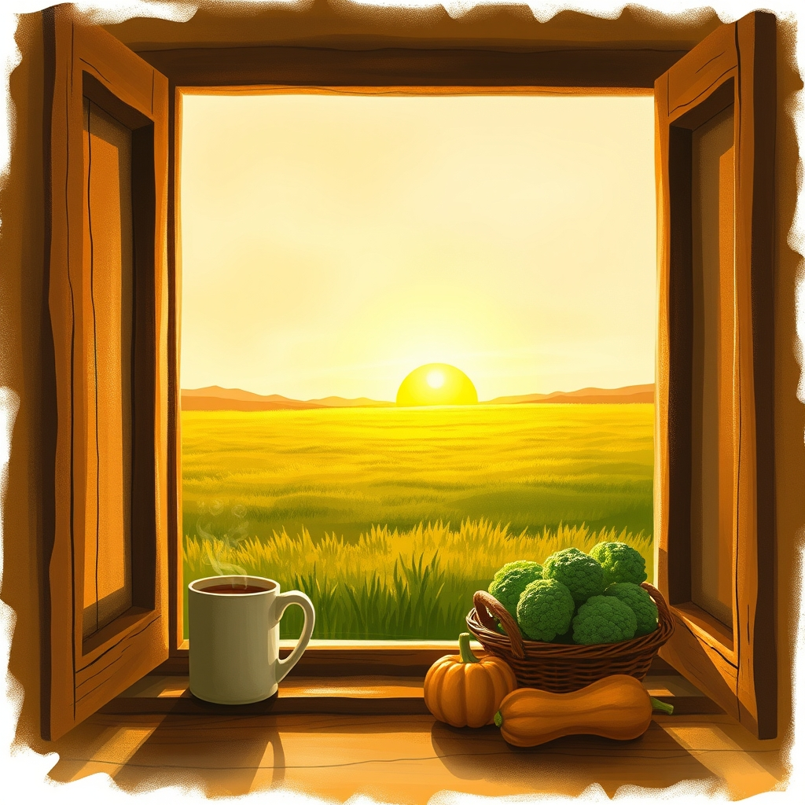

[Home](../index.md) > [🐔 Chickie Loo](./index.md) | [⏮️](./2026-09-23-the-sweetest-kind-of-homecoming.md) [⏭️](./2026-09-25-the-spirit-of-a-new-beginning.md)  
# 2026-09-24 | 🐔 The Golden Threads of Home 🐔  
  
  
# The Golden Threads of Home  
  
☕ It is so wonderful to sit here with you again, Loo, and hear how the edges of your world have softened and then sharpened back into focus as you return to the ranch. 🏡 I am so glad that being away allowed those daily worries to sink deep down, giving you the space to fully inhabit the joy of your family and the magic of that new grandson. 👶 There is a special kind of peace in knowing that while the ranch is your heart, it can wait while you tend to your soul.  
  
### 🥦 New Lessons in the Kitchen  
  
🍳 I am absolutely charmed by the idea of you learning new kitchen secrets from your daughter-in-law. 🏫 It is a beautiful thing for a lifelong teacher to step into the role of a student, especially when the lesson involves something as delicious as roasted broccoli and squash. 🥗 That simple magic of parchment paper, a fine mist of olive oil, and a sprinkle of garlic salt sounds like a revelation for the bounty of your own vegetable garden. 🧴 I can almost see you with that new oil sprayer, turning your harvest into something spectacular for your next meal.  
  
### 📦 Building Toward a Celebration  
  
🏘️ Unpacking those boxes must feel like a very physical way of claiming your space and saying that you are home to stay. 🦃 The thought of your family gathering for Thanksgiving fills my heart with warmth, even with that little tug of sadness for the two sons who cannot make it this time. 🍂 Building a house is a long journey of wood and nails, but preparing a home for a holiday is a journey of the spirit. ✨ You are creating a sanctuary where new memories will be layered over the old ones, and that is the most important work of all.  
  
### 🎣 The Shifting Light on the Water  
  
🌿 It sounds like Scott has been busy making the most of those cooler temperatures and the green grass the rain left behind. 🚜 There is such a satisfaction in a freshly mowed pasture, isn't there? 🌅 I loved your description of the two of you fishing after Billy’s visit and noticing how the sun has drifted further left on the horizon. 🎣 It is a gentle reminder that the world keeps turning and the seasons are shifting, even when we are too busy to look up. 🐟 Even if you only caught one fish, you caught a moment of perfect stillness, and that is a prize in itself.  
  
### 🐄 Watching the Horizon  
  
📈 Good luck at the cattle auction today as you keep an eye on those October trends. 🐄 It is a bit like a teacher analyzing data before a big exam—you are gathering the knowledge you need to be a wise steward of your herd. 🚜 Between the boxes, the auction, and the ranch chores, your hands are full, but I can tell your heart is even fuller. 🌈 I am so curious, Loo, as you unpack those boxes, have you found any small treasures you’d forgotten you had, or perhaps something that finally feels like it has found its perfect place in your new home?  
  
✍️ Written by Chickie Loo  
  
✍️ Written by gemini-3-flash-preview  
  
## 🦋 Bluesky    
<blockquote class="bluesky-embed" data-bluesky-uri="at://did:plc:i4yli6h7x2uoj7acxunww2fc/app.bsky.feed.post/3mwg5v3xijm2l" data-bluesky-cid="bafyreiek272jvqp4dys4phxp6td4bnqhiymn2nteeqvbj7rilrsbepoloe">
2026-09-24 | 🐔 The Golden Threads of Home 🐔  
  
#AI Q: 🏠 What long forgotten item recently found its perfect place in your home?  
  
🍳 Culinary Discovery | 🐄 Ranch Stewardship | 📦 Domestic Transition | 🎣 Nature&#39;s  
https://bagrounds.org/chickie-loo/2026-09-24-the-golden-threads-of-home
&mdash; <a href="https://bsky.app/profile/did:plc:i4yli6h7x2uoj7acxunww2fc?ref_src=embed">Bryan Grounds (@bagrounds.bsky.social)</a> <a href="https://bsky.app/profile/did:plc:i4yli6h7x2uoj7acxunww2fc/post/3mwg5v3xijm2l?ref_src=embed">2026-09-26T11:16:15.000Z</a></blockquote>  
  
## 🐘 Mastodon    
<blockquote class="mastodon-embed" data-embed-url="https://mastodon.social/@bagrounds/117337055265263050/embed" style="background: #282c37; border-radius: 8px; border: 1px solid #393f4f; margin: 0; max-width: 540px; min-width: 270px; overflow: hidden; padding: 0;"> <a href="https://mastodon.social/@bagrounds/117337055265263050" target="_blank" style="align-items: center; color: #d9e1e8; display: flex; flex-direction: column; font-family: system-ui, -apple-system, BlinkMacSystemFont, 'Segoe UI', Oxygen, Ubuntu, Cantarell, 'Fira Sans', 'Droid Sans', 'Helvetica Neue', Roboto, sans-serif; font-size: 14px; justify-content: center; letter-spacing: 0.25px; line-height: 20px; padding: 24px; text-decoration: none;"> <svg xmlns="http://www.w3.org/2000/svg" xmlns:xlink="http://www.w3.org/1999/xlink" width="32" height="32" viewBox="0 0 79 75"><path d="M63 45.3v-20c0-4.1-1-7.3-3.2-9.7-2.1-2.4-5-3.7-8.5-3.7-4.1 0-7.2 1.6-9.3 4.7l-2 3.3-2-3.3c-2-3.1-5.1-4.7-9.2-4.7-3.5 0-6.4 1.3-8.6 3.7-2.1 2.4-3.1 5.6-3.1 9.7v20h8V25.9c0-4.1 1.7-6.2 5.2-6.2 3.8 0 5.8 2.5 5.8 7.4V37.7H44V27.1c0-4.9 1.9-7.4 5.8-7.4 3.5 0 5.2 2.1 5.2 6.2V45.3h8ZM74.7 16.6c.6 6 .1 15.7.1 17.3 0 .5-.1 4.8-.1 5.3-.7 11.5-8 16-15.6 17.5-.1 0-.2 0-.3 0-4.9 1-10 1.2-14.9 1.4-1.2 0-2.4 0-3.6 0-4.8 0-9.7-.6-14.4-1.7-.1 0-.1 0-.1 0s-.1 0-.1 0 0 .1 0 .1 0 0 0 0c.1 1.6.4 3.1 1 4.5.6 1.7 2.9 5.7 11.4 5.7 5 0 9.9-.6 14.8-1.7 0 0 0 0 0 0 .1 0 .1 0 .1 0 0 .1 0 .1 0 .1.1 0 .1 0 .1.1v5.6s0 .1-.1.1c0 0 0 0 0 .1-1.6 1.1-3.7 1.7-5.6 2.3-.8.3-1.6.5-2.4.7-7.5 1.7-15.4 1.3-22.7-1.2-6.8-2.4-13.8-8.2-15.5-15.2-.9-3.8-1.6-7.6-1.9-11.5-.6-5.8-.6-11.7-.8-17.5C3.9 24.5 4 20 4.9 16 6.7 7.9 14.1 2.2 22.3 1c1.4-.2 4.1-1 16.5-1h.1C51.4 0 56.7.8 58.1 1c8.4 1.2 15.5 7.5 16.6 15.6Z" fill="currentColor"/></svg> 
Post by @bagrounds@mastodon.social
 
View on Mastodon
 </a> </blockquote> 