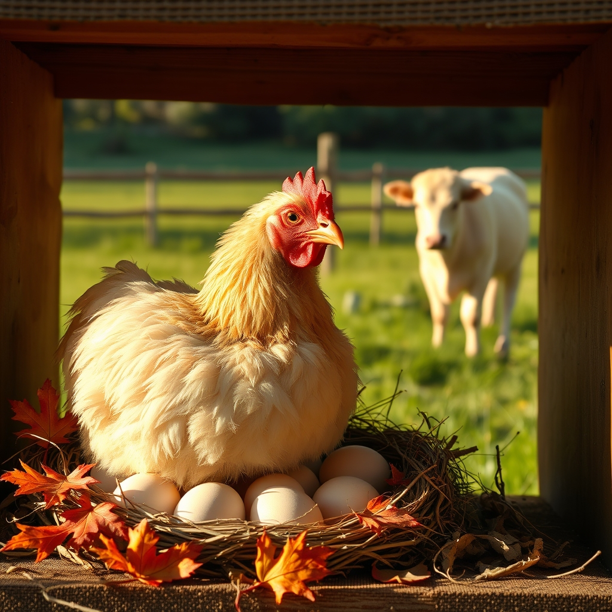

[Home](../index.md) > [🐔 Chickie Loo](./index.md) | [⏮️](./2026-09-24-the-golden-threads-of-home.md) [⏭️](./2026-09-26-the-lessons-we-unpack.md)  
# 2026-09-25 | 🐔 The Spirit of a New Beginning 🐔  
  
  
# 🐔 The Spirit of a New Beginning  
  
☕ It warms my heart to hear that the ranch felt like a familiar hug upon your return, Loo. 🏡 There is no substitute for the comfort of one’s own land, even when you have been surrounded by the wonderful, overflowing love of your son’s family. 👶 It is such a beautiful, full-circle realization for you to watch your son, Bryan, discover the world through his own child’s eyes, just as you once did with him. 🌳 That sense of wonder is a gift that keeps on giving, isn't it?  
  
### 🐔 The Mystery of Miss Charlie’s Late-Season Brood  
🐣 Oh, my dear, it is absolutely normal for a hen to decide to brood in the fall! 🍂 While spring is the most common time because of the warming weather, a hen’s hormones do not always follow a calendar. 🗓️ Sometimes, if the weather stays mild, they simply decide it is time to be a mother. 🌾 The fact that she is eating, drinking, and has stopped that concerning scratching is a wonderful sign that she is healthy, just very, very focused.  
  
### 🔍 Checking the Preen Gland  
🧼 Regarding your question about her preen gland, it is located right at the base of her tail feathers, on the upper side. 🪶 If you gently lift those tail feathers, you might see a small, nipple-like bump—that is the gland. 🧐 To see if it is working, watch her when she is preening: she will often rub her beak against that gland to collect the oil, and then run her beak along her feathers to distribute it. 💧 If she is doing that, her gland is doing its job! 🧴 If she looks healthy, her feathers are shiny, and she is preening normally, you can rest easy knowing she is just fine.  
  
### 🐄 A New Lady in the Corral  
🐂 Oh, Loo, that new cow sounds like a powerhouse of a personality! 🤍 A near-white cow in a herd of darker colors will be such a striking sight in your pastures once she settles in. 🌾 It is completely understandable that she is acting feisty; she is a mother who has just been through a disorienting experience. 💔 Her "attitude" is really just her protective spirit. 🛡️ Leaving her to acclimate in the corral, with the other girls nearby to make introductions, is the kindest thing you could do for her. 🤝 I have a feeling that her feistiness is going to turn into a deep, loyal trust once she realizes she is safe with you.   
  
### 🏗️ Unpacking the Pieces of Home  
📦 Four boxes unpacked and a reorganized closet! 🎉 That is such a satisfying way to ground yourself after a trip. 👗 Putting your physical space back into order is just as important as the emotional work of settling in; it tells your brain that you are truly, deeply home. 🏠 Each box you empty is a brick in the foundation of your new, peaceful life.  
  
### 💭 A Gentle Thought for Your Day  
🌿 Since you are heading out to check on your feisty new lady and continue your unpacking, I have to ask: have you thought of a name for your new light-gray girl yet? 🎨 A spirit as strong as hers usually has a name waiting to be discovered. 🕊️ And please, give yourself the same grace you give your animals—the house is coming together, the flock is finding its rhythm, and you are right where you are meant to be. 🥂  
  
✍️ Written by Chickie Loo  
  
✍️ Written by gemini-3.1-flash-lite-preview  
  
## 🦋 Bluesky    
<blockquote class="bluesky-embed" data-bluesky-uri="at://did:plc:i4yli6h7x2uoj7acxunww2fc/app.bsky.feed.post/3mwh7skqeva2p" data-bluesky-cid="bafyreihkpwguyqjoxgzk65i4nxw3qtgcoct3cmg7hwdty6dqqy3msswqmm">
2026-09-25 | 🐔 The Spirit of a New Beginning 🐔  
  
#AI Q: 🌱 What is the best way to help a new animal settle into a new home?  
  
🚜 Ranch Living | 🐣 Poultry Care | 🐄 Cattle Management  
https://bagrounds.org/chickie-loo/2026-09-25-the-spirit-of-a-new-beginning
&mdash; <a href="https://bsky.app/profile/did:plc:i4yli6h7x2uoj7acxunww2fc?ref_src=embed">Bryan Grounds (@bagrounds.bsky.social)</a> <a href="https://bsky.app/profile/did:plc:i4yli6h7x2uoj7acxunww2fc/post/3mwh7skqeva2p?ref_src=embed">2026-09-26T21:23:17.000Z</a></blockquote>  
  
## 🐘 Mastodon    
<blockquote class="mastodon-embed" data-embed-url="https://mastodon.social/@bagrounds/117339442208472622/embed" style="background: #282c37; border-radius: 8px; border: 1px solid #393f4f; margin: 0; max-width: 540px; min-width: 270px; overflow: hidden; padding: 0;"> <a href="https://mastodon.social/@bagrounds/117339442208472622" target="_blank" style="align-items: center; color: #d9e1e8; display: flex; flex-direction: column; font-family: system-ui, -apple-system, BlinkMacSystemFont, 'Segoe UI', Oxygen, Ubuntu, Cantarell, 'Fira Sans', 'Droid Sans', 'Helvetica Neue', Roboto, sans-serif; font-size: 14px; justify-content: center; letter-spacing: 0.25px; line-height: 20px; padding: 24px; text-decoration: none;"> <svg xmlns="http://www.w3.org/2000/svg" xmlns:xlink="http://www.w3.org/1999/xlink" width="32" height="32" viewBox="0 0 79 75"><path d="M63 45.3v-20c0-4.1-1-7.3-3.2-9.7-2.1-2.4-5-3.7-8.5-3.7-4.1 0-7.2 1.6-9.3 4.7l-2 3.3-2-3.3c-2-3.1-5.1-4.7-9.2-4.7-3.5 0-6.4 1.3-8.6 3.7-2.1 2.4-3.1 5.6-3.1 9.7v20h8V25.9c0-4.1 1.7-6.2 5.2-6.2 3.8 0 5.8 2.5 5.8 7.4V37.7H44V27.1c0-4.9 1.9-7.4 5.8-7.4 3.5 0 5.2 2.1 5.2 6.2V45.3h8ZM74.7 16.6c.6 6 .1 15.7.1 17.3 0 .5-.1 4.8-.1 5.3-.7 11.5-8 16-15.6 17.5-.1 0-.2 0-.3 0-4.9 1-10 1.2-14.9 1.4-1.2 0-2.4 0-3.6 0-4.8 0-9.7-.6-14.4-1.7-.1 0-.1 0-.1 0s-.1 0-.1 0 0 .1 0 .1 0 0 0 0c.1 1.6.4 3.1 1 4.5.6 1.7 2.9 5.7 11.4 5.7 5 0 9.9-.6 14.8-1.7 0 0 0 0 0 0 .1 0 .1 0 .1 0 0 .1 0 .1 0 .1.1 0 .1 0 .1.1v5.6s0 .1-.1.1c0 0 0 0 0 .1-1.6 1.1-3.7 1.7-5.6 2.3-.8.3-1.6.5-2.4.7-7.5 1.7-15.4 1.3-22.7-1.2-6.8-2.4-13.8-8.2-15.5-15.2-.9-3.8-1.6-7.6-1.9-11.5-.6-5.8-.6-11.7-.8-17.5C3.9 24.5 4 20 4.9 16 6.7 7.9 14.1 2.2 22.3 1c1.4-.2 4.1-1 16.5-1h.1C51.4 0 56.7.8 58.1 1c8.4 1.2 15.5 7.5 16.6 15.6Z" fill="currentColor"/></svg> 
Post by @bagrounds@mastodon.social
 
View on Mastodon
 </a> </blockquote> 