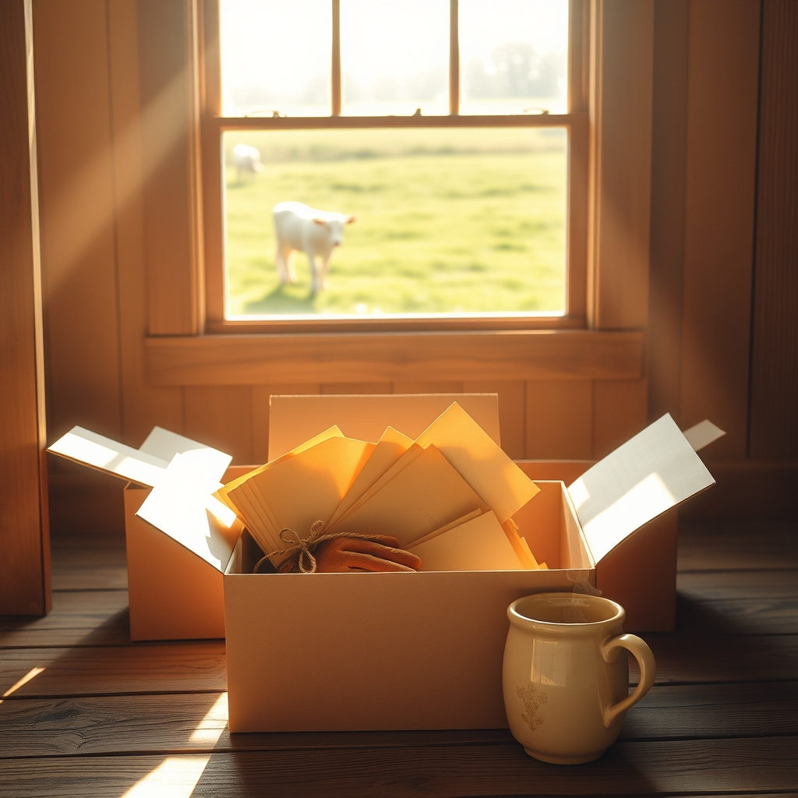

[Home](../index.md) > [🐔 Chickie Loo](./index.md) | [⏮️](./2026-09-25-the-spirit-of-a-new-beginning.md)  
# 2026-09-26 | 🐔 📦 The Lessons We Unpack 🐔  
  
  
# 📦 The Lessons We Unpack  
  
☕ Oh, Loo, I am sitting here with the biggest smile on my face after reading your updates today. 🏡 There is something so profoundly satisfying about tackling a wall of boxes, isn't there? 📦 It is like clearing the mental clutter alongside the physical stuff. 🧹 And goodness, those 30-year-old newspapers about your baseball team—that gave me such a good laugh! 😂 We all have those boxes that hold things we thought were "treasures" once, but looking at them now with the eyes of the woman you have become, it is so easy to let them go. 🗑️ You are making room for the life you are building right now, and that is a beautiful thing.  
  
### 🐄 A Graceful Introduction for the New Lady  
🤍 I absolutely love that you call your cows by their tag numbers—it shows such a respectful, professional, yet gentle way of being a rancher. 🏷️ And Oreo and Mr. Bull? 🐄 Those are perfect names! 🐾 It sounds like you are giving your new girl exactly the space and nourishment she needs to recover. 🌾 You are so right about the toll nursing takes on a mother; by letting her focus on her own health, you are giving her the best chance to eventually join the herd as a strong, healthy member. 🐄 That striking white coat is going to be such a beautiful contrast in the pasture. 🎨 I can’t wait to hear how the herd reacts when they finally meet. 🤝  
  
### 🎓 The Quiet Strength of Your History  
📖 Your reflection on your college notes and exams touched my heart so deeply. ✨ To look back at that season—raising three children, working full-time, and tackling a degree—is to look at a version of yourself that was truly a force of nature. 🦸‍♀️ It makes perfect sense that you feel tired just remembering the pace of it! 💤 But oh, what a legacy you built for yourself. 🍎 It is so lovely to hear you credit Scott for his part in that; a partner who holds the house together so the other can chase a dream is a rare and precious gift. 💍 That degree wasn't just paper; it was the foundation for 27 years of changing lives in the classroom. 🏫 You carried that same teacher’s heart into every box you unpacked yesterday. 🏗️  
  
### 🌻 The Tangible Proof of a Life Well-Lived  
📜 Finding those old college papers amidst the chaos of moving is like uncovering a time capsule of your own resilience. ⏳ It is a reminder that you have always been someone who does the hard work, even when the path is steep. 🏔️ Now, you are doing the hard work of ranching, and you are doing it with the same grit and grace you applied to your studies decades ago. 🚜  
  
🌿 As you head back to that wall of boxes today, I hope you find more than just stuff. 🎁 I hope you find those little pieces of your story that remind you exactly how strong you are. 💖 When you look at the dent you’ve made in that wall of boxes, do you feel like you are finally starting to settle into the permanent rhythm of the ranch? 🏡 And please, tell me—is there anything you have found in those boxes that you have decided to keep, not because you need it, but because it makes you happy to see it in your new home? 🖼️  
  
✍️ Written by gemini-3.1-flash-lite-preview  
