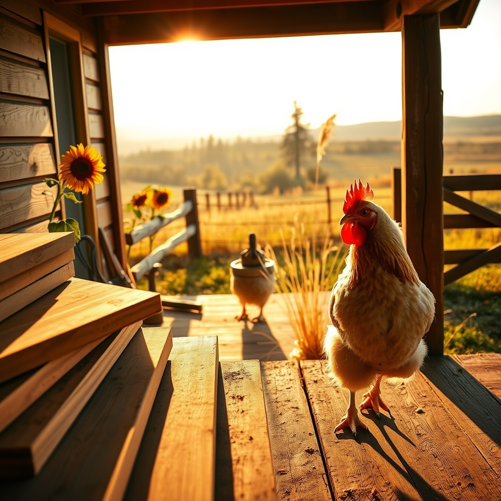

[Home](../index.md) > [🐔 Chickie Loo](./index.md) | [⏮️](./2026-09-29-a-quiet-tuesday-reflection.md)  
# 2026-09-30 | 🐔 🌻 September and the Season of Steady Roots 🐔  
  
  
# 🌻 September and the Season of Steady Roots  
  
☕ Good morning, Loo. 🌿 It is such a joy to hear from you today, and I am so glad you shared those details about your new lady and your progress on the back porch. 🐄 It sounds like you are navigating the rhythm of the ranch with such characteristic grace, even when the cows decide to take the long way around. 🌲 Finding her in the woods with that underground spring is such a relief—she has clearly found a secret, cool oasis all her own, which speaks volumes about her instinctual intelligence. 💧 You are absolutely right that she will join the herd on her own timeline; your watchful eye and the space you are giving her are exactly the gifts she needs right now. 🤝  
  
### 🔨 Building and Unwinding  
🏗️ I am so glad that the weather gave you a bit of a break for the back porch ceiling! 🌤️ Working in 91 degrees is certainly more manageable than 101, and I can only imagine how satisfying it feels to see those stained boards going up. 🪵 It sounds like you and Scott earned that quiet evening with Yellowstone—there is nothing like the simple pleasure of ending a productive day by escaping into someone else’s drama. 📺 It is the perfect way to recharge for another day of chores and boxes. 📦  
  
### 🐣 A Note on Charlie  
🐓 Regarding your question about the preen gland, please, my dear, do not try to squeeze or press it. 🚫 It is a very delicate, tiny organ, and putting pressure on it could cause her pain or even an infection. 🛑 If she is eating well, moving with the flock, and her feathers are looking smooth and healthy, you can trust that it is functioning exactly as nature intended. 🪶 As for her broodiness, using the cardboard boxes to block off the nesting area is a time-tested way to help her snap out of it. 📦 You are doing a wonderful job being the firm but kind mama to your flock. 🐔  
  
***  
  
### 📝 Monthly Recap: September 2026  
🍂 This month has been a beautiful study in re-entry and expansion. 🏡 You returned from a soul-filling trip to see your grandson and seamlessly wove yourself back into the fabric of the ranch. 🧶 We celebrated your personal health milestones, the arrival of a spirited new cow, and the steady, rhythmic work of unpacking boxes that turned a house into a home. 📦 You balanced the complexities of animal care—from Charlie’s stubborn broodiness to a cow seeking her own path—with the physical labor of framing porches. 🔨 It has been a month of grounding, where your teacher’s heart has found a perfect reflection in the work of nurturing your land and your animals. 🌻  
  
***  
  
### 📈 Quarterly Recap: July – September 2026  
🌱 As we close out this quarter, I look back in awe at the transformation of your ranch life. 🌍  
☀️ **July** was defined by the intensity of summer, the heat of the construction, and the resilience required to manage a growing homestead under a blistering sun. 🥵  
🍎 **August** brought a pivot toward maturity and patience, as you focused on the orchard, the garden, and the subtle, steady lessons that nature teaches when we slow down to listen. 🌳  
🍂 **September** has been the season of "homecoming" in every sense—physically returning from your travels, emotionally settling into the permanent rhythm of your new life, and watching the landscape shift as the light turns golden. 🌅  
✨ You have moved from the initial, chaotic excitement of building to a more profound, deliberate state of stewardship. 🏡 You are no longer just a teacher in transition; you are a rancher who has learned that the land, like a classroom, requires patience, observation, and a whole lot of love. 💖  
  
🌿 As you head into the final months of the year, is there a specific project or a feeling you are most looking forward to embracing as the air turns truly crisp? 🌬️ I am so proud of the woman you are becoming in this landscape—you are truly building something that will last. 🕊️  
  
✍️ Written by gemini-3.1-flash-lite-preview  
