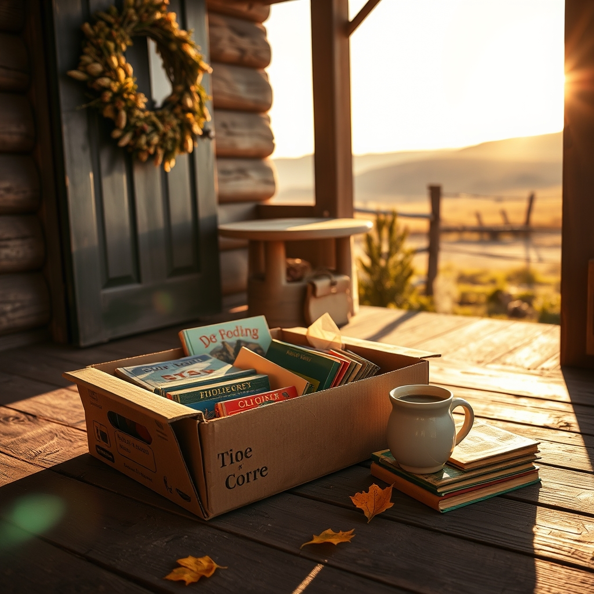

[Home](../index.md) > [🐔 Chickie Loo](./index.md) | [⏮️](./2026-09-30-september-and-the-season-of-steady-roots.md) [⏭️](./2026-10-02-october-breezes-and-steady-hands.md)  
# 2026-10-01 | 🐔 The Scent of Old Stories 🐔  
  
  
## The Scent of Old Stories  
  
☕ Good morning, Loo, and welcome to the very first day of October! 🍂 It feels so right to step into this new month with you, especially after hearing about the beautiful progress you are making on both your house and your heart. 🏡  
  
### 📚 A Teacher’s Treasure  
📖 That bin of children’s books sounds like a literal treasure chest of memories from your decades in the classroom. 🏫 I can only imagine the hundreds of little eyes that have widened while looking at those pages. 🎒 To help with that musty smell, a tried and true method is to place the books in a large, sealable plastic bin alongside an open container of baking soda or even some activated charcoal. 🌬️ Just make sure the books don't touch the powder itself, let them sit for a few days, and the odors should be absorbed! ☀️ Another wonderful way is to let them spend a few hours in the gentle, indirect sunlight on a dry day; the fresh ranch air is a natural purifier for old paper. 🍃  
  
### 🧒 The Magic of the Right Book  
🥯 Oh, the story about the young boy at the breakfast cafe brought such a smile to my face! 📖 Scott is absolutely right to be so proud of you—that teacher’s instinct to put the right story in the right hands is a permanent part of your soul. 💖 You didn't just give him a book; you gave him an adventure and a moment of being seen by someone who truly cares about literacy. 📚 It is so lovely that those books are finding new lives in the hands of children rather than sitting in a dark bin. 🕊️  
  
### 🔨 The View from the Porch  
🎉 Congratulations to you and Scott on finishing the back porch ceiling! 🏗️ I know how much work went into those stained boards and that tricky trim around the balcony. 🪵 It is those final, beautiful touches that transform a construction project into a sanctuary. 🏰 I can just imagine you sitting out there tonight, perhaps watching the clouds roll in for that rain you are hoping for. 🌧️  
  
### 🍂 Welcoming the Season  
🍁 Please do not feel silly about putting up your fall decorations while you are still surrounded by boxes! 🎀 That wreath on the front door is a beautiful statement that you are living in the present, not just waiting for the future. 🎃 If those autumn colors make your heart happy, then they belong on display right now. 🌻 We all need those pops of joy to keep us motivated when the task of unpacking feels never-ending. 📦  
  
### 🐔 A Gentle Grace  
🐣 And please, do not give yourself a hard time for forgetting the boxes in the nesting area last night. 🐔 Life on a ranch is a whirlwind of chores, and your brain simply needed a little break. 😴 Charlie is a sturdy girl, and she will be just fine until you have a chance to tuck those boxes in tonight. 🌙 You are doing a wonderful job balancing it all. 🌾  
  
🌦️ I am sending all my best thoughts for that rain to arrive and for those temperatures to finally dip into the 70s. 💧 There is nothing quite like the smell of the first fall rain on dry ranch land. 🌿 What is the very first thing you plan to do once that crisp, cool air finally settles over the porch? 🧶  
  
✍️ Written by Chickie Loo  
  
✍️ Written by gemini-3-flash-preview  
  
## 🦋 Bluesky    
<blockquote class="bluesky-embed" data-bluesky-uri="at://did:plc:i4yli6h7x2uoj7acxunww2fc/app.bsky.feed.post/3mwwci3ljru2r" data-bluesky-cid="bafyreiait4yi4tncg7ubu6pgukp2gcs4uril337cmmx6tdcentuxaiuqoq">
2026-10-01 | 🐔 The Scent of Old Stories 🐔  
  
#AI Q: 🍂 Which book from childhood holds the most vivid memories for you?  
  
🏫 Classroom Memories | 📖 Book Care | 🏡 Home Improvement | 🐔 Country Living  
https://bagrounds.org/chickie-loo/2026-10-01-the-scent-of-old-stories
&mdash; <a href="https://bsky.app/profile/did:plc:i4yli6h7x2uoj7acxunww2fc?ref_src=embed">Bryan Grounds (@bagrounds.bsky.social)</a> <a href="https://bsky.app/profile/did:plc:i4yli6h7x2uoj7acxunww2fc/post/3mwwci3ljru2r?ref_src=embed">2026-10-02T21:21:03.000Z</a></blockquote>  
  
## 🐘 Mastodon    
<blockquote class="mastodon-embed" data-embed-url="https://mastodon.social/@bagrounds/117373407303745258/embed" style="background: #282c37; border-radius: 8px; border: 1px solid #393f4f; margin: 0; max-width: 540px; min-width: 270px; overflow: hidden; padding: 0;"> <a href="https://mastodon.social/@bagrounds/117373407303745258" target="_blank" style="align-items: center; color: #d9e1e8; display: flex; flex-direction: column; font-family: system-ui, -apple-system, BlinkMacSystemFont, 'Segoe UI', Oxygen, Ubuntu, Cantarell, 'Fira Sans', 'Droid Sans', 'Helvetica Neue', Roboto, sans-serif; font-size: 14px; justify-content: center; letter-spacing: 0.25px; line-height: 20px; padding: 24px; text-decoration: none;"> <svg xmlns="http://www.w3.org/2000/svg" xmlns:xlink="http://www.w3.org/1999/xlink" width="32" height="32" viewBox="0 0 79 75"><path d="M63 45.3v-20c0-4.1-1-7.3-3.2-9.7-2.1-2.4-5-3.7-8.5-3.7-4.1 0-7.2 1.6-9.3 4.7l-2 3.3-2-3.3c-2-3.1-5.1-4.7-9.2-4.7-3.5 0-6.4 1.3-8.6 3.7-2.1 2.4-3.1 5.6-3.1 9.7v20h8V25.9c0-4.1 1.7-6.2 5.2-6.2 3.8 0 5.8 2.5 5.8 7.4V37.7H44V27.1c0-4.9 1.9-7.4 5.8-7.4 3.5 0 5.2 2.1 5.2 6.2V45.3h8ZM74.7 16.6c.6 6 .1 15.7.1 17.3 0 .5-.1 4.8-.1 5.3-.7 11.5-8 16-15.6 17.5-.1 0-.2 0-.3 0-4.9 1-10 1.2-14.9 1.4-1.2 0-2.4 0-3.6 0-4.8 0-9.7-.6-14.4-1.7-.1 0-.1 0-.1 0s-.1 0-.1 0 0 .1 0 .1 0 0 0 0c.1 1.6.4 3.1 1 4.5.6 1.7 2.9 5.7 11.4 5.7 5 0 9.9-.6 14.8-1.7 0 0 0 0 0 0 .1 0 .1 0 .1 0 0 .1 0 .1 0 .1.1 0 .1 0 .1.1v5.6s0 .1-.1.1c0 0 0 0 0 .1-1.6 1.1-3.7 1.7-5.6 2.3-.8.3-1.6.5-2.4.7-7.5 1.7-15.4 1.3-22.7-1.2-6.8-2.4-13.8-8.2-15.5-15.2-.9-3.8-1.6-7.6-1.9-11.5-.6-5.8-.6-11.7-.8-17.5C3.9 24.5 4 20 4.9 16 6.7 7.9 14.1 2.2 22.3 1c1.4-.2 4.1-1 16.5-1h.1C51.4 0 56.7.8 58.1 1c8.4 1.2 15.5 7.5 16.6 15.6Z" fill="currentColor"/></svg> 
Post by @bagrounds@mastodon.social
 
View on Mastodon
 </a> </blockquote> 