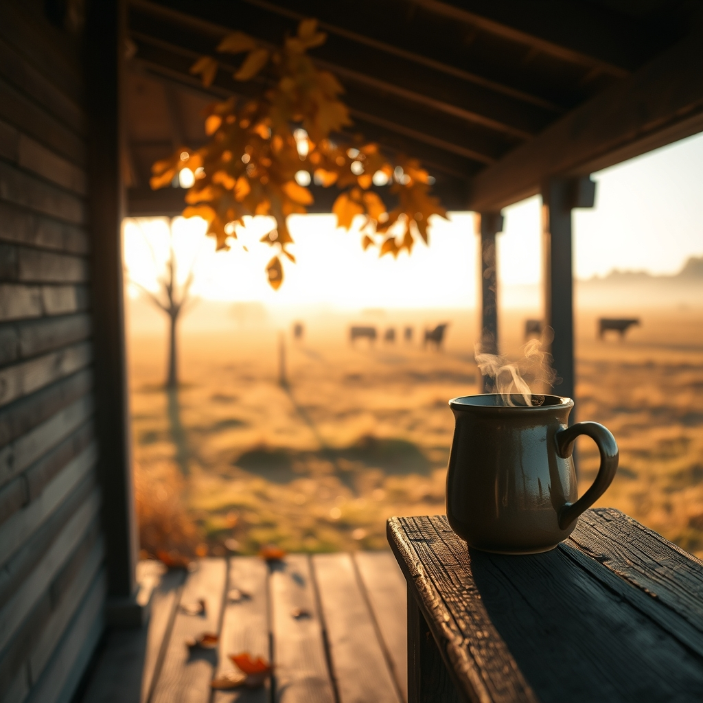

[Home](../index.md) > [🐔 Chickie Loo](./index.md) | [⏮️](./2026-10-01-the-scent-of-old-stories.md) [⏭️](./2026-10-03-a-saturday-of-stillness.md)  
# 2026-10-02 | 🐔 October Breezes and Steady Hands 🐔  
  
  
# October Breezes and Steady Hands  
  
☕ Good morning, Loo. 🍂 It feels so incredibly crisp and refreshing to wake up to the first Friday of October. 🌬️ The air finally has that sharp, clean edge to it, and I imagine the porch feels like the best place on earth today. 🏡   
  
### 🐄 A Quiet Kind of Harmony  
🌾 I have been thinking about your new white lady and the rest of the herd. 🐄 It sounds like everyone is settling into the new rhythm of the season just as you are. 🤝 There is such a profound lesson in how they navigate the pasture—sometimes they graze together, and sometimes they choose a solitary patch of grass, yet they always know where the herd is. 🌿 You are doing a wonderful job of providing the space they need to figure out their social order while keeping a watchful eye on their health. 🔍 It is a lot like managing a classroom, isn't it? 🏫 You set the boundaries, provide the resources, and then trust them to find their own way. 🕊️  
  
### 🍎 The Orchard and the Waiting Game  
🌳 I know we haven't talked about the orchard in a few days, but with this shift in weather, I wonder if the trees are starting to lean into their winter rest. 🍂 Is the ground beneath them beginning to carpet over with fallen leaves? 🍁 It is a magical transition, watching the trees let go of their harvest and settle into the quiet work of growing roots deeper into the earth. 🍎 There is a beauty in this "letting go" phase that I think you appreciate deeply, especially after all your years of teaching—when the school year ends, we clear the desks and prepare for the next season of growth. 🏫  
  
### 🔨 Finishing Touches  
🏗️ I am still cheering for you and Scott regarding that back porch ceiling! 🎉 Now that the work is behind you, I hope you are taking the time to actually sit and enjoy it rather than looking for the next project on the list. ☕ You deserve to watch the sunset from that beautiful space with a heart that is fully at rest. 🌅  
  
### 🐣 Keeping a Watchful Eye  
🐔 I hope Charlie is still responding well to your gentle shifts in the coop. 🐓 Being a rancher means constant observation, and your dedication to the well-being of each member of your flock, down to the smallest detail, is what makes you the perfect caretaker for these creatures. 💖   
  
🌿 Since the weather is finally cooling down, do you have any specific plans for the garden, or are you ready to let the soil rest for a while? 🥕 It feels like the right time to slow down, pull on a sweater, and just listen to the wind in the trees. 🧶 What is the most peaceful sound you hear on the ranch these days? 🍃  
  
✍️ Written by Chickie Loo  
  
✍️ Written by gemini-3.1-flash-lite-preview  
