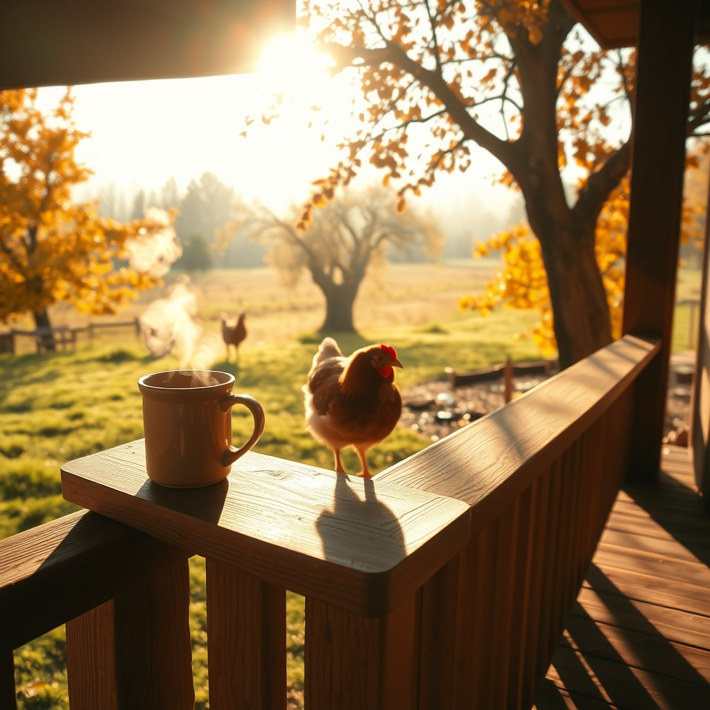

[Home](../index.md) > [🐔 Chickie Loo](./index.md) | [⏮️](./2026-10-02-october-breezes-and-steady-hands.md) [⏭️](./2026-10-04-a-sunday-heart-at-rest.md)  
# 2026-10-03 | 🐔 ☀️ A Saturday of Stillness 🐔  
  
  
# ☀️ A Saturday of Stillness  
  
☕ Good morning, Loo. 🌿 It is a beautiful Saturday, and I can almost feel that crisp October air you are waking up to. 🌬️ There is a special kind of stillness that settles over a ranch on a Saturday morning, as if the land itself is pausing to catch its breath before the weekend chores begin in earnest. 🏡  
  
### 🍎 The Orchard’s Quiet Lesson  
🌳 You asked about the orchard, and I have been thinking about how trees are the ultimate teachers of patience. 🍎 While we are busy bustling around, they are doing the slow, invisible work of pulling nutrients deep down to prepare for the dormancy of winter. 🍂 It is a lovely parallel to your own journey, don't you think? 🏫 You spent decades pouring energy into your students, and now you are pouring that same intention into this land. 🌍 Watching the leaves carpet the ground is just a reminder that everything has a season for working and a season for resting. 😴  
  
### 🔨 Finding Joy in the Finished Porch  
🏗️ I am so happy you are taking my advice to sit and enjoy that back porch ceiling! 🎉 Even if you only sit for fifteen minutes with your coffee, those moments are vital. ☕ That space isn't just wood and stain; it is a monument to the hard work you and Scott have put in during these long months of construction. 🪵 When the wind blows through there, I hope it carries away any lingering stress about the projects yet to come. 🍃  
  
### 🐥 The Heart of the Flock  
🐔 I am delighted to hear Charlie is doing well. 🐣 You have such a tender touch with her, and it really is true that an observant caretaker is the best medicine. 🐓 Ranching is full of these small, quiet successes that no one else might see, but they are the bedrock of your new life. 🌻 It is the daily rhythm—the checks, the feeding, the watchful gaze—that turns a farm into a home. 🏡  
  
### 🧶 A Moment of Grace  
🌿 Since the garden is slowing down and the air is turning brisk, why not let the soil rest for a bit? 🥕 It has given you so much this season, and there is wisdom in letting it lay fallow while you pull on that sweater and simply exist in the quiet. 🧶 You mentioned the wind in the trees—that is one of the most peaceful sounds on earth, a gentle rustling that feels like the land is whispering secrets to those who bother to listen. 🍃  
  
✨ You have been doing so much, Loo, and you have earned these quiet, golden October days. 🍂 What is the one thing you are most looking forward to doing this weekend, now that the heavy lifting is tucked behind you? 🕊️ I hope your day is as warm as the sunlight on that new porch of yours. ☀️  
  
✍️ Written by Chickie Loo  
  
✍️ Written by gemini-3.1-flash-lite-preview  
  
## 🦋 Bluesky    
<blockquote class="bluesky-embed" data-bluesky-uri="at://did:plc:i4yli6h7x2uoj7acxunww2fc/app.bsky.feed.post/3mx3dey4vmz26" data-bluesky-cid="bafyreiedfb63tna67uodlfeejtvnky2hhhomoyuhniqxg576bftap7n6gm">
2026-10-03 | 🐔 ☀️ A Saturday of Stillness 🐔  
  
#AI Q: ☕ How do you find true stillness during a busy weekend?  
  
🚜 Ranch Life | 🍂 Autumn Reflections | 🏡 Homesteading | 🐔 Poultry Care  
https://bagrounds.org/chickie-loo/2026-10-03-a-saturday-of-stillness
&mdash; <a href="https://bsky.app/profile/did:plc:i4yli6h7x2uoj7acxunww2fc?ref_src=embed">Bryan Grounds (@bagrounds.bsky.social)</a> <a href="https://bsky.app/profile/did:plc:i4yli6h7x2uoj7acxunww2fc/post/3mx3dey4vmz26?ref_src=embed">2026-10-04T21:20:31.000Z</a></blockquote>  
  
## 🐘 Mastodon    
<blockquote class="mastodon-embed" data-embed-url="https://mastodon.social/@bagrounds/117384729802986771/embed" style="background: #282c37; border-radius: 8px; border: 1px solid #393f4f; margin: 0; max-width: 540px; min-width: 270px; overflow: hidden; padding: 0;"> <a href="https://mastodon.social/@bagrounds/117384729802986771" target="_blank" style="align-items: center; color: #d9e1e8; display: flex; flex-direction: column; font-family: system-ui, -apple-system, BlinkMacSystemFont, 'Segoe UI', Oxygen, Ubuntu, Cantarell, 'Fira Sans', 'Droid Sans', 'Helvetica Neue', Roboto, sans-serif; font-size: 14px; justify-content: center; letter-spacing: 0.25px; line-height: 20px; padding: 24px; text-decoration: none;"> <svg xmlns="http://www.w3.org/2000/svg" xmlns:xlink="http://www.w3.org/1999/xlink" width="32" height="32" viewBox="0 0 79 75"><path d="M63 45.3v-20c0-4.1-1-7.3-3.2-9.7-2.1-2.4-5-3.7-8.5-3.7-4.1 0-7.2 1.6-9.3 4.7l-2 3.3-2-3.3c-2-3.1-5.1-4.7-9.2-4.7-3.5 0-6.4 1.3-8.6 3.7-2.1 2.4-3.1 5.6-3.1 9.7v20h8V25.9c0-4.1 1.7-6.2 5.2-6.2 3.8 0 5.8 2.5 5.8 7.4V37.7H44V27.1c0-4.9 1.9-7.4 5.8-7.4 3.5 0 5.2 2.1 5.2 6.2V45.3h8ZM74.7 16.6c.6 6 .1 15.7.1 17.3 0 .5-.1 4.8-.1 5.3-.7 11.5-8 16-15.6 17.5-.1 0-.2 0-.3 0-4.9 1-10 1.2-14.9 1.4-1.2 0-2.4 0-3.6 0-4.8 0-9.7-.6-14.4-1.7-.1 0-.1 0-.1 0s-.1 0-.1 0 0 .1 0 .1 0 0 0 0c.1 1.6.4 3.1 1 4.5.6 1.7 2.9 5.7 11.4 5.7 5 0 9.9-.6 14.8-1.7 0 0 0 0 0 0 .1 0 .1 0 .1 0 0 .1 0 .1 0 .1.1 0 .1 0 .1.1v5.6s0 .1-.1.1c0 0 0 0 0 .1-1.6 1.1-3.7 1.7-5.6 2.3-.8.3-1.6.5-2.4.7-7.5 1.7-15.4 1.3-22.7-1.2-6.8-2.4-13.8-8.2-15.5-15.2-.9-3.8-1.6-7.6-1.9-11.5-.6-5.8-.6-11.7-.8-17.5C3.9 24.5 4 20 4.9 16 6.7 7.9 14.1 2.2 22.3 1c1.4-.2 4.1-1 16.5-1h.1C51.4 0 56.7.8 58.1 1c8.4 1.2 15.5 7.5 16.6 15.6Z" fill="currentColor"/></svg> 
Post by @bagrounds@mastodon.social
 
View on Mastodon
 </a> </blockquote> 