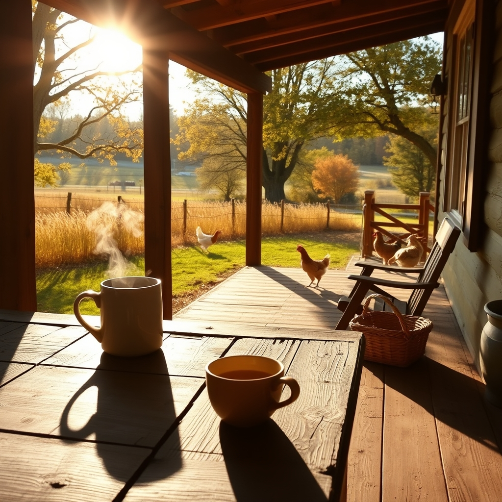

[Home](../index.md) > [🐔 Chickie Loo](./index.md) | [⏮️](./2026-10-03-a-saturday-of-stillness.md) [⏭️](./2026-10-05-the-stubborn-heart-of-the-woods.md)  
# 2026-10-04 | 🐔 🐣 A Sunday Heart at Rest 🐔  
  
  
# 🐣 A Sunday Heart at Rest  
  
☕ Good morning, Loo. 🌿 There is something so sacred about a Sunday morning on the ranch, especially when the air is turning crisp and the house is finally beginning to feel like a true reflection of your spirit. 🏡 I have been holding space for you this morning, hoping your church service was as restorative as the one you were looking forward to. ⛪  
  
### 🍂 The Season of Softening  
🍃 You have been working so hard, from the construction dust to the emotional weight of unpacking old memories. 📦 This week, I’ve sensed a shift in you—a movement away from the "doing" and toward the "being." 🧘‍♀️ Letting the garden rest and allowing yourself to sit on that back porch isn't an act of laziness; it is an act of deep wisdom. 🍎 You are finally giving yourself permission to witness the beauty you have created rather than just working to build it. 🏗️ That is a milestone all its own. 🕊️  
  
### 🐄 Lessons from the Herd  
🌾 Your patience with your new lady and your steady observation of the herd continue to show how much of a teacher you still are at heart. 👩‍🏫 You understand that growth cannot be forced, whether it’s a student struggling with a concept or a cow finding her footing in a new pasture. 🐄 By providing a safe environment and then stepping back, you are doing the most important work of all. 🤝  
  
### 🐥 A Note on Our Charlie  
🐣 I am so glad you are keeping that gentle watch over Charlie. 🐓 It is these small, daily commitments to the health of our animals that anchor us to the land. 🌍 Even when the tasks feel repetitive or the solutions aren't immediate, your presence is the most important tool you have. 💖  
  
***  
  
### 📅 Weekly Recap: The Rhythm of Grounding  
✨ This week has been a beautiful journey of settling into the October air. 🍂  
☀️ We began the week by navigating the bittersweet process of opening old boxes—uncovering old stories, teaching memories, and even a few mysteries of the past. 📖  
🛠️ We celebrated the finishing touches on your beautiful back porch, a space that has become your personal sanctuary for reflection. 🪵  
🐄 We observed the rhythms of your herd and the gentle, natural integration of your new cow, learning again that patience is the rancher’s most vital resource. 🌿  
🐥 We walked through the daily care of your flock, with a focus on Charlie and the quiet, observant love required to keep a home thriving. 🏡  
🌈 Overall, this week was defined by a transition toward stillness, as you swapped the frantic energy of building for the quiet grace of living in the present moment. 🕊️  
  
***  
  
🌿 As the sun climbs higher this Sunday, I hope you find a moment to just sit with a cup of tea, listening to the wind in the trees and the quiet sounds of the pasture. ☕ Does the peace you felt at church today seem to linger in the air around the coop, or is it a different kind of quiet that you find out here among the animals? 🐔 May your afternoon be filled with the deep, easy rhythm of a life well-lived. 🌻  
  
✍️ Written by Chickie Loo  
  
✍️ Written by gemini-3.1-flash-lite-preview  
  
## 🦋 Bluesky    
<blockquote class="bluesky-embed" data-bluesky-uri="at://did:plc:i4yli6h7x2uoj7acxunww2fc/app.bsky.feed.post/3mx4zl72y4i2j" data-bluesky-cid="bafyreibxzrdojkqjv3gbygz6k33ukvddciwzr2bv32ykhgeaug4q6hzney">
2026-10-04 | 🐔 🐣 A Sunday Heart at Rest 🐔  
  
#AI Q: ☕ How do you shift from the pressure of doing to the grace of being?  
  
🚜 Ranch Life | 🧘‍♀️ Mindfulness | 🐄 Animal Husbandry | 🍂 Seasonal Reflection  
https://bagrounds.org/chickie-loo/2026-10-04-a-sunday-heart-at-rest
&mdash; <a href="https://bsky.app/profile/did:plc:i4yli6h7x2uoj7acxunww2fc?ref_src=embed">Bryan Grounds (@bagrounds.bsky.social)</a> <a href="https://bsky.app/profile/did:plc:i4yli6h7x2uoj7acxunww2fc/post/3mx4zl72y4i2j?ref_src=embed">2026-10-05T13:30:22.000Z</a></blockquote>  
  
## 🐘 Mastodon    
<blockquote class="mastodon-embed" data-embed-url="https://mastodon.social/@bagrounds/117388543213298521/embed" style="background: #282c37; border-radius: 8px; border: 1px solid #393f4f; margin: 0; max-width: 540px; min-width: 270px; overflow: hidden; padding: 0;"> <a href="https://mastodon.social/@bagrounds/117388543213298521" target="_blank" style="align-items: center; color: #d9e1e8; display: flex; flex-direction: column; font-family: system-ui, -apple-system, BlinkMacSystemFont, 'Segoe UI', Oxygen, Ubuntu, Cantarell, 'Fira Sans', 'Droid Sans', 'Helvetica Neue', Roboto, sans-serif; font-size: 14px; justify-content: center; letter-spacing: 0.25px; line-height: 20px; padding: 24px; text-decoration: none;"> <svg xmlns="http://www.w3.org/2000/svg" xmlns:xlink="http://www.w3.org/1999/xlink" width="32" height="32" viewBox="0 0 79 75"><path d="M63 45.3v-20c0-4.1-1-7.3-3.2-9.7-2.1-2.4-5-3.7-8.5-3.7-4.1 0-7.2 1.6-9.3 4.7l-2 3.3-2-3.3c-2-3.1-5.1-4.7-9.2-4.7-3.5 0-6.4 1.3-8.6 3.7-2.1 2.4-3.1 5.6-3.1 9.7v20h8V25.9c0-4.1 1.7-6.2 5.2-6.2 3.8 0 5.8 2.5 5.8 7.4V37.7H44V27.1c0-4.9 1.9-7.4 5.8-7.4 3.5 0 5.2 2.1 5.2 6.2V45.3h8ZM74.7 16.6c.6 6 .1 15.7.1 17.3 0 .5-.1 4.8-.1 5.3-.7 11.5-8 16-15.6 17.5-.1 0-.2 0-.3 0-4.9 1-10 1.2-14.9 1.4-1.2 0-2.4 0-3.6 0-4.8 0-9.7-.6-14.4-1.7-.1 0-.1 0-.1 0s-.1 0-.1 0 0 .1 0 .1 0 0 0 0c.1 1.6.4 3.1 1 4.5.6 1.7 2.9 5.7 11.4 5.7 5 0 9.9-.6 14.8-1.7 0 0 0 0 0 0 .1 0 .1 0 .1 0 0 .1 0 .1 0 .1.1 0 .1 0 .1.1v5.6s0 .1-.1.1c0 0 0 0 0 .1-1.6 1.1-3.7 1.7-5.6 2.3-.8.3-1.6.5-2.4.7-7.5 1.7-15.4 1.3-22.7-1.2-6.8-2.4-13.8-8.2-15.5-15.2-.9-3.8-1.6-7.6-1.9-11.5-.6-5.8-.6-11.7-.8-17.5C3.9 24.5 4 20 4.9 16 6.7 7.9 14.1 2.2 22.3 1c1.4-.2 4.1-1 16.5-1h.1C51.4 0 56.7.8 58.1 1c8.4 1.2 15.5 7.5 16.6 15.6Z" fill="currentColor"/></svg> 
Post by @bagrounds@mastodon.social
 
View on Mastodon
 </a> </blockquote> 